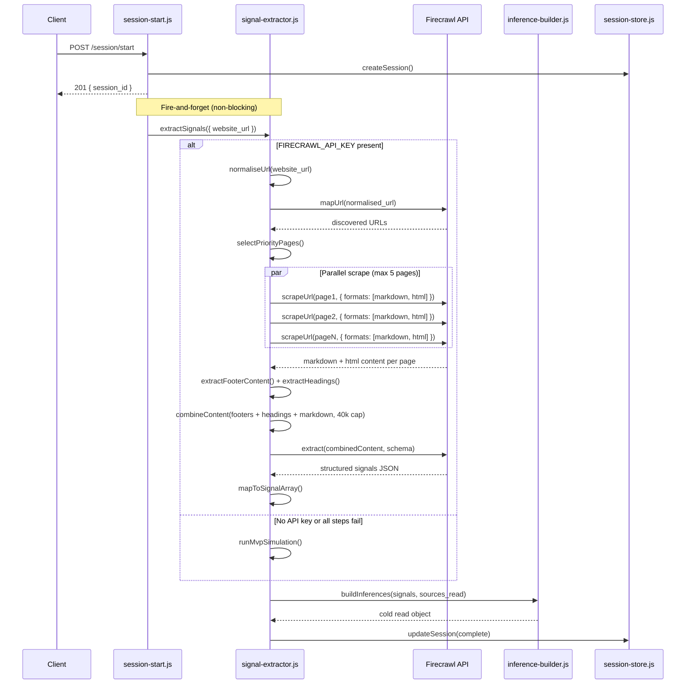
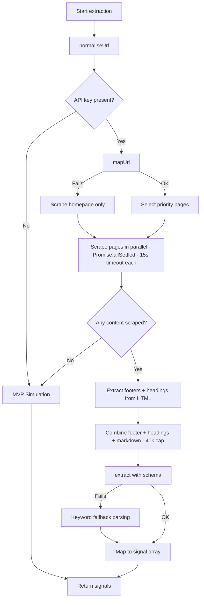

# Design Document: Firecrawl Signal Extraction

## Overview

This design replaces the hardcoded MVP simulation in `signal-extractor.js` with a real website scraping and structured extraction pipeline powered by the Firecrawl SDK (`@mendable/firecrawl-js`). The rewrite is scoped to a single file — `api/src/services/signal-extractor.js` — plus adding the SDK dependency to `api/package.json`.

The new pipeline follows a 5-step sequence:

1. **Init** — Create a Firecrawl client from `FIRECRAWL_API_KEY` env var (or enter simulation mode)
2. **Normalise** — Normalise the user-provided URL (add protocol, strip www, trailing slashes, query/hash)
3. **Map** — Call `mapUrl()` to discover which priority pages exist on the target domain
4. **Scrape** — Call `scrapeUrl()` on up to 5 selected pages in parallel via `Promise.allSettled()` (15s timeout each), requesting both markdown and html formats
5. **Pre-process** — Extract footer content and H1/H2 headings from raw HTML, prepend to combined content
6. **Extract** — Call `extract()` with a structured JSON schema prompt against combined content (40k char cap)
7. **Map to signals** — Convert extracted fields into the `{ type, value, confidence }` array format

A strict fallback chain ensures the pipeline never blocks: missing API key → simulation; map fails → scrape homepage only; scrape fails → simulation; extract fails → keyword-based degraded extraction; all fails → simulation.

The output shape is identical to the current implementation — `{ signals, sources_read, enterprise_signals, competitor_mentions }` — so no downstream changes are required.

### Design Rationale

- **Single-file rewrite**: The extraction pipeline is fully encapsulated in `signal-extractor.js`. The function signature and return shape are preserved, making this a drop-in replacement.
- **Firecrawl over raw HTTP**: Firecrawl handles JavaScript rendering, anti-bot bypasses, and returns clean markdown. Building this from scratch would require puppeteer/playwright, HTML parsing, and content cleaning — significantly more code and maintenance.
- **Structured extraction over manual parsing**: Firecrawl's `extract()` endpoint uses an LLM to pull structured data from content, which is more robust than regex/keyword matching across diverse website layouts.
- **Aggressive fallback**: Every step has a fallback. The pipeline must never block the session start response or leave the session in a permanent "processing" state.

## Architecture

The rewritten `signal-extractor.js` sits in the same position in the architecture — called fire-and-forget from `session-start.js` via `extractAndInfer()`. No other files change.



### Fallback Chain



### Module Internal Structure

The rewritten `signal-extractor.js` is organized into these internal functions:

| Function | Responsibility |
|----------|---------------|
| `initClient()` | Module-level Firecrawl client init from env var |
| `normaliseUrl(rawUrl)` | Normalises user input URL: adds protocol, strips www/trailing slash/query/hash |
| `extractSignals({ website_url, deck_file })` | Main entry point (exported, async) |
| `discoverPages(client, url)` | Calls `mapUrl()`, returns matched priority page URLs |
| `scrapePages(client, urls)` | Scrapes all URLs in parallel with Promise.allSettled() + timeout, returns content array |
| `extractFooterContent(html)` | Extracts `<footer>` tag content from raw HTML, falls back to last 1000 chars |
| `extractHeadings(html)` | Extracts H1/H2 headings from raw HTML, returns top 20 |
| `combineContent(pages)` | Assembles footer signals + headings + markdown, enforces 40k char cap |
| `extractStructured(client, content)` | Calls `extract()` with JSON schema prompt |
| `mapToSignals(extracted)` | Converts structured extraction to signal array format |
| `detectEnterpriseSignals(pages)` | Scans page content for enterprise indicators |
| `keywordFallback(content)` | Degraded extraction via keyword matching |
| `runSimulation(website_url, deck_file)` | Existing MVP simulation logic |

## Components and Interfaces

### Exported Interface (unchanged)

```javascript
// api/src/services/signal-extractor.js
export async function extractSignals({ website_url, deck_file }) → {
  signals: Array<{ type: string, value: string, confidence: 'confident' | 'likely' | 'probable' }>,
  sources_read: string[],
  enterprise_signals: {
    security_page_detected: boolean,
    trust_centre_detected: boolean,
    soc2_mentioned: boolean,
    pricing_enterprise_tier: boolean,
  },
  competitor_mentions: string[],
  extraction_source: 'firecrawl' | 'simulation',  // new metadata field
}
```

The only addition to the return shape is `extraction_source` — a metadata string. Downstream consumers (`inference-builder.js`, `session-start.js`) do not destructure this field, so it's additive and non-breaking. The session store already uses `Object.assign` for updates, so the extra field is stored automatically.

### Firecrawl SDK Interface

The `@mendable/firecrawl-js` SDK provides three methods used in this pipeline:

```javascript
import FirecrawlApp from '@mendable/firecrawl-js';

const client = new FirecrawlApp({ apiKey: process.env.FIRECRAWL_API_KEY });

// 1. Discover site structure
const mapResult = await client.mapUrl(url);
// Returns: { success: boolean, links: string[] }

// 2. Scrape a single page (request both markdown and html)
const scrapeResult = await client.scrapeUrl(pageUrl, { formats: ['markdown', 'html'] });
// Returns: { success: boolean, markdown: string, html: string, metadata: { title, description, ... } }

// 3. Extract structured data from URLs
const extractResult = await client.extract([url], {
  prompt: "Extract company information...",
  schema: zodSchema,  // or plain JSON schema
});
// Returns: { success: boolean, data: { ...extracted fields } }
```

### Internal Components

#### 1. Client Initialization

```javascript
// Module-level initialization (runs once on import)
const FIRECRAWL_API_KEY = process.env.FIRECRAWL_API_KEY;
let firecrawlClient = null;

if (FIRECRAWL_API_KEY) {
  firecrawlClient = new FirecrawlApp({ apiKey: FIRECRAWL_API_KEY });
} else {
  console.warn(JSON.stringify({
    event: 'firecrawl_no_api_key',
    message: 'FIRECRAWL_API_KEY not set, operating in simulation mode',
  }));
}
```

#### 2. Domain Normalisation

User-provided URLs are normalised before any Firecrawl calls to prevent inconsistent behaviour:

```javascript
function normaliseUrl(rawUrl) {
  let url = rawUrl.trim().toLowerCase();
  if (!url.startsWith('http://') && !url.startsWith('https://')) {
    url = 'https://' + url;
  }
  try {
    const parsed = new URL(url);
    parsed.hostname = parsed.hostname.replace(/^www\./, '');
    parsed.pathname = parsed.pathname.replace(/\/$/, '') || '/';
    parsed.search = '';
    parsed.hash = '';
    return parsed.origin;
  } catch {
    return url.startsWith('http') ? url : 'https://' + url;
  }
}
```

#### 3. Priority Page Selection

The priority page list and matching logic:

```javascript
const PRIORITY_PATHS = ['/', '/security', '/trust', '/compliance', '/pricing', '/about'];
const MAX_PAGES = 5; // homepage + up to 4 additional
```

Matching algorithm:
1. Parse the base domain from `website_url`
2. Call `mapUrl()` to get all discovered URLs
3. Normalize discovered URLs to paths
4. Filter `PRIORITY_PATHS` to those present in the site map
5. Always include `/` (homepage), then fill remaining slots from priority list
6. Cap at `MAX_PAGES`

#### 4. Scrape Orchestration

All pages are scraped in parallel using `Promise.allSettled()` — not sequentially. This reduces worst-case scrape time from 75s (5 × 15s) to 15s. Each page has a 15-second timeout enforced via `Promise.race()`. Both markdown and html formats are requested — html is needed for footer and heading extraction.

```javascript
const PAGE_TIMEOUT_MS = 15_000;
const PIPELINE_TIMEOUT_MS = 60_000;

// Parallel scraping with Promise.allSettled
const scrapeResults = await Promise.allSettled(
  targetUrls.map(url =>
    Promise.race([
      client.scrapeUrl(url, { formats: ['markdown', 'html'], onlyMainContent: false }),
      new Promise((_, reject) => setTimeout(() => reject(new Error('timeout')), PAGE_TIMEOUT_MS))
    ])
  )
);
```

#### 5. Footer and Heading Extraction

Before combining content for the extraction call, footer content and H1/H2 headings are extracted from raw HTML and prepended to the combined content. This ensures the extraction model sees the highest-value signals first.

```javascript
function extractFooterContent(html) {
  if (!html) return '';
  const footerMatch = html.match(/<footer[^>]*>([\s\S]*?)<\/footer>/i);
  if (footerMatch) {
    return footerMatch[1].replace(/<[^>]+>/g, ' ').replace(/\s+/g, ' ').trim().slice(0, 2000);
  }
  return html.replace(/<[^>]+>/g, ' ').replace(/\s+/g, ' ').trim().slice(-1000);
}

function extractHeadings(html) {
  if (!html) return '';
  const headings = [];
  for (const m of html.matchAll(/<h1[^>]*>([\s\S]*?)<\/h1>/gi)) headings.push('H1: ' + m[1].replace(/<[^>]+>/g, '').trim());
  for (const m of html.matchAll(/<h2[^>]*>([\s\S]*?)<\/h2>/gi)) headings.push('H2: ' + m[1].replace(/<[^>]+>/g, '').trim());
  return headings.slice(0, 20).join('\n');
}
```

#### 6. Content Combination

Successfully scraped pages are assembled with high-value signals prepended:

```
=== FOOTER SIGNALS ===
[footer content from all pages]

=== PAGE HEADINGS ===
[H1/H2 headings from all pages]

=== PAGE CONTENT ===
--- /homepage ---
[markdown content]

--- /pricing ---
[markdown content]
```

The combined string is truncated at 40,000 characters to stay within extraction token limits.

#### 7. Extraction Prompt & Schema

The extraction prompt instructs Firecrawl's LLM to return a structured JSON object. The schema is defined as a plain object (not Zod, to avoid adding another dependency):

```javascript
const EXTRACTION_SCHEMA = {
  type: 'object',
  properties: {
    company_name: { type: 'string', description: 'Company or product name' },
    product_type: { type: 'string', description: 'e.g. B2B SaaS, API platform, data platform' },
    customer_type: { type: 'string', description: 'e.g. Enterprise, Mid-market, SMB, Consumer' },
    data_sensitivity: { type: 'string', description: 'e.g. Customer data, Financial data, Health data' },
    infrastructure: { type: 'string', description: 'e.g. AWS, GCP, Azure' },
    stage: { type: 'string', description: 'e.g. Pre-revenue, Seed, Series A, Growth' },
    primary_use_case: { type: 'string', description: 'Primary product use case' },
    enterprise_signals: {
      type: 'object',
      properties: {
        security_page_detected: { type: 'boolean' },
        trust_centre_detected: { type: 'boolean' },
        soc2_mentioned: { type: 'boolean' },
        pricing_enterprise_tier: { type: 'boolean' },
      },
    },
    competitor_mentions: {
      type: 'array',
      items: { type: 'string' },
      description: 'Names of competitors mentioned on the website',
    },
    confidence_notes: {
      type: 'object',
      description: 'Map of field name to confidence reasoning (direct statement, strong implication, weak implication)',
    },
  },
};
```

The prompt text:

```
Analyze the following website content and extract structured company information.
Return null for any field where no evidence exists — do not guess.
For confidence_notes, indicate for each field whether the evidence is a
"direct statement", "strong implication", or "weak implication".
```

#### 8. Signal Mapping

The `mapToSignals()` function converts the extracted JSON into the signal array format:

```javascript
function mapToSignals(extracted) {
  const signals = [];
  const fieldMap = [
    'product_type', 'customer_type', 'data_sensitivity',
    'infrastructure', 'stage',
  ];
  
  for (const field of fieldMap) {
    if (extracted[field]) {
      signals.push({
        type: field,
        value: extracted[field],
        confidence: deriveConfidence(extracted.confidence_notes?.[field]),
      });
    }
  }
  
  if (extracted.primary_use_case) {
    signals.push({
      type: 'use_case',
      value: extracted.primary_use_case,
      confidence: deriveConfidence(extracted.confidence_notes?.primary_use_case),
    });
  }
  
  if (extracted.company_name) {
    signals.push({
      type: 'company_name',
      value: extracted.company_name,
      confidence: 'confident',
    });
  }
  
  return signals;
}

function deriveConfidence(note) {
  if (!note) return 'probable';
  const lower = note.toLowerCase();
  if (lower.includes('direct')) return 'confident';
  if (lower.includes('strong')) return 'likely';
  return 'probable';
}
```

#### 9. Enterprise Signal Detection

Enterprise signals are populated from two sources:
- **Extraction result**: The `enterprise_signals` object from the structured extraction
- **Page-level detection**: Direct checks on which pages were successfully scraped

```javascript
function detectEnterpriseSignals(scrapedPages, extractedSignals) {
  const signals = {
    security_page_detected: false,
    trust_centre_detected: false,
    soc2_mentioned: false,
    pricing_enterprise_tier: false,
  };

  // Page-level detection
  for (const page of scrapedPages) {
    if (['/security', '/trust'].includes(page.path)) {
      signals.security_page_detected = true;
    }
  }

  // Merge with extraction results (extraction takes precedence for content-based signals)
  if (extractedSignals) {
    signals.trust_centre_detected = extractedSignals.trust_centre_detected || signals.trust_centre_detected;
    signals.soc2_mentioned = extractedSignals.soc2_mentioned || signals.soc2_mentioned;
    signals.pricing_enterprise_tier = extractedSignals.pricing_enterprise_tier || signals.pricing_enterprise_tier;
  }

  return signals;
}
```

#### 10. Keyword Fallback

When the `extract()` call fails, a degraded keyword-based parser scans the combined content:

```javascript
function keywordFallback(content) {
  const lower = content.toLowerCase();
  const signals = [];

  // Product type detection
  if (lower.includes('saas') || lower.includes('software as a service')) {
    signals.push({ type: 'product_type', value: 'B2B SaaS', confidence: 'probable' });
  } else if (lower.includes('api') || lower.includes('developer')) {
    signals.push({ type: 'product_type', value: 'API platform', confidence: 'probable' });
  }

  // Customer type detection
  if (lower.includes('enterprise')) {
    signals.push({ type: 'customer_type', value: 'Enterprise (B2B)', confidence: 'probable' });
  }

  // Infrastructure detection
  for (const [keyword, value] of [['aws', 'AWS'], ['google cloud', 'GCP'], ['azure', 'Azure']]) {
    if (lower.includes(keyword)) {
      signals.push({ type: 'infrastructure', value, confidence: 'probable' });
      break;
    }
  }

  return signals;
}
```

## Data Models

### Signal (existing, unchanged)

```javascript
{
  type: string,      // 'product_type' | 'customer_type' | 'data_sensitivity' | 'infrastructure' | 'stage' | 'use_case' | 'company_name'
  value: string,     // Free-text value extracted from content
  confidence: string // 'confident' | 'likely' | 'probable'
}
```

### Enterprise Signals (existing, unchanged)

```javascript
{
  security_page_detected: boolean,
  trust_centre_detected: boolean,
  soc2_mentioned: boolean,
  pricing_enterprise_tier: boolean,
}
```

### Extraction Result (internal, new)

The structured JSON returned by Firecrawl's `extract()` endpoint:

```javascript
{
  company_name: string | null,
  product_type: string | null,
  customer_type: string | null,
  data_sensitivity: string | null,
  infrastructure: string | null,
  stage: string | null,
  primary_use_case: string | null,
  enterprise_signals: {
    security_page_detected: boolean,
    trust_centre_detected: boolean,
    soc2_mentioned: boolean,
    pricing_enterprise_tier: boolean,
  },
  competitor_mentions: string[],
  confidence_notes: Record<string, string>,  // field name → reasoning
}
```

### Scraped Page (internal, new)

```javascript
{
  path: string,       // e.g. '/pricing'
  url: string,        // Full URL
  content: string,    // Markdown content from scrape
  html: string,       // Raw HTML content from scrape (for footer/heading extraction)
  title: string,      // Page title from metadata
}
```

### Extraction Output (exported, unchanged shape + 1 additive field)

```javascript
{
  signals: Signal[],
  sources_read: string[],
  enterprise_signals: EnterpriseSignals,
  competitor_mentions: string[],
  extraction_source: 'firecrawl' | 'simulation',  // additive metadata
}
```

### Structured Log Events

| Event | Fields | Level |
|-------|--------|-------|
| `extraction_start` | `website_url`, `timestamp` | info |
| `extraction_complete` | `pages_attempted`, `pages_scraped`, `signals_extracted`, `extraction_source`, `duration_ms` | info |
| `page_scrape_failed` | `page_url`, `error`, `duration_ms` | warn |
| `extraction_fallback` | `reason`, `website_url` | warn |
| `firecrawl_no_api_key` | `message` | warn |


## Correctness Properties

*A property is a characteristic or behavior that should hold true across all valid executions of a system — essentially, a formal statement about what the system should do. Properties serve as the bridge between human-readable specifications and machine-verifiable correctness guarantees.*

### Property 1: Missing API key forces simulation mode

*For any* invocation of `extractSignals` when `FIRECRAWL_API_KEY` is not set, the returned object should have `extraction_source` equal to `"simulation"` and should contain the same hardcoded signals as the MVP simulation.

**Validates: Requirements 1.2, 7.1, 12.3**

### Property 2: Domain normalisation produces consistent URLs

*For any* user-provided URL string (with or without protocol, with or without www, with or without trailing slash, with or without query/hash), `normaliseUrl` should return a URL that: (a) starts with `https://`, (b) has no `www.` prefix, (c) has no trailing slash on the origin, (d) has no query parameters or hash fragments.

**Validates: Requirements 2.1**

### Property 3: Page selection respects priority list and budget

*For any* site map (set of discovered URLs) and the fixed priority pages list, the selected pages should satisfy all of: (a) the homepage is always included, (b) every selected page path is in the priority pages list, (c) the total number of selected pages is at most 5, and (d) selected pages (other than homepage) exist in the site map.

**Validates: Requirements 2.3, 2.4, 9.1**

### Property 4: Parallel scrapes complete within timeout bounds

*For any* set of pages to scrape where an arbitrary subset of scrapes fail (via Promise.allSettled), the pipeline should complete successfully with signals derived from the pages that succeeded, and the failed pages should not appear in `sources_read`. The total scrape wall-clock time should not exceed 15 seconds plus overhead (since scrapes run in parallel).

**Validates: Requirements 3.1, 3.3, 10.2**

### Property 5: Sources read matches successfully scraped pages

*For any* set of successfully scraped pages, each page's path should appear in the `sources_read` array, and `sources_read` should contain no paths for pages that were not successfully scraped.

**Validates: Requirements 3.4**

### Property 6: Combined content includes footer and heading sections and respects cap

*For any* set of scraped page contents and HTML (regardless of individual page sizes), the combined content string should: (a) never exceed 40,000 characters, (b) contain footer signals section before page headings section before page content section when footer/heading content is available, (c) include extracted footer text from HTML `<footer>` elements, (d) include H1/H2 headings from HTML.

**Validates: Requirements 3.5, 4.1, 4.2, 4.3, 4.4**

### Property 7: Signal mapping completeness and null exclusion

*For any* valid extraction result, every non-null field in the extraction (product_type, customer_type, data_sensitivity, infrastructure, stage, primary_use_case, company_name) should produce exactly one signal in the output array with the matching type and value. Conversely, any field that is null in the extraction result should produce no signal of that type.

**Validates: Requirements 4.7, 8.3, 13.3**

### Property 8: Confidence derivation follows the mapping rules

*For any* confidence note string, `deriveConfidence` should return `"confident"` if the note contains "direct", `"likely"` if it contains "strong", and `"probable"` otherwise (including when the note is null or absent).

**Validates: Requirements 4.8**

### Property 9: Enterprise signals reflect scraped content evidence

*For any* set of scraped pages and their content, the enterprise_signals object should satisfy: (a) `security_page_detected` is true if and only if a /security or /trust page was successfully scraped, (b) `trust_centre_detected` is true if and only if the content contains "trust centre" or "trust center", (c) `soc2_mentioned` is true if and only if the content contains "SOC 2" or "SOC2", (d) `pricing_enterprise_tier` is true if and only if a /pricing page was scraped and contains an enterprise tier reference. All fields default to false when no evidence is present.

**Validates: Requirements 5.1, 5.2, 5.3, 5.4, 5.5**

### Property 10: Competitor mentions pass through faithfully

*For any* extraction result, the `competitor_mentions` array in the output should exactly match the `competitor_mentions` array from the extraction result, and every element should be a string. When the extraction returns no competitor mentions, the output should be an empty array.

**Validates: Requirements 6.1, 6.2, 6.3**

### Property 11: Output shape invariant

*For any* invocation of `extractSignals` (whether using Firecrawl or simulation), the returned object should contain: (a) `signals` as an array where each element has `type`, `value`, and `confidence` fields, (b) `sources_read` as an array of strings, (c) `enterprise_signals` as an object with exactly the four boolean fields from `ENTERPRISE_SIGNALS_SCHEMA`, (d) `competitor_mentions` as an array of strings, and (e) `extraction_source` as either `"firecrawl"` or `"simulation"`. Additionally, every signal `type` should be one of: `product_type`, `customer_type`, `data_sensitivity`, `infrastructure`, `stage`, `use_case`, `company_name`.

**Validates: Requirements 7.4, 8.1, 8.2**

## Error Handling

The error handling strategy follows the principle: **never block, always degrade gracefully**.

### Error Categories and Responses

| Error | Source | Response | Fallback |
|-------|--------|----------|----------|
| Missing `FIRECRAWL_API_KEY` | Module init | Log warning, enter simulation mode | MVP simulation |
| `mapUrl()` network error | Site map discovery | Log warning, skip map step | Scrape homepage only |
| `mapUrl()` returns empty | Site map discovery | Treat as no map | Scrape homepage only |
| `scrapeUrl()` timeout (>15s) | Page scraping | Log warning with page URL and duration | Skip page, continue |
| `scrapeUrl()` HTTP error | Page scraping | Log warning with error details | Skip page, continue |
| All scrapes fail | Page scraping | Log warning | MVP simulation |
| `extract()` failure | Structured extraction | Log warning | Keyword fallback parser |
| `extract()` returns malformed JSON | Structured extraction | Log warning | Keyword fallback parser |
| Keyword fallback produces no signals | Degraded extraction | Log warning | MVP simulation |
| Pipeline total >60s | Pipeline abort | Log warning, abort remaining ops | Proceed with collected content |

### Error Propagation

Errors within the extraction pipeline are caught and handled internally. The `extractSignals` function never throws — it always returns a valid result object. The outer `extractAndInfer` function in `session-start.js` has its own try/catch that sets `infer_status: 'failed'`, but this should only trigger for truly unexpected errors (e.g., out-of-memory).

### Structured Error Logging

All errors are logged as structured JSON with consistent fields:

```javascript
console.warn(JSON.stringify({
  event: 'page_scrape_failed',
  page_url: url,
  error: err.message,
  duration_ms: elapsed,
}));
```

No stack traces in structured logs — the `error` field contains the message only. Stack traces go to stderr via `console.error` for unexpected failures.

## Testing Strategy

### Property-Based Testing

Property-based tests use `fast-check` (the standard PBT library for JavaScript/Node.js). Each property test runs a minimum of 100 iterations with randomly generated inputs.

Each test is tagged with a comment referencing the design property:
```javascript
// Feature: firecrawl-signal-extraction, Property 1: Missing API key forces simulation mode
```

The following properties are tested with `fast-check`:

| Property | Generator Strategy |
|----------|-------------------|
| P1: Simulation fallback | Generate random website URLs; run with no API key |
| P2: Domain normalisation | Generate random URL strings with/without protocol, www, trailing slash, query, hash |
| P3: Page selection | Generate random sets of URLs (site maps) of varying sizes; verify selection invariants |
| P4: Parallel scrape resilience | Generate random page lists with random failure patterns (boolean per page) |
| P5: Sources read | Generate random sets of scraped page objects; verify sources_read contents |
| P6: Content assembly + cap | Generate random page contents and HTML of varying sizes; verify footer/heading prepend and 40k cap |
| P7: Signal mapping | Generate random extraction result objects with random null/non-null fields |
| P8: Confidence derivation | Generate random strings (including those containing "direct", "strong", neither, and null) |
| P9: Enterprise signals | Generate random page sets with random content containing/not containing keywords |
| P10: Competitor mentions | Generate random extraction results with varying competitor_mentions arrays |
| P11: Output shape | Generate random inputs (URL/deck combinations); verify output structure |

### Unit Tests

Unit tests cover specific examples, edge cases, and integration points:

- **Extraction schema validation**: Verify `EXTRACTION_SCHEMA` contains all required fields (Req 13.1)
- **Prompt content**: Verify extraction prompt instructs null for missing evidence (Req 13.2)
- **Map failure fallback**: When `mapUrl()` throws, only homepage is scraped (Req 2.4)
- **Extract failure fallback**: When `extract()` throws, keyword parser runs (Req 4.5)
- **All scrapes fail**: Returns simulation result (Req 7.2)
- **Fallback logging**: Verify structured log output on fallback (Req 7.3, 11.4)
- **No retry on failure**: Failed scrapes are not retried (Req 9.2)
- **Completion logging**: Verify structured log on start and completion (Req 11.1, 11.2, 11.3)
- **Empty competitor mentions**: Returns `[]` not `null` (Req 6.3)
- **60s pipeline abort**: Pipeline aborts and returns partial results (Req 10.4)

### Test File Structure

```
api/src/services/__tests__/
  signal-extractor.test.js          # Unit tests
  signal-extractor.property.test.js # Property-based tests with fast-check
```

### Mocking Strategy

The Firecrawl SDK is mocked at the module level for all tests. The mock provides controllable responses for `mapUrl()`, `scrapeUrl()`, and `extract()` — including failure injection for fallback testing.

Internal pure functions (`normaliseUrl`, `mapToSignals`, `deriveConfidence`, `combineContent`, `extractFooterContent`, `extractHeadings`, `detectEnterpriseSignals`, `keywordFallback`, `selectPriorityPages`) are exported for direct testing or tested via the main `extractSignals` entry point with controlled mock responses.

### Dependencies

- `fast-check` — property-based testing library
- `vitest` or `node:test` — test runner (whichever is already configured, or `node:test` for zero-dependency)
