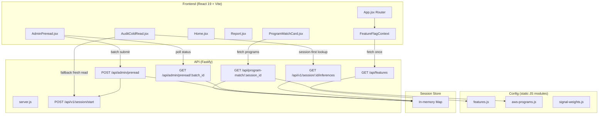

# Design Document — overnight-v1

## Overview

This design covers the overnight-v1 GTM build for Proof360: four user-facing features (shareable cold read URL, admin pre-read batch tool, landing page swap, AWS program match card) plus three architectural primitives (feature flags, confidence surfacing, signal weight skeleton). All changes are additive — no existing endpoints, components, auth flows, or scoring logic are modified destructively.

The build touches both the Fastify API (`api/src/`) and the React frontend (`frontend/src/`). No new frontend dependencies are introduced. New backend config files are static JS modules with no external dependencies.

---

## Architecture

### System Context



### New Files

| File | Type | Purpose |
|------|------|---------|
| `api/src/config/features.js` | Config | Feature flag definitions — static FEATURES object |
| `api/src/config/aws-programs.js` | Config | AWS funding program catalogue with trigger conditions |
| `api/src/config/signal-weights.js` | Config | Signal weight skeleton (not wired into scoring) |
| `api/src/handlers/features.js` | Handler | `GET /api/features` — returns FEATURES object |
| `api/src/handlers/program-match.js` | Handler | `GET /api/program-match/:session_id` — evaluates program eligibility |
| `api/src/handlers/admin-preread.js` | Handler | `POST /api/admin/preread` + `GET /api/admin/preread/:batch_id` |
| `frontend/src/contexts/FeatureFlagContext.jsx` | Context | React Context provider + `useFeatureFlags` hook |
| `frontend/src/pages/AdminPreread.jsx` | Page | Admin batch pre-read tool |
| `frontend/src/components/ProgramMatchCard.jsx` | Component | AWS program eligibility cards for Layer 2 |
| `frontend/src/components/report/ConfidenceRibbon.jsx` | Component | Confidence banner for Report page |
| `frontend/src/components/ConfidenceChip.jsx` | Component | Inline confidence indicator for GapCard |

### Modified Files

| File | Change |
|------|--------|
| `api/src/server.js` | Register 4 new routes |
| `api/src/handlers/inferences.js` | Add `confidence` field to response |
| `api/src/handlers/session-start.js` | Accept optional `source` field, write to session |
| `api/src/services/session-store.js` | Add `source` field to session schema |
| `frontend/src/App.jsx` | Add `/admin/preread` route, wrap with FeatureFlagContext |
| `frontend/src/api/client.js` | Add exports for new endpoints |
| `frontend/src/pages/AuditColdRead.jsx` | Session-first lookup, auto-submit, share CTA, confidence ribbon |
| `frontend/src/pages/Home.jsx` | Swap to cold-read-first hero layout |
| `frontend/src/pages/Report.jsx` | Add ConfidenceRibbon, ProgramMatchCard in Layer 2 |
| `frontend/src/components/report/GapCard.jsx` | Add ConfidenceChip when gap confidence differs from overall |

---

## Components and Interfaces

### 1. Feature Flag System

#### `api/src/config/features.js`

```js
export const FEATURES = {
  surfaces: {
    founder: true,
    buyer: false,
    investor: false,
    broker: false,
    aws_seller: false,
    distributor: false,
    admin: true,
  },
  layer2_cards: {
    program_match: true,
    risk_heatmap: false,
    vendor_route: true,
    quote: false,
  },
  cold_read: {
    shareable_url: true,
    preread_tool: true,
  },
};
```

#### `api/src/handlers/features.js`

- `GET /api/features` — returns `FEATURES` object as JSON
- No auth required — flags are not sensitive

#### `frontend/src/contexts/FeatureFlagContext.jsx`

- React Context created with `createContext`
- Provider fetches `GET /api/features` once on mount via `useEffect`
- Stores result in `useState`
- On fetch failure, falls back to safe defaults:
  - All `surfaces` flags: only `founder` and `admin` true
  - All `layer2_cards` flags: only `vendor_route` true (pre-existing)
  - All `cold_read` flags: false (new features disabled)
- Exports `useFeatureFlags()` hook returning the FEATURES object
- Provider wraps `<BrowserRouter>` in `App.jsx`

### 2. Shareable Cold Read URL

#### Frontend Changes — `AuditColdRead.jsx`

On mount, the component reads `session` and `url` from `useSearchParams()`:

```
Mount logic:
1. If session param exists → GET /api/v1/session/:id/inferences
   - 200: render existing result (no new cold read)
   - 404/expired: if url param exists → fall back to step 2; else show form
2. If only url param exists → validate URL
   - Valid: auto-submit POST /api/v1/session/start with { website_url, source: "share_link" }
   - Invalid: show form with url pre-filled
3. No params → show standard input form
```

Loading state during auto-submit: "Running cold read for {url}..."

#### Share CTA (gated by `cold_read.shareable_url`)

After cold read completes, render a share section with three actions:

- **Copy link**: Constructs `{origin}/audit/cold-read?session={session_id}&url={encodeURIComponent(original_url)}`, copies to clipboard via `navigator.clipboard.writeText()`
- **Email**: Opens `mailto:?subject=...&body=...` with the shareable URL
- **LinkedIn**: Opens `https://www.linkedin.com/sharing/share-offsite/?url={encodedShareableUrl}`

#### Confidence Ribbon on Cold Read

When the inferences response includes a `confidence` object with `overall !== "high"`, render a ribbon above the result:

| `overall` | Ribbon text |
|-----------|-------------|
| `"medium"` | "High-confidence read with some gaps" |
| `"low"` | "Directional read — additional signals recommended" |
| `"partial"` | "Limited data — treat as early signal" |
| `"high"` | No ribbon |

Ribbon styling: full-width, subtle background (amber for medium, orange for low, red-tinted for partial), 13px text, IBM Plex Mono font.

### 3. Cold Read Handler — Confidence Field

#### `api/src/handlers/inferences.js` modification

Add `confidence` field to the response object. The confidence is computed from the signal extraction results already stored on the session:

```js
function computeConfidence(session) {
  const attempted = session.sources_read?.attempted ?? PAGES_TO_CHECK.length;
  const succeeded = session.sources_read?.succeeded ?? 0;
  const ratio = attempted > 0 ? succeeded / attempted : 0;

  let overall;
  if (ratio >= 0.9) overall = 'high';
  else if (ratio >= 0.7) overall = 'medium';
  else if (ratio >= 0.5) overall = 'low';
  else overall = 'partial';

  return {
    overall,
    sources_attempted: attempted,
    sources_succeeded: succeeded,
    missing_sources: session.sources_read?.missing ?? [],
  };
}
```

The `sources_read` object is already populated by `signal-extractor.js` during the extraction pipeline. The confidence computation is a pure function of source counts — no new external calls.

The confidence object is also written to the session so the report handler can include it.

### 4. Admin Pre-Read Batch Tool

#### `api/src/handlers/admin-preread.js`

Two endpoints:

**`POST /api/admin/preread`**

- Auth: `x-admin-key` header must match `process.env.PROOF360_ADMIN_KEY`
- Body: `{ urls: string[] }` (parsed from newline/comma-separated input on frontend)
- Validation: max 20 URLs, 401 on bad key, 400 on >20 URLs
- Rate limit: max 2 batches per 60s per admin key (tracked in-memory Map of timestamps)
  - On violation: 429 with `{ error: "rate_limit", retry_after_seconds: N }`
- Memory guard: before creating new sessions, count sessions with `source === "preread"`. If count >= 100, delete oldest preread sessions to bring count to 99.
- Processing: generates `batch_id` (UUID), creates session entries with `source: "preread"`, triggers cold reads with concurrency cap of 4 using a semaphore pattern:

```js
async function runWithConcurrency(urls, maxConcurrent = 4) {
  const results = [];
  const executing = new Set();

  for (const url of urls) {
    const p = triggerColdRead(url).then(result => {
      executing.delete(p);
      return result;
    });
    executing.add(p);
    results.push(p);

    if (executing.size >= maxConcurrent) {
      await Promise.race(executing);
    }
  }

  return Promise.all(results);
}
```

- Response: `{ batch_id, reads: [{ url, session_id, status: "queued" }] }`
- Batch state stored in a separate in-memory Map with 1h TTL

**`GET /api/admin/preread/:batch_id`**

- Auth: same `x-admin-key` check
- Response: `{ batch_id, reads: [{ url, session_id, status, shareable_url, confidence }] }`
  - `status`: `"complete"` | `"running"` | `"failed"` (derived from session's `infer_status`)
  - `shareable_url`: constructed when status is complete
  - `confidence`: from session's confidence object when available

#### `frontend/src/pages/AdminPreread.jsx`

- On load: prompt for admin key (stored in `sessionStorage`)
- Gated by `cold_read.preread_tool` feature flag — redirects to `/` if false
- UI: textarea for URLs, "Run batch" button, status table
- Polls `GET /api/admin/preread/:batch_id` every 3 seconds until all terminal
- Status table columns: URL, status (with colour indicator), shareable link (copy button), confidence chip
- "Download all as markdown" button when all reads are terminal — generates `.md` with URL, session ID, shareable link, confidence per read

### 5. Landing Page Swap

#### `frontend/src/pages/Home.jsx` modification

Replace the current hero (headline + terminal pane) with a cold-read-first layout:

**New hero structure:**
- Heading: "See what we see about any company"
- Sub-hero: "Public-source trust posture analysis. 60 seconds. No login."
- Single URL input field (same styling as `/audit` input)
- Primary CTA button: "Run cold read →"
- On submit: navigate to `/audit/cold-read?url={encodedUrl}` (leverages the auto-submit logic)

**Remove:** stats grid, how-it-works steps, vendor ecosystem section, final CTA repeat.

**Add below fold:** One persona-hint prose section referencing additional use cases (buyers, investors, brokers). Hidden when no `surfaces.*` flags beyond `founder` and `admin` are true.

**Preserve:** nav bar, footer (add privacy disclaimer: "Analysis based on public sources. Not legal or financial advice."), fonts, colours, Proof360Mark.

### 6. ProgramMatchCard

#### `frontend/src/components/ProgramMatchCard.jsx`

- Fetches `GET /api/program-match/{session_id}` on mount
- Gated by `layer2_cards.program_match` feature flag
- Loading: skeleton shimmer placeholder (CSS animation, no library)
- Success with programs: renders heading "AWS funding programs you may qualify for" + card per program
- Each card: program name, benefit amount, eligibility reason, confidence chip, "Learn more" CTA (external link)
- Zero programs or error: renders nothing (self-hide)
- Colour palette: green/neutral tones (#EAF3DE / #3A7A3A), matching GapCard border-radius and padding

#### Placement in Report.jsx

Inserted in Layer 2 section after the existing vendor intelligence / gap cards, before NextSteps. Only rendered when `layer2_locked === false` and feature flag is enabled.

### 7. Program Match Backend

#### `api/src/handlers/program-match.js`

- `GET /api/program-match/:session_id`
- Looks up session, returns 404 if not found
- Returns 202 if `signals_object` is null (assessment incomplete)
- Evaluates each program in `aws-programs.js` against session signals:

```js
function evaluatePrograms(signals, catalogue) {
  return catalogue
    .filter(program => program.triggers.every(t => t.evaluate(signals)))
    .map(program => ({
      program_id: program.program_id,
      name: program.name,
      benefit: program.benefit,
      eligibility_reason: buildEligibilityReason(program, signals),
      application_url: program.application_url,
      category: program.category,
      confidence: computeProgramConfidence(program, signals),
    }));
}
```

Confidence assignment:
- `"high"`: all trigger signals present and match exactly
- `"medium"`: all required triggers match but some optional signals missing
- `"low"`: partial match with inference required

#### `api/src/config/aws-programs.js`

Structured catalogue of 15+ AWS programs derived from `docs/aws-funding-program-mapping.md`. Each program:

```js
{
  program_id: 'activate_founders',
  name: 'AWS Activate Founders',
  benefit: '$1,000 AWS credits + Developer Support',
  application_url: 'https://aws.amazon.com/activate/',
  category: 'startup_credits',
  triggers: [
    { field: 'stage', op: 'in', values: ['pre-seed', 'seed', 'series_a'] },
    { field: 'has_raised_institutional', op: 'eq', value: false },
  ],
  confidence_when_matched: 'high',
}
```

Trigger evaluation is a pure function: each trigger has a `field`, `op` (eq, in, exists, not_eq), and expected value(s). The `evaluate` function checks the signal field against the condition.

Categories included: `startup_credits`, `partner_programs`, `customer_funding`, `sector_accelerators`, `nonprofit`.

### 8. Report Confidence Surfacing

#### `frontend/src/components/report/ConfidenceRibbon.jsx`

- Receives `confidence` object as prop
- Renders full-width banner below report header when `overall !== "high"`
- Text mapping same as cold read ribbon (section 2 above)
- Styling: subtle background tint, 13px text, dismissible (optional)

#### `frontend/src/components/ConfidenceChip.jsx`

- Receives `level` prop (`"high"` | `"medium"` | `"low"`)
- Renders small inline pill: "medium confidence" / "low confidence"
- Colours: medium = amber, low = orange

#### GapCard.jsx modification

- Receives `overallConfidence` prop from Report.jsx
- When `gap.confidence !== overallConfidence`, renders `<ConfidenceChip level={gap.confidence} />`
- When equal, no chip (avoids noise)

### 9. Signal Weights Skeleton

#### `api/src/config/signal-weights.js`

```js
export const SIGNAL_WEIGHTS = {
  critical: { weight: 1.0, signals: ['soc2', 'mfa', 'cyber_insurance'] },
  high:     { weight: 0.7, signals: ['incident_response', 'vendor_questionnaire', 'edr'] },
  medium:   { weight: 0.4, signals: ['sso', 'dmarc', 'security_headers'] },
  low:      { weight: 0.2, signals: ['spf', 'hsts'] },
  positive: { weight: 0.3, signals: ['cloud_provider', 'waf_detected', 'tls_current'] },
};
```

Not imported by `gap-mapper.js`. Existing trust score calculation (`100 - Σ severity weights`) remains unchanged.

### 10. Route Registration

#### `api/src/server.js` additions

```js
// --- overnight-v1: Feature flags ---
app.get('/api/features', featuresHandler);

// --- overnight-v1: Program match ---
app.get('/api/program-match/:session_id', programMatchHandler);

// --- overnight-v1: Admin pre-read ---
app.post('/api/admin/preread', adminPrereadHandler);
app.get('/api/admin/preread/:batch_id', adminPrereadStatusHandler);
```

#### `frontend/src/App.jsx` additions

```jsx
<Route path="/admin/preread" element={<AdminPreread />} />
```

#### `frontend/src/api/client.js` additions

```js
export const getFeatures = () => request('GET', '/api/features');
export const getProgramMatch = (sessionId) => request('GET', `/api/program-match/${sessionId}`);
export const submitPreread = (body, adminKey) => request('POST', '/api/admin/preread', body, { 'x-admin-key': adminKey });
export const getPrereadStatus = (batchId, adminKey) => request('GET', `/api/admin/preread/${batchId}`, null, { 'x-admin-key': adminKey });
```

The `request` function in `client.js` needs a minor modification to accept optional extra headers. This is additive — the existing signature `request(method, path, body)` gains an optional fourth parameter `extraHeaders` that merges into the headers object.

---

## Data Models

### Session Object — New Fields

Added to the session object in `session-store.js`:

```js
{
  // ... existing fields ...
  source: 'user' | 'share_link' | 'preread',  // NEW — defaults to 'user'
  confidence: {                                 // NEW — computed after extraction
    overall: 'high' | 'medium' | 'low' | 'partial',
    sources_attempted: number,
    sources_succeeded: number,
    missing_sources: string[],
  },
}
```

### Batch Object (in-memory, admin-preread.js)

```js
{
  batch_id: string,          // UUID
  admin_key_hash: string,    // for rate limiting
  created_at: number,        // Date.now()
  reads: [{
    url: string,
    session_id: string,
    status: 'queued' | 'running' | 'complete' | 'failed',
  }],
}
```

Stored in a module-level `Map` with 1h TTL. Cleaned up on access.

### AWS Program Definition

```js
{
  program_id: string,
  name: string,
  benefit: string,
  application_url: string,
  category: 'startup_credits' | 'partner_programs' | 'customer_funding' | 'sector_accelerators' | 'nonprofit',
  triggers: [{
    field: string,       // signal field name
    op: 'eq' | 'in' | 'exists' | 'not_eq',
    value?: any,         // for eq, not_eq
    values?: any[],      // for in
  }],
  confidence_when_matched: 'high' | 'medium' | 'low',
}
```

### Feature Flags Shape

```js
{
  surfaces: {
    founder: boolean,
    buyer: boolean,
    investor: boolean,
    broker: boolean,
    aws_seller: boolean,
    distributor: boolean,
    admin: boolean,
  },
  layer2_cards: {
    program_match: boolean,
    risk_heatmap: boolean,
    vendor_route: boolean,
    quote: boolean,
  },
  cold_read: {
    shareable_url: boolean,
    preread_tool: boolean,
  },
}
```

---

## Correctness Properties

*A property is a characteristic or behavior that should hold true across all valid executions of a system — essentially, a formal statement about what the system should do. Properties serve as the bridge between human-readable specifications and machine-verifiable correctness guarantees.*

### Property 1: Shareable URL round-trip

*For any* valid session ID (UUID) and any valid URL string, constructing a shareable URL and then parsing it back should recover both the original session ID and the original URL exactly.

**Validates: Requirements 2.2**

### Property 2: Confidence level mapping

*For any* confidence level in the set {high, medium, low, partial}, the confidence-to-ribbon-text function should return the correct display string for non-high levels and null/undefined for high. The mapping must be total — every valid input produces a defined output.

**Validates: Requirements 3.1, 3.2, 3.3, 3.4, 12.2, 12.3, 12.4, 12.5**

### Property 3: Confidence computation from source counts

*For any* non-negative integer pair (sources_attempted, sources_succeeded) where sources_succeeded <= sources_attempted, the computed confidence `overall` should be: "high" when ratio >= 0.9, "medium" when 0.7 <= ratio < 0.9, "low" when 0.5 <= ratio < 0.7, and "partial" when ratio < 0.5. When sources_attempted is 0, overall should be "partial".

**Validates: Requirements 14.2, 14.3, 14.4, 14.5**

### Property 4: Preread concurrency cap

*For any* batch of URLs (1 to 20), the preread executor should never have more than 4 cold reads running concurrently at any point during execution.

**Validates: Requirements 4.11**

### Property 5: Preread memory guard preserves non-preread sessions

*For any* mix of sessions in the Session_Store with varying sources (user, share_link, preread), after the memory guard runs, all sessions with source !== "preread" should still exist in the store, and the count of preread-sourced sessions should be <= 100.

**Validates: Requirements 4.12, 4.13**

### Property 6: Program match returns only eligible programs

*For any* valid signals_object and the AWS programs catalogue, every program returned by the program match evaluator should have all of its trigger conditions satisfied by the input signals. No program with unsatisfied triggers should appear in the result.

**Validates: Requirements 8.1**

### Property 7: Program match confidence assignment

*For any* program and any signals_object, the assigned confidence should be "high" when all trigger signals are present and match exactly, "medium" when required triggers match but optional context is missing, and "low" when the match relies on inference. The confidence should never be higher than the program's `confidence_when_matched` ceiling.

**Validates: Requirements 8.4**

### Property 8: AWS programmes catalogue schema validity

*For any* program in the AWS_Programs_Catalogue, it should have all required fields (program_id, name, benefit, application_url, category, triggers, confidence_when_matched), and all trigger conditions should reference signal fields from the known set that the Signal_Extractor produces.

**Validates: Requirements 9.2, 9.4**

### Property 9: Feature flag safe defaults

*For any* failure of the Features_Endpoint, the fallback configuration should have `surfaces.founder` and `surfaces.admin` set to true, `layer2_cards.vendor_route` set to true, and all overnight-v1 features (`layer2_cards.program_match`, `cold_read.shareable_url`, `cold_read.preread_tool`, non-founder/non-admin surfaces) set to false.

**Validates: Requirements 11.6, 17.4**

### Property 10: Confidence chip visibility

*For any* gap confidence level and any overall report confidence level, the ConfidenceChip should be visible if and only if the gap confidence differs from the overall confidence.

**Validates: Requirements 13.1, 13.2**

---

## Error Handling

### Graceful Failure Strategy

All new features follow a "fail silent, preserve existing" pattern:

| Component | Failure mode | Behaviour |
|-----------|-------------|-----------|
| ProgramMatchCard | API error / network failure | Self-hides, no error shown |
| ConfidenceRibbon | Missing/malformed confidence data | Not rendered, report continues |
| ConfidenceChip | Missing confidence field on gap | Not rendered |
| FeatureFlagContext | Features endpoint unreachable | Falls back to safe defaults |
| AdminPreread batch | Individual read fails | Row shows "failed" status, other reads continue |
| Shareable URL | Session expired | Falls back to fresh cold read via URL param |
| Shareable URL | Both session and URL missing | Shows standard input form |

### API Error Responses

| Endpoint | Condition | Status | Body |
|----------|-----------|--------|------|
| `POST /api/admin/preread` | Missing/wrong admin key | 401 | `{ "error": "unauthorized" }` |
| `POST /api/admin/preread` | >20 URLs | 400 | `{ "error": "max_20_urls_per_batch" }` |
| `POST /api/admin/preread` | Rate limited | 429 | `{ "error": "rate_limit", "retry_after_seconds": N }` |
| `GET /api/admin/preread/:batch_id` | Unknown batch | 404 | `{ "error": "batch_not_found" }` |
| `GET /api/program-match/:session_id` | Session not found | 404 | `{ "error": "session_not_found" }` |
| `GET /api/program-match/:session_id` | Assessment incomplete | 202 | `{ "status": "assessment_incomplete", "message": "Assessment still running" }` |

---

## Testing Strategy

### Property-Based Tests

Property-based testing applies to the pure logic functions in this build. Use `fast-check` as the PBT library (already available in the Node ecosystem, zero-config).

Each property test runs a minimum of 100 iterations and is tagged with its design property reference.

**Testable pure functions:**
- `buildShareableUrl(sessionId, originalUrl)` / `parseShareableUrl(url)` — round-trip (Property 1)
- `confidenceLevelToText(level)` — mapping (Property 2)
- `computeConfidence(attempted, succeeded)` — threshold logic (Property 3)
- `runWithConcurrency(tasks, cap)` — concurrency invariant (Property 4)
- `enforcePrereadMemoryGuard(sessions)` — memory + source isolation (Property 5)
- `evaluatePrograms(signals, catalogue)` — trigger satisfaction (Property 6)
- `computeProgramConfidence(program, signals)` — confidence rules (Property 7)
- Catalogue validation — schema + field validity (Property 8)
- `SAFE_DEFAULTS` constant — flag values (Property 9)
- `shouldShowConfidenceChip(gapConfidence, overallConfidence)` — visibility (Property 10)

Tag format: `// Feature: overnight-v1, Property N: <property_text>`

### Unit Tests (Example-Based)

- Session-first lookup: mock session store, verify correct branch taken
- Admin key validation: verify 401 on missing/wrong key
- Rate limiting: verify 429 on third batch in 60s
- Feature flag gating: verify components hide when flags are false
- ProgramMatchCard: mock API responses (programs, empty, error), verify render/hide
- Share CTA: verify clipboard, mailto, LinkedIn URL construction
- Landing page: verify hero elements present, marketing sections removed

### Integration Tests

- Full cold read flow: start → infer-status → inferences (with confidence) → submit → report
- Preread batch: submit 5 URLs → poll status → all complete
- Program match: complete assessment → call program-match → verify eligible programs
- Feature flags: fetch /api/features → verify shape matches config

### Non-Regression

- Existing `/audit` flow unchanged
- Existing `/report/:sessionId` renders without errors
- Existing `/portal` and `/account` flows unchanged
- Trust score calculation in `gap-mapper.js` unchanged (no import of signal-weights.js)
