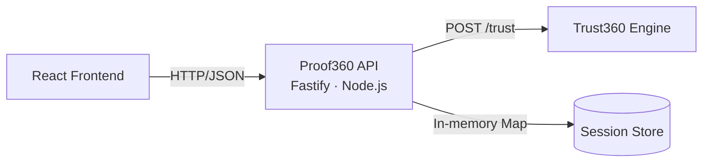
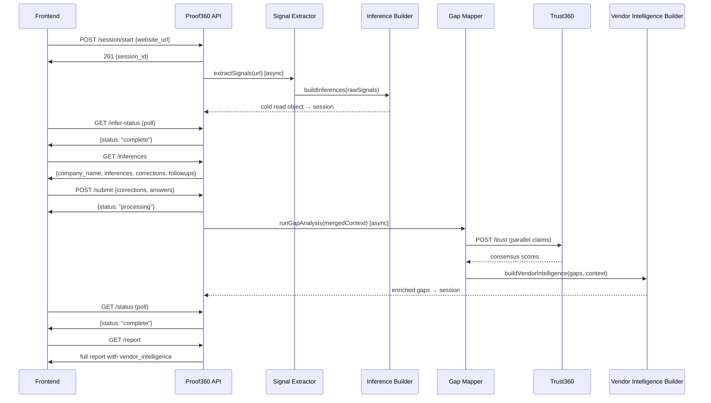

# Design Document: Proof360 API Cold Read

## Overview

The Proof360 API is a Fastify/Node.js adapter layer between the React frontend and the Trust360 reasoning engine. It implements the cold read assessment model: a founder submits a website URL or pitch deck, the system extracts signals and builds inferences automatically, the founder corrects misreads and answers targeted follow-up questions, and the system runs gap analysis to produce a trust readiness report with vendor intelligence per gap.

The API manages a 9-endpoint session lifecycle scoped to `/api/v1/`:

```
POST /session/start              → create session, begin signal extraction
GET  /session/:id/infer-status   → poll extraction progress
GET  /session/:id/inferences     → cold read object (inferences + corrections + follow-ups)
GET  /session/:id/followup-questions → follow-up questions only
POST /session/:id/submit         → corrections + answers, triggers gap analysis
GET  /session/:id/status         → poll analysis progress
GET  /session/:id/early-signal   → estimated score at Q4-equivalent threshold
POST /session/:id/capture-email  → email capture, unlocks Layer 2
GET  /session/:id/report         → full report with vendor intelligence
```

All business logic lives in the API. The frontend is a pure rendering layer. The Trust360 engine (POST /trust) is already built — this API translates business context into evaluable claims and renders the results.

The in-memory session store (Map-based, 24-hour TTL) is sufficient for MVP. No database.

## Architecture

### System Context



### Request Flow



### Async Pipeline Pattern

Two async pipelines run fire-and-forget after the synchronous response:

1. **Signal extraction pipeline** (triggered by `POST /session/start`):
   `extractSignals → buildInferences → update session (infer_status: complete)`

2. **Gap analysis pipeline** (triggered by `POST /session/:id/submit`):
   `mergeContext → evaluateGapTriggers → Trust360 claims (parallel) → confirmGaps → computeScore → buildVendorIntelligence → writeSignalsObject → update session (analysis_status: complete)`

Both pipelines catch errors and set the corresponding status to `"failed"`. The frontend polls status endpoints and handles failure states.

### Layer Structure

```
handlers/          → HTTP request/response, validation, session lookup
services/          → Business logic, stateless transforms, external calls
config/            → Static data: gap definitions, vendor catalog, framework map
```

Handlers are thin — validate input, call services, write session, return response. Services are pure functions or async operations with no HTTP awareness. Config files export static data structures.

## Components and Interfaces

### Handlers

#### session-start.js
```typescript
// POST /api/v1/session/start
// Input: { website_url?: string, deck_file?: string }
// Output: 201 { session_id: string }
// Error: 400 if neither website_url nor deck_file provided
// Side effect: fires async signal extraction pipeline
```

#### infer-status.js
```typescript
// GET /api/v1/session/:id/infer-status
// Output: { status: "processing" | "complete" | "failed" }
// Error: 404 if session not found or expired
```

#### inferences.js
```typescript
// GET /api/v1/session/:id/inferences
// Output: { company_name, source_summary, inferences[], correctable_fields[], followup_questions[] }
// Error: 404 if session not found, 409 if infer_status !== "complete"
```

#### followup-questions.js
```typescript
// GET /api/v1/session/:id/followup-questions
// Output: { followup_questions[] }
// Error: 404 if session not found, 409 if infer_status !== "complete"
```

#### submit.js
```typescript
// POST /api/v1/session/:id/submit
// Input: { corrections: Record<string, string>, followup_answers: Record<string, string> }
// Output: { status: "processing" }
// Error: 404 if session not found, 409 if infer_status !== "complete"
// Side effect: fires async gap analysis pipeline
```

#### status.js
```typescript
// GET /api/v1/session/:id/status
// Output: { status: "not_started" | "processing" | "complete" | "failed" }
// Error: 404 if session not found
```

#### early-signal.js
```typescript
// GET /api/v1/session/:id/early-signal
// Output: { estimated_trust_score: number, preliminary_deal_readiness: string }
// Error: 404 if session not found, 409 if insufficient signal data
```

#### capture-email.js
```typescript
// POST /api/v1/session/:id/capture-email
// Input: { email: string }
// Output: { success: true }
// Error: 400 if invalid email, 404 if session not found
// Side effect: sets layer2_locked=false, updates signals_object.email_captured=true
```

#### report.js
```typescript
// GET /api/v1/session/:id/report
// Output: full report object (see Data Models)
// Error: 404 if session not found, 409 if analysis_status !== "complete"
// Behavior: when layer2_locked=true, omit evidence and vendor_intelligence from gaps
```

### Services

#### signal-extractor.js
```typescript
extractSignals({ website_url, deck_file }): Promise<{ signals: RawSignal[], sources_read: string[] }>
```
For MVP, simulates extraction with plausible defaults. In production, calls Trust360 for LLM-based extraction from scraped pages / parsed PDF.

#### inference-builder.js
```typescript
buildInferences(signals: RawSignal[], sources_read: string[], website_url: string | null): ColdReadObject
```
Pure function. Maps raw signals to display inferences, builds correctable fields, generates follow-up questions for uninferred signal types.

#### context-normalizer.js
```typescript
normalizeContext(rawContext: Record<string, string>): NormalizedContext
```
Pure function. Normalises free-text values to internal enums: infrastructure strings → `"aws"|"gcp"|"azure"`, compliance variants → `"soc2"|"iso27001"`, boolean-ish strings → `true|false`, stage variants → canonical enum values.

#### gap-mapper.js
```typescript
runGapAnalysis(context: NormalizedContext): Promise<GapAnalysisResult>
```
Evaluates gap triggers, builds Trust360 claims, calls POST /trust in parallel, confirms gaps (MOS >= 7), computes trust_score and deal_readiness, writes signals_object.

#### trust-client.js
```typescript
evaluateClaim(claim: Trust360Claim): Promise<Trust360Response>
evaluateClaims(claims: Trust360Claim[]): Promise<Record<string, ClaimResult>>
```
HTTP client for Trust360 engine. 20-second timeout per call. Parallel execution for multiple claims.

#### vendor-selector.js
```typescript
selectVendors(gaps: Gap[]): MatchedVendor[]
```
Matches confirmed gaps to vendor catalog entries. Assigns priority based on gap severity.

#### vendor-intelligence-builder.js
```typescript
buildVendorIntelligence(gap: Gap, context: NormalizedContext): VendorIntelligence | null
```
Builds the full vendor_intelligence object per brief-vendors.md shape: quadrant, pick card, vendor grid, disclosure. Returns null for gaps with no mapped vendor category.

#### session-store.js
```typescript
createSession(input: { website_url?, deck_file? }): Session
getSession(id: string): Session | null
updateSession(id: string, updates: Partial<Session>): Session | null
deleteSession(id: string): void
```
In-memory Map with 24-hour TTL. `getSession` returns null for expired sessions and removes them from the store.

### Config

#### gaps.js
Exports `GAP_DEFINITIONS` array and `SEVERITY_WEIGHTS` map. Each gap definition contains: `id`, `severity`, `label`, `category`, `triggerCondition(context)`, `claimTemplate(context)`.

#### vendors.js
Exports `VENDORS` catalog (keyed by vendor_id) and `VENDOR_CATEGORIES` with quadrant axes and vendor positions.

#### frameworks.js
Exports `FRAMEWORK_MAP` from target customer types to applicable framework identifier arrays.


## Data Models

### Session Object

```javascript
{
  id: "uuid",                          // UUID v4
  website_url: "string | null",
  deck_file: "string | null",          // file path or buffer reference

  // Inference phase
  infer_status: "processing | complete | failed",
  raw_signals: [],                     // RawSignal[] from signal extractor
  inferences: [],                      // Inference[] from inference builder
  correctable_fields: [],              // CorrectableField[]
  followup_questions: [],              // FollowupQuestion[]
  company_name: "string",
  source_summary: "string",

  // Submission phase
  corrections: {},                     // Record<string, string>
  followup_answers: {},                // Record<string, string>

  // Analysis phase
  analysis_status: "null | processing | complete | failed",
  merged_context: {},                  // NormalizedContext
  gaps: [],                            // Gap[]
  trust_score: "number | null",        // 0-100
  deal_readiness: "string | null",     // ready | partial | not_ready

  // Vendor data
  vendor_intelligence: {},             // Record<gap_id, VendorIntelligence>

  // Report
  layer2_locked: true,                 // boolean, false after email capture

  // Signals object (non-negotiable — brief-strategy.md)
  signals_object: {},                  // SignalsObject

  // Email gate
  email: "string | null",

  // Metadata
  created_at: "number"                 // Date.now() timestamp
}
```

### RawSignal

```javascript
{
  type: "string",          // product_type | customer_type | data_sensitivity | infrastructure | stage | use_case | sector
  value: "string",         // extracted value
  confidence: "string"     // confident | likely | probable
}
```

### Inference (display object)

```javascript
{
  inference_id: "string",  // e.g. "inf_product_type"
  label: "string",         // human-readable, e.g. "B2B SaaS product"
  confidence: "string",    // confident | likely | probable
  category: "string"       // product | market | data | company | infrastructure | governance | identity
}
```

### CorrectableField

```javascript
{
  key: "string",           // field identifier: customer_type | data_sensitivity | infrastructure
  label: "string",         // display label
  inferred_value: "string" // default value from inference
}
```

### FollowupQuestion

```javascript
{
  question_id: "string",   // e.g. "q_identity"
  context: "string",       // why we're asking
  question: "string",      // the question text
  options: ["string"]      // always includes "Not sure"
}
```

### NormalizedContext

```javascript
{
  customer_type: "enterprise | mid_market | smb | consumer",
  data_sensitivity: "customer_data | financial_data | health_data | none",
  infrastructure: "aws | gcp | azure | unknown",
  identity_model: "password_only | mfa_only | sso | unknown",
  insurance_status: "active | none | planning | unknown",
  compliance_status: "soc2 | iso27001 | none | unknown",
  questionnaire_experience: "completed | stalled_deal | none | unknown",
  stage: "pre_revenue | seed | series_a | series_b | growth",
  sector: "string",
  use_case: "string"
}
```

### Gap Object (per brief-strategy.md — non-negotiable)

```javascript
{
  gap_id: "string",                    // e.g. "soc2"
  category: "string",                  // infrastructure | identity | governance | monitoring
  severity: "string",                  // critical | moderate | low
  title: "string",
  why: "string",                       // business-impact explanation
  risk: "string",                      // consequence description
  control: "string",                   // what closes this gap
  closure_strategies: ["string"],
  vendor_implementations: [{           // {vendor_name, url, notes}
    vendor_name: "string",
    url: "string",
    notes: "string"
  }],
  score_impact: "number",             // severity weight (critical=20, high=10, medium=5, low=2)
  confidence: "string",               // high | medium | low (from Trust360 MOS)
  evidence: [{                         // {source, citation}
    source: "string",
    citation: "string"
  }],
  time_estimate: "string",
  vendor_intelligence: {}              // VendorIntelligence | undefined (omitted when layer2_locked)
}
```

### VendorIntelligence (per brief-vendors.md — non-negotiable)

```javascript
{
  category_name: "string",             // e.g. "GRC & compliance automation"
  quadrant_axes: {
    x_left: "string",
    x_right: "string",
    y_top: "string",
    y_bottom: "string"
  },
  vendors: [{
    vendor_id: "string",
    display_name: "string",
    initials: "string",                // 1-2 chars
    x: "number",                       // 0.0-1.0 quadrant position
    y: "number",                       // 0.0-1.0 quadrant position
    is_partner: "boolean",
    is_pick: "boolean",                // exactly one per category
    deal_label: "string | null",
    best_for: "string",
    summary: "string",
    referral_url: "string | null"      // null for non-partners
  }],
  pick: {
    vendor_id: "string",
    stage_context: "string",           // e.g. "Seed stage · AWS stack"
    recommendation_headline: "string",
    recommendation_body: "string",     // first-person narrative
    meta: {
      time_to_close: "string",
      covers: "string",
      best_for: "string",
      what_wed_do_differently: "string"
    },
    cta_label: "string",
    deal_label: "string | null",
    referral_url: "string | null"
  },
  disclosure: "string"                 // names all partners, states referral arrangement
}
```

### SignalsObject (per brief-strategy.md — non-negotiable)

```javascript
{
  session_id: "string",
  company_name: "string",
  website: "string",                   // URL
  deck_uploaded: "boolean",
  stage: "string",
  sector: "string",
  primary_use_case: "string",
  questions_answered: [{
    question_id: "string",
    answer: "string"
  }],
  gaps: [],                            // Gap[] (same schema as above)
  trust_score: "number",               // 0-100
  deal_readiness: "string",            // ready | partial | not_ready
  email_captured: "boolean",
  timestamp: "string",                 // ISO datetime
  source: "string"                     // website | api | partner
}
```

### Report Response

```javascript
{
  session_id: "string",
  company_name: "string",
  assessed_at: "string",               // ISO datetime
  trust_score: "number",
  deal_readiness_label: "string",
  deal_readiness_score: "number",
  headline: {
    ready_count: "number",
    blocking_count: "number",
    summary_line: "string"
  },
  snapshot: {
    deal_blockers: "number",
    fundraising_risk: "number",
    strengths: "number"
  },
  gaps: [],                            // Gap[] with vendor_intelligence when unlocked
  strengths: [],                       // { category, label }[]
  next_steps: [{
    step_number: "number",
    title: "string",
    score_trajectory: "string",        // e.g. "70 → 81 (+11)"
    description: "string"
  }],
  layer2_locked: "boolean"
}
```

### Gap Definition (config/gaps.js)

```javascript
{
  id: "string",                        // e.g. "soc2"
  severity: "string",                  // critical | high | medium | low
  label: "string",                     // human-readable title
  category: "string",                  // governance | identity | infrastructure | monitoring
  triggerCondition: "(context) => boolean",
  claimTemplate: "(context) => { question: string, evidence: string }"
}
```

### Vendor Catalog Entry (config/vendors.js)

```javascript
{
  id: "string",
  display_name: "string",
  initials: "string",
  closes: ["string"],                  // gap IDs this vendor addresses
  cost_range: "string",
  timeline: "string",
  is_partner: "boolean",
  deal_label: "string | null",
  best_for: "string",
  summary: "string",
  referral_url: "string | null"
}
```

### Error Response (all endpoints)

```javascript
{
  error: "string",                     // human-readable message
  code: "string"                       // machine-readable error code
}
```


## Correctness Properties

*A property is a characteristic or behavior that should hold true across all valid executions of a system — essentially, a formal statement about what the system should do. Properties serve as the bridge between human-readable specifications and machine-verifiable correctness guarantees.*

### Property 1: Session creation produces valid initial state

*For any* valid input (website_url or deck_file or both), creating a session SHALL produce a session with a valid UUID v4 as its id, infer_status set to "processing", analysis_status set to null, layer2_locked set to true, and all other fields initialised to their default values.

**Validates: Requirements 1.1, 1.3**

### Property 2: Signal extraction output validity

*For any* website_url input, the signal extractor SHALL return signals that each contain a type (from the set: product_type, customer_type, data_sensitivity, infrastructure, stage, use_case, sector), a non-empty value string, and a confidence level from the set {confident, likely, probable}. *For any* deck_file input, the same invariants hold. The sources_read array SHALL be non-empty.

**Validates: Requirements 2.1, 2.2, 2.3**

### Property 3: Inference builder cold read object completeness

*For any* set of raw signals and sources, the inference builder SHALL produce an object where: (a) every raw signal maps to an inference with inference_id, label, confidence matching the signal's confidence, and category; (b) correctable_fields always includes entries for customer_type, data_sensitivity, and infrastructure; (c) follow-up questions are generated only for signal types NOT present in the raw signals (from the set: identity_model, insurance_status, questionnaire_experience); (d) every follow-up question's options array contains "Not sure"; (e) when no compliance or infrastructure evidence exists in raw signals, inferences include these at "probable" confidence.

**Validates: Requirements 4.2, 4.3, 4.4, 5.1, 5.2, 5.3, 5.4, 5.5**

### Property 4: Company name derivation from URL

*For any* valid URL string, the inference builder SHALL derive company_name from the URL's hostname (stripping "www." prefix and taking the first subdomain segment, capitalised). When no URL is provided, company_name SHALL default to a non-empty fallback string.

**Validates: Requirements 5.6**

### Property 5: Context merge — corrections override inferred values

*For any* session with inferred values and a set of corrections, the merged context SHALL contain the correction value for every field where a correction was provided, and the inferred value for every field where no correction was provided.

**Validates: Requirements 8.1**

### Property 6: Answer normalisation round-trip

*For any* known follow-up answer string (from the defined option sets for identity_model, insurance_status, questionnaire_experience), the normaliser SHALL map it to the corresponding internal enum value. The mapping SHALL be deterministic — the same input always produces the same output.

**Validates: Requirements 8.2**

### Property 7: Gap trigger evaluation matches context

*For any* normalised context object, the set of triggered gaps SHALL be exactly the set of gap definitions whose triggerCondition function returns true for that context. No gap SHALL be triggered if its condition returns false, and no gap SHALL be missed if its condition returns true.

**Validates: Requirements 9.1**

### Property 8: Trust360 MOS threshold determines gap confirmation

*For any* triggered gap with a Trust360 claim result, the gap SHALL be confirmed if and only if MOS >= 7. When Trust360 is unavailable (error/timeout), the gap SHALL be confirmed as fallback with a fallback flag set to true.

**Validates: Requirements 9.3, 9.4**

### Property 9: Trust score computation

*For any* set of confirmed gaps, the trust_score SHALL equal max(0, 100 - Σ severity_weights) where critical=20, high=10, medium=5, low=2. The deal_readiness SHALL be "ready" when trust_score >= 80, "partial" when 50 <= trust_score < 80, and "not_ready" when trust_score < 50.

**Validates: Requirements 9.5, 9.6**

### Property 10: Gap object schema conformance

*For any* confirmed gap, the gap object SHALL contain all fields defined in the brief-strategy.md schema: gap_id, category (from {infrastructure, identity, governance, monitoring}), severity (from {critical, moderate, low}), title, why, risk, control, closure_strategies (array), vendor_implementations (array of {vendor_name, url, notes}), score_impact (positive integer), confidence (from {high, medium, low}), evidence (array of {source, citation}), and time_estimate.

**Validates: Requirements 9.7**

### Property 11: Vendor intelligence shape and referral integrity

*For any* confirmed gap with a mapped vendor category, the vendor_intelligence object SHALL contain: category_name, quadrant_axes (with x_left, x_right, y_top, y_bottom), vendors array, pick object, and disclosure string. Each vendor entry SHALL have vendor_id, display_name, initials, x (0.0-1.0), y (0.0-1.0), is_partner, is_pick, deal_label, best_for, summary, and referral_url. *For any* vendor where is_partner is false, referral_url SHALL be null.

**Validates: Requirements 14.1, 14.2, 14.3, 14.4**

### Property 12: Exactly one pick per vendor category

*For any* vendor_intelligence object, exactly one vendor in the vendors array SHALL have is_pick set to true. The pick object's vendor_id SHALL match that vendor's vendor_id.

**Validates: Requirements 14.5**

### Property 13: Disclosure names all partner vendors

*For any* vendor_intelligence object, the disclosure string SHALL contain the display_name of every vendor in the vendors array where is_partner is true. When no partner vendors exist, the disclosure SHALL state that no referral arrangement exists.

**Validates: Requirements 14.7**

### Property 14: Signals object completeness

*For any* completed gap analysis, the signals object written to the session SHALL contain all fields per brief-strategy.md: session_id, company_name, website, deck_uploaded (boolean), stage, sector, primary_use_case, questions_answered (array), gaps (array), trust_score (integer 0-100), deal_readiness, email_captured (boolean), timestamp (ISO string), and source. After email capture, email_captured SHALL be true.

**Validates: Requirements 15.1, 15.2, 15.4**

### Property 15: Report response schema conformance

*For any* session with analysis_status "complete", the report endpoint SHALL return an object containing: session_id, company_name, assessed_at, trust_score, deal_readiness_label, deal_readiness_score, headline (with ready_count, blocking_count, summary_line), snapshot (with deal_blockers, fundraising_risk, strengths), gaps array, strengths array, next_steps array (each with step_number, title, score_trajectory, description), and layer2_locked boolean.

**Validates: Requirements 13.1, 13.2, 13.3, 13.4, 13.6**

### Property 16: Email validation rejects invalid formats

*For any* string that does not match a valid email format (missing @, missing domain, empty local part, etc.), the capture-email endpoint SHALL return HTTP 400. *For any* valid email string, it SHALL return { success: true } and update the session.

**Validates: Requirements 12.1, 12.2, 12.4**

### Property 17: Session expiry at 24-hour TTL

*For any* session with a created_at timestamp older than 24 hours, getSession SHALL return null and the session SHALL be removed from the store. Sessions younger than 24 hours SHALL be retrievable.

**Validates: Requirements 16.1**

### Property 18: Gap definition and claim template structure

*For any* gap definition in the catalog, it SHALL contain id, severity, label, category, a triggerCondition function, and a claimTemplate function. *For any* context object passed to a claimTemplate, the result SHALL contain a question string, an evidence string, and when wrapped with metadata, SHALL include gapId and severity.

**Validates: Requirements 18.1, 18.3**

### Property 19: Vendor catalog entry structure

*For any* vendor in the catalog, the entry SHALL contain: id, display_name, initials, closes (non-empty array of gap IDs), cost_range, timeline, is_partner (boolean), deal_label, best_for, summary, and referral_url. *For any* vendor where is_partner is false, referral_url SHALL be null.

**Validates: Requirements 19.2**

### Property 20: Endpoint status codes for non-existent sessions

*For any* random UUID that does not correspond to an existing session, all GET and POST endpoints that take a session :id parameter SHALL return HTTP 404.

**Validates: Requirements 3.2, 6.3, 7.3, 10.2, 11.3, 12.3, 13.8**

### Property 21: Endpoint 409 for premature requests

*For any* session where infer_status is not "complete", GET /inferences, GET /followup-questions, and POST /submit SHALL return HTTP 409. *For any* session where analysis_status is not "complete", GET /report SHALL return HTTP 409. *For any* session where analysis_status is null, GET /status SHALL return { status: "not_started" }.

**Validates: Requirements 4.5, 6.2, 7.2, 10.3, 13.7**

## Error Handling

### Error Response Format

All errors return a consistent JSON shape:

```javascript
{ error: "Human-readable message", code: "MACHINE_READABLE_CODE" }
```

### Error Codes

| Code | HTTP | Condition |
|------|------|-----------|
| `SESSION_NOT_FOUND` | 404 | Session ID does not exist or has expired |
| `INVALID_INPUT` | 400 | Missing required fields (no URL or deck) |
| `INVALID_EMAIL` | 400 | Email format validation failed |
| `NOT_READY` | 409 | Requested resource not yet available (infer_status or analysis_status not complete) |
| `EXTRACTION_FAILED` | 500 | Signal extraction pipeline failed (logged, session marked failed) |
| `ANALYSIS_FAILED` | 500 | Gap analysis pipeline failed (logged, session marked failed) |
| `TRUST360_UNAVAILABLE` | — | Trust360 engine unreachable (not surfaced to client — gaps confirmed as fallback) |

### Trust360 Failure Strategy

Trust360 unavailability never blocks the pipeline. When POST /trust fails or times out (20s):
- The triggered gap is confirmed as fallback
- A `fallback: true` flag is set on the claim result
- The gap proceeds through scoring and vendor intelligence as normal
- Structured JSON is logged with trace_id, session_id, gap_id, error

### Async Pipeline Error Handling

Both async pipelines (signal extraction and gap analysis) wrap their entire execution in try/catch:
- On failure: set the corresponding status field to `"failed"`, log structured error
- The frontend detects failure via polling and shows a retry option
- No partial state is written — either the pipeline completes fully or the status is "failed"

### Structured Logging

All pipeline stages log JSON with: `trace_id`, `session_id`, `stage`, `duration_ms`, and relevant context. Errors include the full error message and stack trace.

## Testing Strategy

### Testing Framework

- **Test runner**: Node.js built-in test runner (`node:test`) or Vitest
- **Property-based testing**: [fast-check](https://github.com/dubzzz/fast-check) — the standard PBT library for JavaScript/TypeScript
- **HTTP testing**: Fastify's `inject()` method for handler-level tests without starting a server

### Dual Testing Approach

**Unit tests** cover:
- Specific examples: known URL → expected company name, known answer → expected enum
- Edge cases: empty body → 400, expired session → 404, premature request → 409
- Integration points: handler → service → session store flow
- Error conditions: Trust360 timeout, extraction failure

**Property tests** cover:
- All 21 correctness properties defined above
- Each property test runs minimum 100 iterations with fast-check
- Each test is tagged with: `Feature: proof360-api-cold-read, Property {N}: {title}`

### Property Test Configuration

```javascript
import fc from 'fast-check';

// Minimum 100 iterations per property
const PBT_CONFIG = { numRuns: 100 };

// Example tag format in test description:
// "Feature: proof360-api-cold-read, Property 9: Trust score computation"
```

### Key Generators (fast-check arbitraries)

- **urlArbitrary**: generates valid HTTP/HTTPS URLs with realistic hostnames
- **rawSignalArbitrary**: generates RawSignal objects with valid type/value/confidence combinations
- **contextArbitrary**: generates NormalizedContext objects with valid enum values for all fields
- **gapSetArbitrary**: generates arrays of confirmed Gap objects with valid severity/category combinations
- **emailArbitrary**: generates valid and invalid email strings
- **correctionArbitrary**: generates correction objects that override specific fields
- **vendorArbitrary**: generates vendor catalog entries with valid structure

### Test Organisation

```
proof360/api/test/
  unit/
    session-store.test.js
    inference-builder.test.js
    context-normalizer.test.js
    gap-mapper.test.js
    vendor-intelligence-builder.test.js
    trust-client.test.js
  property/
    session-lifecycle.property.test.js
    inference-builder.property.test.js
    context-merge.property.test.js
    gap-analysis.property.test.js
    score-computation.property.test.js
    vendor-intelligence.property.test.js
    signals-object.property.test.js
    report-schema.property.test.js
    email-validation.property.test.js
    endpoint-errors.property.test.js
  integration/
    full-flow.test.js
```

### Build Phase Verification

Each build phase has a verification gate before proceeding:

- **Phase 1**: POST /session/start returns session_id, GET /inferences returns cold read object
- **Phase 2**: Full flow start → inferences → submit → status === complete
- **Phase 3**: GET /report returns complete shape including vendor_intelligence
- **Phase 4**: Email capture unlocks Layer 2 fields in report response
