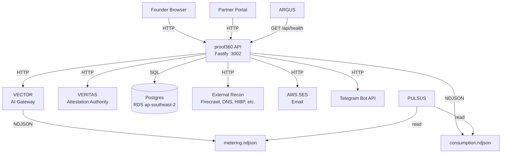
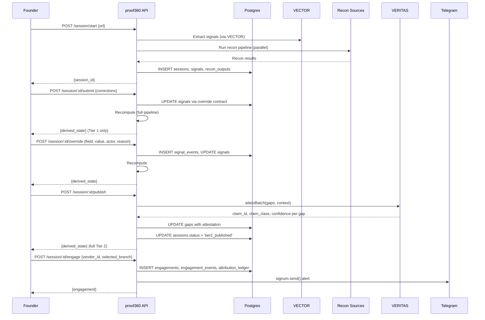
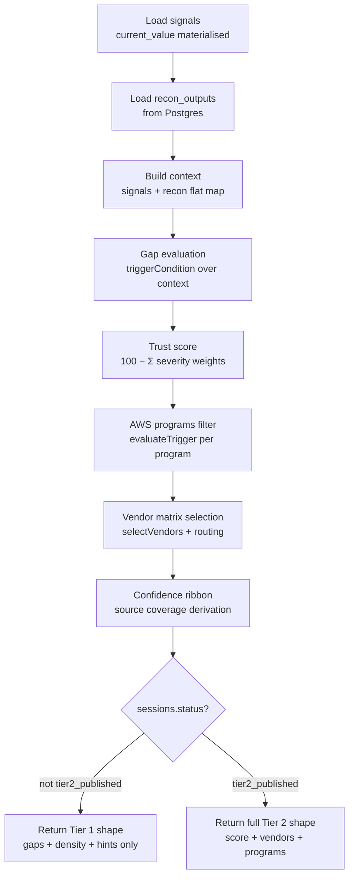

# Design Document — proof360 v3.0

## Overview

proof360 v3.0 transforms the platform from an in-memory, NDJSON-backed diagnostic tool into a Postgres-persisted, deterministic signal correction engine with governed claim escalation and commercial routing. The build is a 10-phase hard-sequenced delivery governed by two constitutional doctrines:

1. **Compute centralised, rendering distributed.** Backend owns signals (state), recompute (truth), and the attestation boundary. Frontends receive derived state and render. They shall not compute. They shall not mutate truth.
2. **Mutation gated, reads unrestricted.** Reading derived state carries no contract beyond authentication. Mutating truth carries a single contract: the structured override-submission shape. Every mutation surface uses the same shape.

The doctrine pair stated tightly: *All decisions are derived. All mutations are explicit. All truth is replayable.*

Source of truth: `docs/proof360-v3-convergence-locked.md` (architecture lock) and `docs/kiro-build-brief-v3.md` (build brief). When this document contradicts the lock, the lock wins.

### Design Rationale

The current system stores sessions in an in-memory Map with NDJSON append for leads. Trust evaluation uses a fallback-confirm-all pattern (trust-client.js confirms all gaps when Trust360 is unavailable). The frontend computes signal status colours and renders vendor recommendations from local state. These patterns violate both doctrines and cannot support editable reports, governed attestation, or commercial routing.

v3.0 replaces each violation:
- In-memory → Postgres (persistent, replayable state)
- Fallback-confirm-all → VERITAS hard-fail (governed attestation)
- Frontend computation → server-side recompute kernel (centralised truth)
- Ad-hoc writes → override contract (gated mutation)

### Technology Constraints

- **Backend:** Fastify (existing), `pg` for Postgres (no ORM), vitest for testing
- **Frontend:** React 19 (existing), no new frontend dependencies
- **External services:** VECTOR for all LLM inference, VERITAS for attestation, SES for email
- **Infrastructure:** RDS Postgres (ap-southeast-2), SSM for secrets, existing EC2/Nginx deployment

---

## Architecture

### System Context



### Request Flow — Session Lifecycle



### Two-Speed Architecture

The recompute kernel and VERITAS attestation are deliberately separated:

- **Fast path (recompute):** Pure function over persisted signals + recon_outputs. No external calls. Sub-second response. Runs on every override.
- **Slow path (attestation):** VERITAS HTTP calls with 30s per-gap timeout. Runs only on publish/republish. May take 30+ seconds for a batch.

This separation is constitutional per lock §4.

---

## Components and Interfaces

### Phase 1 — Postgres Foundation

#### New Files

| File | Purpose |
|------|---------|
| `api/db/migrations/001_v3_schema.sql` | DDL for all 10 tables |
| `api/src/db/pool.js` | Single Postgres connection pool, env-driven, no ORM |

#### Modified Files

| File | Change |
|------|--------|
| `api/src/services/session-store.js` | Add parallel Postgres writes alongside in-memory Map |
| `api/src/handlers/submit.js` | Write `signals` rows to Postgres alongside in-memory state |
| `api/src/handlers/capture-email.js` | Write `leads` rows to Postgres alongside NDJSON |
| `api/package.json` | Add `pg` dependency |

#### `api/src/db/pool.js` Interface

```js
// Single Postgres pool — credentials from SSM /proof360/postgres/*
import pg from 'pg';

const pool = new pg.Pool({
  host: process.env.PG_HOST,
  port: parseInt(process.env.PG_PORT || '5432'),
  database: process.env.PG_DATABASE || 'proof360',
  user: process.env.PG_USER,
  password: process.env.PG_PASSWORD,
  max: 10,
  idleTimeoutMillis: 30000,
});

export default pool;
export const query = (text, params) => pool.query(text, params);
```

### Phase 2 — VECTOR Contract + Consumption Ledger

#### New Files

| File | Purpose |
|------|---------|
| `api/src/services/consumption-emitter.js` | Record non-VECTOR external API consumption to NDJSON |

#### Modified Files

| File | Change |
|------|--------|
| `api/src/services/signal-extractor.js` | Pass `correlation_id`, emit Firecrawl consumption |
| `api/src/services/trust-client.js` | Pass `tenant_id`, `session_id`, `correlation_id` on VECTOR calls |
| `api/src/services/nim-client.js` | Pass `correlation_id` on VECTOR calls |
| `api/src/services/recon-dns.js` | Emit consumption record |
| `api/src/services/recon-http.js` | Emit consumption record |
| `api/src/services/recon-certs.js` | Emit consumption record |
| `api/src/services/recon-ip.js` | Emit consumption record |
| `api/src/services/recon-github.js` | Emit consumption record |
| `api/src/services/recon-jobs.js` | Emit consumption record |
| `api/src/services/recon-hibp.js` | Emit consumption record |
| `api/src/services/recon-ports.js` | Emit consumption record |
| `api/src/services/recon-ssllabs.js` | Emit consumption record |
| `api/src/services/recon-abuseipdb.js` | Emit consumption record |
| `VECTOR/src/metering/metering-emitter.js` | Add `correlation_id` field to MeteringRecord |

#### `consumption-emitter.js` Interface

```js
/**
 * Record a non-VECTOR external API call to consumption.ndjson.
 * @param {{ session_id: string, source: string, units: number, unit_type: string, success: boolean, error?: string }} record
 */
export function record({ session_id, source, units, unit_type, success, error }) { ... }
```

#### VECTOR Call Shape (all proof360 calls)

```js
{
  tenant_id: 'proof360',           // or partner tenant_id
  session_id: '<session uuid>',
  correlation_id: '<session uuid>' // same as session_id for proof360
}
```

### Phase 3 — Override Contract

#### New Files

| File | Purpose |
|------|---------|
| `api/src/handlers/override.js` | `POST /api/v1/session/:id/override` handler |
| `api/src/handlers/resolve-conflict.js` | `POST /api/v1/session/:id/resolve-conflict` handler |
| `api/src/services/signal-store.js` | Override stack management, conflict detection |

#### Modified Files

| File | Change |
|------|--------|
| `api/src/server.js` | Register `/override` and `/resolve-conflict` routes |


#### API Contract — Override

```
POST /api/v1/session/:id/override
Content-Type: application/json

Request:
{
  "field": "stage",
  "value": "Series A",
  "actor": "founder",
  "reason": "user override"
}

Response (200):
{
  "derived_state": { ... full recompute result ... }
}

Response (404):
{ "error": "Session not found" }

Response (400):
{ "error": "Missing required field: field, value, actor" }
```

#### API Contract — Resolve Conflict

```
POST /api/v1/session/:id/resolve-conflict
Content-Type: application/json

Request:
{
  "field": "stage",
  "chosen_value": "Series A",
  "actor": "founder",
  "reason": "founder confirmed correct value"
}

Response (200):
{
  "derived_state": { ... full recompute result ... }
}

Response (409):
{ "error": "Signal is not in conflicted status" }
```

#### Override Stack Rules (enforced server-side in `signal-store.js`)

1. System overrides shall never beat human overrides (rescans shall not undo edits)
2. Overrides are append-only via `signal_events`
3. Latest human override = `current_value`
4. Cross-actor conflict (founder vs partner) → `status = 'conflicted'`, no silent merge
5. Recompute uses only `current_value`
6. Conflict resolution requires explicit `POST /resolve-conflict`; no automatic merging

#### `signal-store.js` Interface

```js
/**
 * Apply an override to a signal field.
 * @param {string} sessionId
 * @param {{ field: string, value: string, actor: string, reason: string }} override
 * @returns {Promise<{ signal: object, event: object, conflicted: boolean }>}
 */
export async function applyOverride(sessionId, override) { ... }

/**
 * Resolve a conflicted signal.
 * @param {string} sessionId
 * @param {{ field: string, chosen_value: string, actor: string, reason: string }} resolution
 * @returns {Promise<{ signal: object, event: object }>}
 */
export async function resolveConflict(sessionId, resolution) { ... }

/**
 * Load all signals for a session with current_value materialised.
 * @param {string} sessionId
 * @returns {Promise<object[]>}
 */
export async function loadSignals(sessionId) { ... }
```

### Phase 4 — Deterministic Recompute Kernel

#### New Files

| File | Purpose |
|------|---------|
| `api/src/services/recompute.js` | Pure function: signals + recon_outputs → derived_state |
| `api/src/handlers/recompute.js` | `POST /api/v1/session/:id/recompute` endpoint wrapper |

#### Modified Files

| File | Change |
|------|--------|
| `api/src/server.js` | Register `/recompute` route |

#### API Contract — Recompute

```
POST /api/v1/session/:id/recompute

Response (200):
{
  "derived_state": {
    "session_id": "<uuid>",
    "status": "active|tier1|tier2_published",

    // Always present (Tier 1)
    "gaps": [{
      "id": "<uuid>",
      "gap_def_id": "soc2",
      "description": "SOC 2 certification gap",
      "confidence": "high|medium|low",
      "evidence_summary": "...",
      "severity": "critical|high|medium|low",
      "framework_impact": [...],
      "remediation": [...]
    }],
    "density": { "total": 14, "high": 6, "medium": 5, "low": 3 },
    "directional_hints": ["compliance posture appears partial", ...],
    "confidence_ribbon": { "overall": "medium", "sources_attempted": 10, "sources_succeeded": 8 },

    // Tier 2 only (null when status != 'tier2_published')
    "trust_score": 62,
    "vendor_recommendations": [{
      "vendor_id": "vanta",
      "display_name": "Vanta",
      "closes_gaps": ["soc2"],
      "priority": "start_here",
      "routing_options": {
        "primary": { "party": "john", "type": "internal", "label": "Book via Proof360" },
        "alternatives": [{ "party": "distributor", "tenant_id": "...", "type": "distributor", "label": "Via Ingram" }]
      },
      "veritas_class": "ATTESTED",
      "veritas_confidence": 0.92
    }],
    "aws_programs": [{
      "program_id": "activate_founders",
      "name": "AWS Activate Founders",
      "benefit": "$1,000 AWS credits + Developer Support",
      "confidence": "high"
    }],
    "engagement_router": { ... }
  }
}
```

#### Recompute Kernel Pipeline (`recompute.js`)



#### `recompute.js` Interface

```js
/**
 * Deterministic recompute kernel. Pure function.
 * SHALL NOT make external calls.
 * SHALL NOT perform partial recompute.
 * Idempotent: same inputs → identical output.
 *
 * @param {{ signals: object[], recon_outputs: object[], session: object, gaps_config: object[], vendors_config: object, aws_programs: object[] }} input
 * @returns {{ derived_state: object }}
 */
export function recompute(input) { ... }
```

### Phase 5 — Tier Boundary + VERITAS Full Adapter

#### New Files

| File | Purpose |
|------|---------|
| `api/src/services/veritas-adapter.js` | Translation layer: proof360 → VERITAS evidence/claim API |
| `api/src/services/veritas-client.js` | Thin HTTP wrapper for VERITAS endpoints |
| `api/src/handlers/publish.js` | `POST /api/v1/session/:id/publish` handler |

#### Modified Files

| File | Change |
|------|--------|
| `api/src/services/recompute.js` | Tier 1/Tier 2 conditional rendering based on `sessions.status` |
| `api/src/handlers/inferences.js` | Strip Tier 2 fields server-side |
| `api/src/server.js` | Register `/publish` route |

#### API Contract — Publish

```
POST /api/v1/session/:id/publish

Response (200):
{
  "derived_state": { ... full Tier 2 derived_state ... }
}

Response (503):
{
  "error": "veritas_unavailable",
  "message": "Tier-2 attestation could not complete. Please retry.",
  "failed_gaps": ["soc2", "mfa"],
  "partial_results": [{ "gap_id": "cyber_insurance", "claim_id": "...", "claim_class": "ATTESTED" }]
}
```

#### VERITAS Adapter Interface (`veritas-adapter.js`)

```js
/**
 * Attest a single gap against VERITAS.
 * Retries with exponential backoff (1s, 2s, 4s) up to 3 retries.
 * Per-gap timeout: 30s.
 */
export async function attest(gap, sessionContext) { ... }

/**
 * Attest a batch of gaps in parallel via Promise.allSettled.
 * Partial failures preserved — successful attestations retain claim_id.
 */
export async function attestBatch(gaps, sessionContext) { ... }

/**
 * Identify gaps requiring re-attestation after signal changes.
 * Returns gaps that depend on at least one changed signal.
 */
export function gapsRequiringReattestation(allGaps, changedSignalIds) { ... }
```

#### VERITAS Evidence Submission Shape

```json
{
  "predicate": "soc2",
  "projection": "claim_template_text",
  "content": {
    "signals": [{ "field": "compliance_status", "value": "none", "source": "founder", "confidence": "high" }],
    "recon_evidence": { "dmarc_policy": "none", "has_hsts": false },
    "gap_evidence": { "source": "assessment", "citation": "..." }
  },
  "tenant_id": "<proof360 tenant uuid>",
  "freshness_ttl": 86400
}
```

#### Render Mapping (enforced server-side in recompute kernel)

| VERITAS class | Confidence | Vendor matrix inclusion | UI treatment |
|---|---|---|---|
| ATTESTED | > 0.85 | Yes | Standard rendering |
| ATTESTED | ≤ 0.85 | Yes, with caveat | "Attested with moderate confidence" |
| INFERRED | any | No | "Inferred — not yet attested" |
| UNKNOWN | any | No | "Insufficient evidence to attest" |

### Phase 6 — Engagement System

#### New Files

| File | Purpose |
|------|---------|
| `api/src/handlers/engage.js` | `POST /api/v1/session/:id/engage` handler |
| `api/src/services/engagement-router.js` | Three-branch routing logic |

#### Modified Files

| File | Change |
|------|--------|
| `api/src/config/vendors.js` | Add `routing(context)` function per vendor |
| `api/src/server.js` | Register `/engage` route |

#### API Contract — Engage

```
POST /api/v1/session/:id/engage
Content-Type: application/json

Request:
{
  "vendor_id": "vanta",
  "selected_branch": "distributor"
}

Response (200):
{
  "engagement_id": "<uuid>",
  "status": "routed",
  "routed_to": { "tenant_id": "...", "name": "Ingram Micro AU" }
}

Response (409):
{ "error": "Session not yet published to Tier 2" }
```

#### Per-Vendor Routing Shape (in `config/vendors.js`)

```js
// Added to each vendor entry:
routing: (context) => ({
  primary: {
    party: 'john',           // 'john' | 'distributor' | 'vendor'
    type: 'internal',        // 'internal' | 'distributor' | 'direct'
    label: 'Book via Proof360',
    template: 'hubspot_booking',
    url: 'https://meetings.hubspot.com/john3174'
  },
  alternatives: [{
    party: 'distributor',
    tenant_id: '<ingram_tenant_uuid>',
    type: 'distributor',
    label: 'Via Ingram Micro',
    contact: 'partner@ingram.com.au'
  }]
})
```

The recompute kernel calls `vendor.routing(context)` for each vendor and includes the result in `derived_state.vendor_recommendations[i].routing_options`. Routing logic executes inside the recompute kernel — compute stays centralised. The frontend shall not evaluate routing functions.

#### Engagement Routing Rules

1. `john` → internal handling, John commission attribution
2. `distributor` → match `tenants.partner_branch = 'distributor'`, ordered by `priority NULLS LAST, created_at`, select first result. Shall not route randomly.
3. `vendor` → direct attribution, no routing intermediary

### Phase 7 — Frontend

#### New Files

| File | Purpose |
|------|---------|
| `frontend/src/components/OverridePanel.jsx` | Right-hand signal correction panel |
| `frontend/src/components/EngagementRouter.jsx` | Per-vendor routing UI |

#### Modified Files

| File | Change |
|------|--------|
| `frontend/src/pages/Report.jsx` | Tier 1/Tier 2 binary rendering, publish button, loading spinner |
| `frontend/src/pages/AuditColdRead.jsx` | Tier 1 rendering (no score) |

#### Frontend Doctrine Rules

- The frontend shall not contain arithmetic operators for scoring, filtering, or gap evaluation
- The frontend shall render only `derived_state` JSON from the recompute kernel
- The frontend shall not evaluate routing functions or conditions
- All routing options come pre-resolved from `derived_state`

### Phase 8 — Postgres Read Switch

#### Modified Files

| File | Change |
|------|--------|
| `api/src/handlers/inferences.js` | Read from Postgres instead of in-memory |
| `api/src/handlers/report.js` | Read from Postgres |
| `api/src/handlers/early-signal.js` | Read from Postgres |
| `api/src/handlers/admin-preread.js` | Read from Postgres |
| `api/src/handlers/program-match.js` | Read from Postgres + fix `signals_object`/`signals` key collision |
| `api/src/services/session-store.js` | Becomes write-through cache; reads from Postgres |

### Phase 9 — Backfill

#### New Files

| File | Purpose |
|------|---------|
| `scripts/backfill-leads.js` | Replay `leads.ndjson` → `leads` Postgres table |

### Phase 10 — Cleanup + Out-of-Band Fixes

#### New Files

| File | Purpose |
|------|---------|
| `api/src/services/signum-stub.js` | 3-line Telegram alert wrapper |
| `api/tests/property/recompute.property.test.js` | Recompute determinism property tests |
| `api/tests/property/override.property.test.js` | Override stack invariant property tests |
| `api/tests/property/veritas-adapter.property.test.js` | VERITAS render mapping property tests |
| `api/tests/property/tier-boundary.property.test.js` | Tier boundary property tests |
| `api/tests/unit/engagement-router.test.js` | Engagement routing unit tests |
| `api/tests/unit/veritas-adapter.test.js` | VERITAS adapter unit tests |

#### Modified Files

| File | Change |
|------|--------|
| `api/src/handlers/capture-email.js` | Wire SES integration |
| `frontend/src/pages/Portal.jsx` | Replace hardcoded Auth0 dev-tenant with env-driven config |
| `ARGUS/config/services.json` | Update proof360 health endpoint to `/api/health` |

#### Deleted Files

| File | Reason |
|------|--------|
| `api/src/services/gpu-manager.js` | Dead code — NIM runs via VECTOR hosted free tier |

#### `signum-stub.js` Interface

```js
/**
 * 3-line stub — direct Telegram while SIGNUM is pre-build.
 * Replaceable by full SIGNUM without changing call site.
 */
export async function send({ channel, to, message }) {
  await fetch(`https://api.telegram.org/bot${process.env.TELEGRAM_BOT_TOKEN}/sendMessage`, {
    method: 'POST',
    headers: { 'Content-Type': 'application/json' },
    body: JSON.stringify({ chat_id: to, text: message })
  });
}
```

---

## Data Models

### Postgres Schema

All tables per convergence lock §5. Migration stored at `api/db/migrations/001_v3_schema.sql`.

#### Relational Tables

```sql
-- Sessions
CREATE TABLE sessions (
  id UUID PRIMARY KEY DEFAULT gen_random_uuid(),
  tenant_id UUID REFERENCES tenants(id),
  url TEXT,
  created_at TIMESTAMPTZ NOT NULL DEFAULT now(),
  updated_at TIMESTAMPTZ NOT NULL DEFAULT now(),
  status TEXT NOT NULL DEFAULT 'active'
    CHECK (status IN ('active', 'tier1', 'tier2_published', 'expired'))
);

-- Signals
CREATE TABLE signals (
  id UUID PRIMARY KEY DEFAULT gen_random_uuid(),
  session_id UUID NOT NULL REFERENCES sessions(id),
  field TEXT NOT NULL,
  inferred_value TEXT,
  inferred_source TEXT,
  inferred_at TIMESTAMPTZ,
  current_value TEXT,
  current_actor TEXT,
  status TEXT NOT NULL DEFAULT 'inferred'
    CHECK (status IN ('inferred', 'overridden', 'conflicted')),
  UNIQUE (session_id, field)
);

-- Gaps
CREATE TABLE gaps (
  id UUID PRIMARY KEY DEFAULT gen_random_uuid(),
  session_id UUID NOT NULL REFERENCES sessions(id),
  gap_def_id TEXT NOT NULL,
  triggered BOOLEAN NOT NULL DEFAULT false,
  severity TEXT,
  framework_impact JSONB,
  evidence JSONB,
  veritas_claim_id UUID,
  veritas_class TEXT CHECK (veritas_class IN ('ATTESTED', 'INFERRED', 'UNKNOWN') OR veritas_class IS NULL),
  veritas_confidence NUMERIC,
  attested_at TIMESTAMPTZ
);

-- Tenants
CREATE TABLE tenants (
  id UUID PRIMARY KEY DEFAULT gen_random_uuid(),
  name TEXT NOT NULL,
  email_domains TEXT[],
  vendor_catalog_filter TEXT[],
  partner_branch TEXT CHECK (partner_branch IN ('distributor', 'vendor', 'internal')),
  priority INTEGER,
  created_at TIMESTAMPTZ NOT NULL DEFAULT now()
);

-- Recon Outputs (lock §5 amendment)
CREATE TABLE recon_outputs (
  id UUID PRIMARY KEY DEFAULT gen_random_uuid(),
  session_id UUID NOT NULL REFERENCES sessions(id),
  source TEXT NOT NULL
    CHECK (source IN ('dns', 'http', 'certs', 'ip', 'github', 'jobs', 'hibp', 'ports', 'ssllabs', 'abuseipdb')),
  payload JSONB NOT NULL,
  fetched_at TIMESTAMPTZ NOT NULL DEFAULT now(),
  ttl_seconds INTEGER NOT NULL DEFAULT 3600,
  UNIQUE (session_id, source)
);

-- Engagements
CREATE TABLE engagements (
  id UUID PRIMARY KEY DEFAULT gen_random_uuid(),
  session_id UUID NOT NULL REFERENCES sessions(id),
  selected_branch TEXT NOT NULL CHECK (selected_branch IN ('john', 'distributor', 'vendor')),
  routed_tenant_id UUID REFERENCES tenants(id),
  vendor_id TEXT,
  status TEXT NOT NULL DEFAULT 'created'
    CHECK (status IN ('created', 'routed', 'accepted', 'rejected', 'converted')),
  created_at TIMESTAMPTZ NOT NULL DEFAULT now()
);

-- Leads
CREATE TABLE leads (
  id UUID PRIMARY KEY DEFAULT gen_random_uuid(),
  session_id UUID NOT NULL REFERENCES sessions(id),
  email TEXT NOT NULL,
  captured_at TIMESTAMPTZ NOT NULL DEFAULT now(),
  source TEXT
);
```

#### Append-Only Event Tables

```sql
-- Signal Events (input mutation audit)
CREATE TABLE signal_events (
  id UUID PRIMARY KEY DEFAULT gen_random_uuid(),
  signal_id UUID NOT NULL REFERENCES signals(id),
  event_type TEXT NOT NULL
    CHECK (event_type IN ('inferred', 'overridden', 'rescanned', 'conflict_resolved')),
  actor TEXT NOT NULL,
  reason TEXT,
  prior_value TEXT,
  new_value TEXT,
  ts TIMESTAMPTZ NOT NULL DEFAULT now()
);

-- Engagement Events (commercial state transition audit)
CREATE TABLE engagement_events (
  id UUID PRIMARY KEY DEFAULT gen_random_uuid(),
  engagement_id UUID NOT NULL REFERENCES engagements(id),
  event_type TEXT NOT NULL
    CHECK (event_type IN ('created', 'routed', 'accepted', 'rejected', 'converted')),
  actor TEXT NOT NULL,
  metadata JSONB,
  ts TIMESTAMPTZ NOT NULL DEFAULT now()
);

-- Attribution Ledger (money tracking)
CREATE TABLE attribution_ledger (
  id UUID PRIMARY KEY DEFAULT gen_random_uuid(),
  engagement_id UUID NOT NULL REFERENCES engagements(id),
  party TEXT NOT NULL,
  share_percentage NUMERIC,
  expected_amount NUMERIC,
  expected_date DATE,
  confirmed_amount NUMERIC,
  confirmed_date DATE,
  received_amount NUMERIC,
  received_date DATE,
  status TEXT NOT NULL DEFAULT 'expected'
    CHECK (status IN ('expected', 'confirmed', 'received', 'disputed'))
);
```

#### Indexes

```sql
CREATE INDEX idx_signals_session ON signals(session_id);
CREATE INDEX idx_gaps_session ON gaps(session_id);
CREATE INDEX idx_recon_outputs_session ON recon_outputs(session_id);
CREATE INDEX idx_signal_events_signal ON signal_events(signal_id);
CREATE INDEX idx_engagement_events_engagement ON engagement_events(engagement_id);
CREATE INDEX idx_attribution_engagement ON attribution_ledger(engagement_id);
CREATE INDEX idx_engagements_session ON engagements(session_id);
CREATE INDEX idx_leads_session ON leads(session_id);
CREATE INDEX idx_tenants_branch ON tenants(partner_branch);
```

### Consumption Ledger Shape (NDJSON)

```json
{
  "session_id": "<uuid>",
  "source": "firecrawl|hibp|abuseipdb|github|ssllabs|crtsh|ipapi|portscan|jobs|dns|http",
  "units": 5,
  "unit_type": "credits|api_calls|queries",
  "success": true,
  "error": null,
  "timestamp": "2026-04-26T14:32:11Z"
}
```

### VECTOR Metering Record (amended)

```json
{
  "tenant": "proof360",
  "model": "claude-haiku-4-5-20251001",
  "provider": "anthropic",
  "tokens": { "prompt": 2143, "completion": 487, "total": 2630 },
  "sovereignty_tier": "non-sovereign",
  "route_decision": "anthropic",
  "correlation_id": "<session_uuid>",
  "timestamp": "2026-04-26T14:32:11Z"
}
```

### Audit Boundary Separation

Three distinct audit domains. They reference each other; they shall never mirror.

| Domain | Owner | Unit | Replay path |
|---|---|---|---|
| `signal_events` | proof360 | input mutation | Reconstruct override stack chronologically; replay recompute against any historical state |
| `engagement_events` | proof360 | commercial state transition | Reconstruct lifecycle: created → routed → accepted → converted |
| VERITAS claims | VERITAS | governed truth | Query claim provenance via VERITAS API; proof360 holds `claim_id` reference only |

`signal_events` shall not duplicate VERITAS claim history. `engagement_events` shall not duplicate `attribution_ledger` data. Each table has one ownership domain.


---

## Correctness Properties

*A property is a characteristic or behavior that should hold true across all valid executions of a system — essentially, a formal statement about what the system should do. Properties serve as the bridge between human-readable specifications and machine-verifiable correctness guarantees.*

### Property Reflection

Before writing properties, redundancy was eliminated:

- Requirements 7.1 and 7.2 both test the Tier 1 boundary from opposite directions (what IS returned vs what is NOT returned). These are combined into one comprehensive property.
- Requirements 9.1, 9.2, 9.3, 9.4 all test the VERITAS render mapping. These are combined into one property that covers all four cases.
- Requirements 5.4 and 5.5 both test override stack head computation. Combined into one property.
- Requirements 10.1 and 10.2 both test republish re-attestation. Combined into one property.
- Requirements 2.1, 2.2, 2.3 all test the parallel write invariant. Combined into one property.
- Requirements 17.2 and 17.3 both test backfill correctness. Combined into one property.

---

### Property 1: Parallel Write Consistency

*For any* session, signal, or lead write operation, the data written to Postgres and the data written to the in-memory store (or NDJSON) shall be identical — same fields, same values, same session_id.

**Validates: Requirements 2.1, 2.2, 2.3**

---

### Property 2: VECTOR Call Correlation

*For any* VECTOR call made by proof360, the call payload shall include `tenant_id`, `session_id`, and `correlation_id`, where `correlation_id` equals `session_id`.

**Validates: Requirements 3.1**

---

### Property 3: Consumption Record Completeness

*For any* external API call made during a session (recon sources, Firecrawl), a consumption record shall be appended to `consumption.ndjson` with the correct `session_id`, `source`, and `success` status.

**Validates: Requirements 4.1, 4.4**

---

### Property 4: Override Stack Head Invariant

*For any* sequence of overrides applied to a signal field — regardless of order, actor, or value — `current_value` shall equal the value set by the most recent human override in the stack. A subsequent system override shall never change `current_value` when a human override exists.

**Validates: Requirements 5.4, 5.5**

---

### Property 5: Cross-Actor Conflict Detection

*For any* two different human actors (e.g. `founder` and `partner:<id>`) who set different values for the same signal field, `signals.status` shall be set to `'conflicted'` with no silent merge.

**Validates: Requirements 5.6**

---

### Property 6: Signal Event Append Invariant

*For any* override or conflict resolution submitted to the override contract, a corresponding row shall be appended to `signal_events` with the correct `event_type`, `actor`, `prior_value`, `new_value`, and `ts`. The event table shall grow monotonically — no rows shall be deleted or updated.

**Validates: Requirements 5.3, 5.8, 5.11**

---

### Property 7: Recompute Idempotence

*For any* combination of persisted signals and recon_outputs, calling the recompute kernel multiple times with no intervening override changes shall return byte-identical `derived_state` on every call.

**Validates: Requirements 6.4**

---

### Property 8: Recompute No External Calls

*For any* input to the recompute kernel (signals + recon_outputs), the kernel shall produce `derived_state` without making any external HTTP calls, DNS lookups, or file I/O beyond reading from the provided input.

**Validates: Requirements 6.2**

---

### Property 9: Tier 1 Boundary Enforcement

*For any* session where `sessions.status` is not `'tier2_published'`, the recompute kernel shall return a response that contains `gaps`, `density`, and `directional_hints`, and shall not contain `trust_score` (non-null), `vendor_recommendations` (non-empty), or `aws_programs` (non-empty).

**Validates: Requirements 7.1, 7.2**

---

### Property 10: Tier 2 Completeness

*For any* session where `sessions.status` is `'tier2_published'`, the recompute kernel shall return a response that contains all of: `trust_score` (non-null), `vendor_recommendations`, `aws_programs`, and `engagement_router` data simultaneously.

**Validates: Requirements 7.4**

---

### Property 11: VERITAS Render Mapping

*For any* gap with a VERITAS attestation result, the recompute kernel shall apply the render mapping exactly:
- `ATTESTED` with `confidence > 0.85` → included in vendor matrix, standard rendering
- `ATTESTED` with `confidence ≤ 0.85` → included in vendor matrix with caveat "attested with moderate confidence"
- `INFERRED` (any confidence) → excluded from vendor matrix, marked "inferred — not yet attested"
- `UNKNOWN` (any confidence) → excluded from vendor matrix, marked "insufficient evidence to attest"

**Validates: Requirements 9.1, 9.2, 9.3, 9.4**

---

### Property 12: VERITAS Unavailability Hard Fail

*For any* publish attempt when VERITAS is unavailable (HTTP error, timeout, or network failure), the publish endpoint shall return HTTP 503 and `sessions.status` shall remain unchanged. No gap shall be confirmed as a fallback.

**Validates: Requirements 8.7, 8.12**

---

### Property 13: Any-Attest Publish Gate

*For any* attestation batch where at least one gap is successfully attested, `sessions.status` shall advance to `'tier2_published'`. For any batch where all gaps fail, `sessions.status` shall not advance.

**Validates: Requirements 8.6**

---

### Property 14: Partial Batch Claim Persistence

*For any* attestation batch with mixed results (some attested, some failed), the `veritas_claim_id` of successfully attested gaps shall be persisted to the `gaps` table and shall be retained on subsequent republish attempts.

**Validates: Requirements 8.11, 10.2**

---

### Property 15: Republish Re-attestation Scope

*For any* republish after signal changes, only gaps whose underlying signals appear in the set of changed signal IDs shall be re-attested. Gaps whose underlying signals are unchanged shall retain their existing `veritas_claim_id` and `veritas_class`.

**Validates: Requirements 10.1, 10.2**

---

### Property 16: Engagement Tier Gate

*For any* engage request against a session where `sessions.status` is not `'tier2_published'`, the engage endpoint shall return HTTP 409 and no engagement row shall be inserted.

**Validates: Requirements 11.2**

---

### Property 17: Distributor Routing Priority Order

*For any* distributor engagement where multiple tenants have `partner_branch = 'distributor'`, the engagement shall be routed to the tenant with the lowest non-null `priority` value. When priorities are equal or null, the tenant with the earliest `created_at` shall be selected. The selection shall be deterministic — not random.

**Validates: Requirements 11.5**

---

### Property 18: Engagement Event Append Invariant

*For any* engagement state transition (created → routed → accepted → rejected → converted), an `engagement_events` row shall be appended with the correct `event_type`, `actor`, and `ts`. The event table shall grow monotonically.

**Validates: Requirements 12.1**

---

### Property 19: Read Migration Equivalence

*For any* session, the JSON returned by each read endpoint (`/inferences`, `/report`, `/early-signal`, `/preread`, `/program-match`) shall be byte-identical before and after the Postgres read switch.

**Validates: Requirements 16.4**

---

### Property 20: Backfill Round-Trip

*For any* lead record in `leads.ndjson`, the corresponding row in the `leads` Postgres table after backfill shall contain identical field values (`session_id`, `email`, `captured_at`, `source`). The total row count in `leads` shall equal the line count of `leads.ndjson`.

**Validates: Requirements 17.2, 17.3**

---

### Property 21: Vendor Routing Shape Completeness

*For any* vendor in `config/vendors.js` and any valid routing context, calling `vendor.routing(context)` shall return an object with a `primary` field containing at minimum `{ party, type, label }`, and an `alternatives` array (which may be empty).

**Validates: Requirements 11.3**

---


## Error Handling

### Override Contract Errors

| Condition | Response | Side Effect |
|---|---|---|
| Session not found | 404 `{ error: "Session not found" }` | None |
| Missing required field | 400 `{ error: "Missing required field: ..." }` | None |
| Signal field does not exist | 400 `{ error: "Unknown signal field: ..." }` | None |
| Conflict resolution on non-conflicted signal | 409 `{ error: "Signal is not in conflicted status" }` | None |
| Cross-actor conflict detected | 200 with `derived_state` | `signals.status = 'conflicted'`, `signal_events` row appended |

### VERITAS Adapter Errors

| Condition | Response | Side Effect |
|---|---|---|
| VERITAS unavailable (all retries exhausted) | 503 `{ error: "veritas_unavailable", failed_gaps, partial_results }` | `sessions.status` unchanged. Successfully attested gaps retain `claim_id`. |
| Per-gap timeout (>30s) | Gap marked as failed in batch result | Other gaps in batch continue. Failed gap excluded from vendor matrix. |
| All gaps return UNKNOWN | 200 with empty vendor matrix | `sessions.status = 'tier2_published'`. UI surfaces "insufficient evidence" message. |
| Partial batch failure (some attested, some failed) | 503 with `partial_results` | Attested gaps retain `claim_id`. Status does not advance. Republish retries only failed gaps. |

### VECTOR Errors

| Condition | Response | Side Effect |
|---|---|---|
| Rate limit (429-equivalent) | Surface "service capacity reached, retry shortly" to user | Exponential backoff retry (max 3 attempts) |
| Sovereignty policy block | Surface block reason to user | No silent model downgrade |
| VECTOR unavailable | Surface error to user | Pipeline stage marked as failed |

### Engagement Errors

| Condition | Response | Side Effect |
|---|---|---|
| Session not tier2_published | 409 `{ error: "Session not yet published to Tier 2" }` | No engagement created |
| Invalid vendor_id | 400 `{ error: "Unknown vendor" }` | None |
| Invalid selected_branch | 400 `{ error: "Invalid branch" }` | None |
| No matching distributor tenant | 404 `{ error: "No distributor tenant available" }` | None |

### Postgres Errors

| Condition | Response | Side Effect |
|---|---|---|
| Connection pool exhausted | 503 `{ error: "Database unavailable" }` | In-memory store continues serving reads (during Phase 1) |
| Write failure during parallel write | Log error, continue with in-memory write | NDJSON write still attempted |
| Migration failure | Startup blocked | API does not start |

### Recompute Errors

| Condition | Response | Side Effect |
|---|---|---|
| Session not found | 404 | None |
| No signals for session | 200 with empty `derived_state` | Gaps array empty, score 100 |
| Gap triggerCondition throws | Gap skipped, logged | Other gaps still evaluated |

---

## Testing Strategy

### Dual Testing Approach

proof360 v3.0 uses a dual testing approach:

1. **Property-based tests (vitest + fast-check):** Verify universal properties across generated inputs. Minimum 100 iterations per property. Each test references its design document property.
2. **Unit tests (vitest):** Verify specific examples, edge cases, integration points, and error conditions.

### Property-Based Testing Configuration

- **Library:** fast-check (via vitest)
- **Minimum iterations:** 100 per property test
- **Tag format:** `Feature: proof360-v3, Property {number}: {property_text}`
- **Mock strategy:** VERITAS mocked for all adapter tests. Postgres mocked for pure function tests. VECTOR mocked for correlation tests.

### Property Test Suite

| Test File | Properties Covered | What Varies |
|---|---|---|
| `api/tests/property/recompute.property.test.js` | P7 (idempotence), P8 (no external calls), P9 (Tier 1 boundary), P10 (Tier 2 completeness) | Signal values, recon payloads, session status, gap trigger combinations |
| `api/tests/property/override.property.test.js` | P4 (stack head), P5 (conflict detection), P6 (event append) | Override sequences, actor types, field names, values, ordering |
| `api/tests/property/veritas-adapter.property.test.js` | P11 (render mapping), P12 (hard fail), P13 (any-attest gate), P14 (claim persistence), P15 (re-attestation scope) | Claim classes, confidence values, batch sizes, failure patterns, signal change sets |
| `api/tests/property/tier-boundary.property.test.js` | P9 (Tier 1), P10 (Tier 2) | Session status values, gap counts, signal combinations |
| `api/tests/property/engagement.property.test.js` | P16 (tier gate), P17 (distributor priority), P18 (event append), P21 (routing shape) | Vendor IDs, branch types, tenant priority orderings, routing contexts |
| `api/tests/property/parallel-write.property.test.js` | P1 (write consistency) | Session data, signal data, lead data |
| `api/tests/property/backfill.property.test.js` | P20 (round-trip) | Lead records, NDJSON content |

### Unit Test Suite

| Test File | What It Tests |
|---|---|
| `api/tests/unit/veritas-adapter.test.js` | Retry behaviour (3 retries, exponential backoff), 30s timeout, two-step VERITAS flow, error shapes |
| `api/tests/unit/engagement-router.test.js` | Three-branch routing (john, distributor, vendor), attribution ledger insertion, SIGNUM stub call |
| `api/tests/unit/override-contract.test.js` | Conflict resolution flow, actor resolution from auth context, endpoint validation |
| `api/tests/unit/consumption-emitter.test.js` | NDJSON append, field validation, error handling |
| `api/tests/unit/recompute.test.js` | Specific gap trigger scenarios, trust score calculation examples, AWS program matching |
| `api/tests/unit/vector-contract.test.js` | 429 retry, sovereignty block surfacing, correlation_id presence |

### Integration Tests (Manual Verification Gates)

Each phase has a verification gate per the build brief. These are not automated but are documented for Claude Code verification:

- **Phase 1:** Run session end-to-end, verify Postgres rows match in-memory state across 5 sessions
- **Phase 2:** Verify `correlation_id` in metering.ndjson, consumption.ndjson records for every recon source
- **Phase 3:** Override via curl, verify signal_events append, cross-actor conflict scenario
- **Phase 4:** 100-call determinism test, signal edit → recompute → verify derived_state changes
- **Phase 5:** VERITAS down → 503, VERITAS up → claims persist, Tier 1 never returns score
- **Phase 6:** Three branches route correctly, attribution_ledger populated
- **Phase 7:** Frontend code search: no arithmetic in JSX, override panel → recompute → re-render
- **Phase 8:** Differential test: 10 sessions, compare in-memory vs Postgres reads
- **Phase 9:** `wc -l leads.ndjson` matches `SELECT COUNT(*) FROM leads`
- **Phase 10:** Full end-to-end walkthrough, ARGUS green, Telegram fires, SES delivers

### What Is NOT Property-Tested

- **UI rendering** (Requirements 13, 14, 15): Verified by manual inspection and code review (no arithmetic in JSX)
- **Schema DDL** (Requirements 1.1-1.4): Smoke tests only
- **NDJSON cutover** (Requirements 18): Process verification, not functional property
- **SES email** (Requirement 19): Integration test with mock SES
- **Auth0 config** (Requirement 20): Smoke test (grep for dev-tenant)
- **Dead code removal** (Requirement 21): Smoke test (file existence check)
- **Doctrine constraints** (Requirements 26, 27): Code review / grep verification
- **Process constraints** (Requirements 28, 29, 30): Not testable as automated tests

