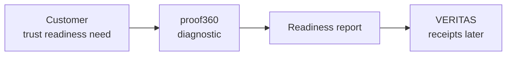

# proof360

proof360 is the live trust-readiness diagnostic and entity onramp for the
EthiksLabs stack. A founder gives it a company signal, proof360 produces a
structured trust posture, lets the human correct inferred data, and routes the
next commercial step.

## Stack Diagram

## Natural-Language Build Note

This orientation layer was produced in 3 prompts total, using natural language: create the repo README, add the Mermaid stack diagram, and make the result obvious for Sarvesh in GitHub.

## Why It Exists

The stack needs a front door. proof360 turns a messy public company footprint
into a usable trust report, then separates quick diagnostic value from governed
Tier 2 actionability.

## SPV Logic

proof360 is a customer-facing product SPV. Its commercial job is origination:
diagnostic assessment, trust gap discovery, vendor or distributor routing, and
future attested proof packs. Other infrastructure SPVs support it, but proof360
owns the customer journey.

## What It Owns

- Assessment UX and report rendering.
- Public signal capture and session flow.
- Human override contract for correcting inferred fields.
- Engagement routing across proof360-led, distributor, or vendor-direct paths.

It does not own inference routing, final truth, cost derivation, or monitoring.
Those belong to VECTOR, VERITAS, PULSUS, and ARGUS respectively.

## Current State

- Workspace state: live.
- Runtime: Node.js API and React/Vite frontend.
- Port: 3002 for the API.
- Public URL: proof360.au.
- v3 architecture is locked; v1 remains live while v3 build work is pending.

## Stack Position

proof360 calls VECTOR for inference, VERITAS for governed attestation, PULSUS for
consumption/cost signals, ARGUS for monitoring, and SIGNUM for future shared
notifications.

## Start Here

- `DOSSIER.md` explains the product boundary and v3 architecture.
- `AGENTS.md` and `CLAUDE.md` explain repo operating rules.
- `docs/` contains build briefs and convergence material.
