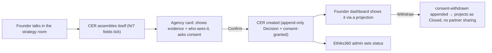

# proof360 — Changelog for Sarvesh

Plain-English "why it was made" for each change, written for the CTO outside the EthiksLabs internal doctrine. Newest first. Problem → Fix → Why it matters. Jargon defined inline.

---

## 2026-07-03 · Website-reply robustness — a failed scan re-asks instead of stranding (slice 5b)

**Problem.** Two edge cases were knowingly deferred from the previous slice (flagged by Codex review, decision recorded on PR #6). (1) If a founder answered the "what's the company called?" ask with a website *inside a sentence* — "we're at northwind.io" — the URL detector missed it and the whole sentence was saved as the company's name. (2) If the reply *was* recognised as a website but the site scan then failed, nobody asked again: the record sat waiting for a company forever. We reproduced (2) live in a browser before fixing it.

**Fix.** Three small, mostly-pure changes. (1) URL detection moved into its own tested module with **two strictness levels**: ordinary chat messages keep the old narrow matcher (mentioning a domain mid-sentence never triggers a scan), while a reply to a direct "what's the company?" ask uses a broader matcher that catches embedded domains. (2) The reply classifier now hands the *exact* extracted URL to the scanner — the two can't disagree by construction. (3) The "what happens after the scan" decision is a pure function: success guarantees a company lands (the analysed name, else the scanned domain); failure makes the advisor re-ask — *"That site didn't read — give me another link, or just tell me the company name and we'll keep moving."* — and the wait stays armed. The safety gate is deliberate: only an explicit success captures; anything else fails to the re-ask path.

**Why it matters.** The gap-prompt's promise is "the founder is never stranded". These were the two remaining ways to strand them. Both are now closed with unit tests (TDD — tests written first, watched fail, then fixed) plus a live browser walk.

---

## 2026-07-01 · CER persona gap-prompt — the lens asks for what's missing (slice 5)

**Problem.** A founder could start a pathway by talking but then stall: a CER needs a company, and if we didn't know it yet (no website scanned, nothing on record), the flow couldn't reach the consent step. We refused to fix this with a form field or by dropping the requirement.

**Fix.** When a CER is forming and a required field is missing, the fitting advisor asks for it in the conversation — e.g. **Sophia**: *"Before I set this up — what's the company called? A name, a website, or a deck all work."* The founder answers however they like: a plain name is captured as a fact; a website is read by the existing scan. Either way the field fills and the flow continues — no form, the requirement stays.

**Why it matters.** It keeps the product's core promise intact — the record assembles itself out of the conversation, and the founder is never blocked and never handed a form. It also directly closes the gap Codex flagged on the previous PR.

**How it was built (for the record).** Full design → spec → plan → build cycle with a fresh agent per task and independent review at each step. The final whole-branch review caught a real bug the per-task reviews missed — a website typed inside a sentence ("we're at northwind.io") would have stranded the founder because two different bits of code disagreed on what counts as a URL. Fixed by making them use the same detector. Verified: 70/70 frontend tests green.

**Scope.** MVP asks for the **company**; the advisor→field map is built to extend to contact/evidence later. Design + plan committed under `docs/design/` and `docs/plans/`.

---

## 2026-07-01 · CER conversation flow — the record assembles itself in the chat (3b)

**Problem.** The CER engine + cards existed (below) but weren't connected to the strategy-room chat. A founder couldn't actually *create* a pathway by talking.

**Fix.** Wired the CER into the live chat so it behaves like the product promise: the record forms as the founder talks, and nothing is created until they confirm.

- **Hybrid trigger.** A pathway-relevant phrase in a founder's message (e.g. "cloud spend on AWS" → AWS, "SOC 2" → compliance) *proposes* a route — the "forming N/7" card appears in the conversation with the route shown as a question. The founder commits with one click ("Use the … pathway →"). No CTA before they've said something; the founder always confirms.
- **Then the agency card** surfaces inline (consent + who-sees-it), and confirming creates the CER, which then shows as a created-pathway card and a sidebar facet beside the Company Profile.
- **Demo access.** The CER endpoints now use the same gate as `/journey`: real auth in production, a demo stand-in when `DEMO_FOUNDER_MODE` is on — so the demo founder can drive the whole flow without a login.

**Why it matters.** This is the felt difference from a normal intake form: the commercial decision *assembles itself out of the conversation* and stays under the founder's control. Verified live — typing a message makes the CER card build itself in the chat stream, field by field.

**Demo completeness.** The demo founder is now seeded with its own company (Northwind Robotics — the founder's *own* workspace, kept distinct from the amber Hive & Co example) so the flow walks all the way through: forming card → confirm route → agency card → consent → created CER + sidebar facet. Verified live in the browser and via the API (create/list/status/withdraw). Only applies in `DEMO_FOUNDER_MODE`; a real founder's workspace still starts empty and fills as they talk.

---

## 2026-07-01 · CER (Commercial Engagement Record) — engine, API, and cards

**What a CER is (one line):** when a founder decides to pursue a commercial pathway (AWS credits via Ingram, cyber insurance via Austbrokers, compliance via Vanta, Cisco via Ingram), proof360 creates a **living, permissioned, evidence-backed record** of that decision — with consent, route, visibility, and status — instead of just firing a form.

**Problem.** A "call to action" today is just a button: click it and a form posts silently. There's no durable record of *what the founder agreed to share*, *who is allowed to see it*, or *what evidence backs it* — and no way for the founder to withdraw that consent later. For a trust product, that's the whole game.

**Fix (this change).** A CER is modelled as a **typed commercial Decision**, not a new database or a new primitive. It rides proof360's existing append-only founder-memory store (the same event log that powers the "Company Profile fills as you talk" tile). Three things shipped:

1. **Engine** — a `decision` record + an append-only `cer_event` log (consent-granted / consent-withdrawn / status-updated). Current status and consent are *derived by replaying the log*, never by editing a row. Consent-withdrawn overrides the admin status to `Closed` at read time, and the original grant is never erased (audit stays intact).
2. **API** — four endpoints under `/api/v1/profile/current/cers` (create, list, consent-withdraw, admin status). Every write is an append; reads are a pure projection. A partner (e.g. Ingram) can only ever see CERs on *their own* route and only while consent stands — proven by a test, before any partner can log in.
3. **UI cards** — four React components (the "forming N/7" build card, the inline consent/agency card, the created-CER projection, and the sidebar facet), theme-driven, no hardcoded colours.

**Why it matters.** The product promise becomes concrete: *proof360 doesn't just recommend a pathway — it turns recommendations into permissioned, evidence-backed commercial Decisions the founder controls.* One CER shape works for all four pathways (AWS is just the first proof), so adding a fifth is config, not a rebuild. Consent is revocable and fully auditable, which is exactly what an enterprise/investor trust surface needs.

**Scope note.** The cards are built and tested but **not yet wired into the live chat flow** (that's the next step — the conversation ticks the fields and surfaces the agency card). Recommendation *engine*, real partner integrations (Ingram/Vanta/Austbrokers/Cisco), HubSpot, partner dashboards, and billing are all intentionally out of scope for v1 — mocked or seeded.

**Verification.** api unit suite 51/51 green; frontend 47/47 green. No confidence/freshness score minted on the CER — trust semantics stay with VERITAS, per the frozen invariant.
