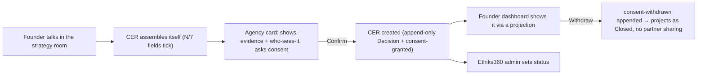

# proof360 — Changelog for Sarvesh

Plain-English "why it was made" for each change, written for the CTO outside the EthiksLabs internal doctrine. Newest first. Problem → Fix → Why it matters. Jargon defined inline.

---

## 2026-08-26 · The record gets a surface of its own

**Problem.** The product had been accumulating a real evidence record for months — every claim read from a company's public trail, graded inferred-until-confirmed, with its provenance attached — and displaying it as a single integer in a floating panel: *"6 things we've noted so far"*. A founder could see that we knew six things about them and had no way to see what the six were, let alone correct one. Meanwhile the same panel's header counted something different (claims + shortlist + pathways = 12) and the sidebar card counted a third thing entirely (a legacy tile count wired to nothing, permanently reading 0/6). Three numbers for one record, on one screen.

**Fix.** The record now has a place to live. `GET /api/v1/session/:id/record` returns the whole thing in one read — company, claims, open pathways, kept pathways, and how much the founder has settled in their own words — rather than the caller fanning out to three endpoints and stitching three partial truths together. On the surface it renders as a **projection**: the same shell as "Vendors matched to your gaps", opening over the conversation rather than navigating away from it. Kept pathways lead, open ones follow, claims come last as the evidence that earned them. Each claim is answerable in place, writing the same `claim_event` the chat ceremony writes — one verb, one log — and the page re-reads afterwards, so confirming a claim visibly opens the next pathway.

There is also a standalone `/record` route for the cold cases (a shared link, a second device). It renders the identical component, so there is one design rather than two that drift.

**A wrong turn worth knowing about**, because the reasoning applies to anything you build on this surface: the first cut was a full-page route. It looked fine and was wrong — navigating to it remounts the chat page, which only *writes* a session snapshot on unload and never reads one back, so "back to the conversation" started a brand-new session and the founder's conversation was gone. Overlays over the chat are correct here; full-page routes are not, until the chat can restore itself.

**Why it matters.** SPEC-011 has had confirm/correct/reject since it was written. The verbs existed, the data existed, and nothing surfaced them. This is the difference between a product that says it holds your evidence and one that shows it to you.

## 2026-08-26 · What's open to you — the capability register made visible

**Problem.** `api/src/config/capability-register.json` holds 70 active entries (32 AWS/Microsoft/Ingram programs, 36 vendors, 2 services) and `evaluateRegister` derives live matches against a founder's confirmed claims and open gaps. The only way any of it reached a person was a persona happening to mention **one** in conversation; the panel showed only what had already been accepted. Asked "where is the AWS stuff?", the honest answer was "nowhere you can see it."

**Fix.** An "Open to you now" section, derived fresh on every read and never stored. Each entry renders its kind, what it's worth, a link to the original, an add action — and, as prominently as the offer, **the claim or gap that earned it**: *"proposed because your cloud provider is confirmed as Oracle."* That reason line is the difference between a recommendation and an advertisement, and it's why the D4 rule matters: nothing appears until the record holds first-party testimony, so every offer traces to something the founder said or a gap that's real.

Two related fixes in the same area. A kept pathway is now titled by the **item**, not the route — every AWS offer routes `ingram_micro_aws`, so titling by route label rendered five genuinely different programs as five identical lines. And a repeat accept is now recognised as already-kept rather than falling through to `proposal_not_open`, which told the caller the wrong reason (accepting closes the proposal). The 409 contract is unchanged; only the reason got honest.

**Why it matters.** The register is the commercial engine. It was fully built and effectively invisible.

## 2026-08-26 · Nothing on screen is invented any more

**Problem.** Three surfaces were showing fabricated data as though it were measured.

1. The machine drawer's "Operational work units" read *Tokens processed 18,420 · Analysis passes 0 · Sources reviewed 0 · Model correlations 2*. Two of those were **hardcoded literals** — 18,420 would have read 18,420 for every company, forever. One was a boolean dressed as a count (`graphNodes.length > 0 ? 2 : 0`). The fourth counted inferences under a label saying sources. The rows contradicted each other on their face: 18,420 tokens processed across zero passes over zero sources.
2. The settings panel rendered a module-level constant marked `// ── Mock data — demo founder profile ──` **to whoever was signed in**: an AWS Activate application under review for $10k, $1,000 of Azure credits, a Vanta subscription "via proof360 · renews 14 Jun 2026", a pending cyber insurance quote, an AWS Console connected to two regions, and "Your company · Founder · Free" as the identity of a logged-in person. The sidebar badges (2 / 1 / 1) were literals too.
3. `ProvenanceAccordion` was passed a hardcoded empty array under the heading "Analysis provenance will appear here" — a promise nothing could keep.

**Fix.** The drawer is now **"What we read"** and every row traces to a measurement the read actually took: pages read, sources read, signals found, corpus holdings cited, and the engines that did the reading — named rather than counted, because "2 engines" tells a founder nothing and "perplexity · gemini" tells them who read their site. A measured zero shows (reading nothing is a real answer); an absent value hides; if nothing can be vouched for, the panel doesn't render. Token counts are deliberately **absent**: `inference.js` meters real usage server-side but it never reaches the browser, and approximating it is the exact thing being fixed.

The account panel derives from the person signed in and the pathways they actually kept — which is the true answer to "programs you've applied for through proof360" — carrying the real CTA where a route has one and none where it doesn't, with consent shown honestly (a withdrawn pathway is not an active one). Purchases and Integrations have no data source at all, so they say so plainly instead of inventing one.

**Why it matters.** This is a product about provenance. A plausible constant under a heading that says "operational work units" is worse than a blank, and a fabricated *account* is worse still — it states commercial relationships that don't exist, to the person they supposedly belong to. The standing rule is: no invented number, live or illustrative. If you add a surface, a row with no measurement behind it should not exist.

## 2026-08-26 · The model picker actually routes now

**Problem.** The chrome showed `● Claude Sonnet 4.6 · Bedrock` above answers signed `claude-haiku-4-5-20251001`. The frontend had been sending `model_override` since the chrome redesign; `session-chat.js` pinned `const MODEL = 'claude-haiku-4-5-20251001'` and never read it. The dropdown was decorative, and four of its seven entries aren't wired to this seam at all — picking Gemini or NVIDIA produced a Haiku answer wearing their badge.

**Fix.** `resolveChatModel()` honours the pick against a `SERVED_MODELS` whitelist — what `inference.js` MODEL_MAP genuinely resolves to a Bedrock profile. Default-deny on an untrusted body field: anything off the list falls back rather than reaching the inference layer to be interpreted. A fallback now **declares itself** (`X-Model-Substituted`), and `X-Model` reports what answered rather than what was asked for. The catalogue carries a `served` flag and the picker marks unwired entries "not wired here yet" — the breadth stays listed on purpose, because inference being a market rather than a monolith is the argument this product makes.

**If you wire another provider**, add it to both lists (`SERVED_MODELS` in `api/src/handlers/session-chat.js` and `served: true` in `frontend/src/data/vectorModels.js`) — there's a test asserting the two agree, because when they drift the chip starts lying again.

## 2026-08-26 · A panel can no longer take the conversation down with it

**Problem.** One unexpected object in one text slot threw React error #31 inside a projection. React text children *throw* on objects rather than stringifying, the app-level error boundary caught it, and the entire chat — the read, the personas, the record, the conversation in progress — was replaced by a black RENDER ERROR screen.

**Fix.** `PanelBoundary` wraps the projection sheet. An overlay is a leaf and must not be able to destroy the room it opened over. The sheet now fails inside its own frame — *"We couldn't render this one. That's on us, not you. Your conversation is still there."* — loud in the console with the component stack, one sentence on screen. Every text slot on the projection also passes through a guard that yields a string or nothing, with a test that renders a deliberately hostile record (an object in *every* slot) and asserts the app stays up.

**The lesson underneath**, worth carrying: the crash happened because the test fixture was written from what the shape was assumed to be, not what the server actually emits. The same assumption produced `[object Object]` in the claim strip earlier the same day. Build fixtures from a live response — the endpoint is one curl away — and shape bugs surface in the test rather than in front of someone.

## 2026-08-26 · Smaller things, same day

- **Ask fatigue.** The confirm ceremony re-asked the same unanswered question every turn, forever — it picked the highest-priority still-inferred claim each exchange and nothing recorded that it had already asked. A question asked and not answered is itself an answer. One voiced ask, then move on; the founder can settle any claim directly on the record instead. The count increments on a question actually *voiced*, not merely armed.
- **Orphaned sessions.** A session left `processing` when the API restarted stayed that way forever — a fresh process has nothing in flight. They're now failed at boot. Two real orphans were caught on the first run. Corrupt session files are reported, never deleted.
- **Memory ceiling.** `max_memory_restart` was 256M against a process that peaks near 490MB during concurrent reads, so pm2 was killing it mid-read. Raised to 1G, verified with three concurrent reads (113MB peak, zero restarts). `ecosystem.config.cjs` was also missing from the deploy workflow's trigger paths, so config-only changes silently never shipped.
- **Nameless gaps.** Persona prompts rendered gaps by an ID field that didn't exist, so personas couldn't name the specific gap they were discussing. Same root cause as the two shape bugs above.

---

## 2026-07-17 · CER noun: "Commercial" → "Customer" Engagement Record (sweep)

**What:** every comment, doc, and UI string now says **Customer** Engagement Record. **Why:** John ruled 2026-07-16 that the record belongs to the customer — the noun should say whose it is, not what kind of deal it is. **What did NOT change:** the stored `decision_type: 'commercial_engagement'` enum stays as accepted residue — renaming stored data would mean a migration for zero behaviour change. If you build against the API, nothing breaks; if you write prose, it's Customer.

## 2026-07-03 · Real founders — the demo stand-in retires from production (D3)

**Problem.** Production ran in "demo founder" mode: every visitor to the journey page saw the same seeded demo record, and a *real* login would have seen an empty journey forever — nothing ever connected a real person's login identity to their data in the memory database. This flag was always marked temporary ("remove this flag when live founder→atom resolution lands").

**Fix.** Resolution now happens lazily on a founder's first authenticated visit. If we've seen their login before (their Auth0 identifier is stamped on a person record), we return it. If not, we read their existing chat/profile history from the founder-memory store and replay it into the memory database using the same tested migration that proved the v1→v2 move — so a founder who has been using the chat logs in and their journey is already populated. A founder with no history gets just their person record — we never invent a company name for them. A database uniqueness rule on the identifier makes double-creation impossible even under a race. With that in place, the demo flag is removed from the production build: journey and pathway records now require a real login (per John's auth-in-front ruling, 2026-07-03), anonymous visitors to the journey page get a sign-in invitation instead of an error, and the anonymous chat keeps its clearly-labelled example company.

**Why it matters.** Every "show your work" claim on the journey/CER surfaces was undermined by the surface itself being a demo. This makes the product honest end-to-end: your journey renders from your record, gated by your login.

---

## 2026-07-03 · Website-reply robustness — a failed scan re-asks instead of stranding (slice 5b)

**Problem.** Two edge cases were knowingly deferred from the previous slice (flagged by Codex review, decision recorded on PR #6). (1) If a founder answered the "what's the company called?" ask with a website *inside a sentence* — "we're at northwind.io" — the URL detector missed it and the whole sentence was saved as the company's name. (2) If the reply *was* recognised as a website but the site scan then failed, nobody asked again: the record sat waiting for a company forever. We reproduced (2) live in a browser before fixing it.

**Fix.** Three small, mostly-pure changes. (1) URL detection moved into its own tested module with **two strictness levels**: ordinary chat messages keep the old narrow matcher (mentioning a domain mid-sentence never triggers a scan), while a reply to a direct "what's the company?" ask uses a broader matcher that catches embedded domains. (2) The reply classifier now hands the *exact* extracted URL to the scanner — the two can't disagree by construction. (3) The "what happens after the scan" decision is a pure function: success guarantees a company lands (the analysed name, else the scanned domain); failure makes the advisor re-ask — *"That site didn't read — give me another link, or just tell me the company name and we'll keep moving."* — and the wait stays armed. The safety gate is deliberate: only an explicit success captures; anything else fails to the re-ask path.

**Why it matters.** The gap-prompt's promise is "the founder is never stranded". These were the two remaining ways to strand them. Both are now closed with unit tests (TDD — tests written first, watched fail, then fixed) plus a live browser walk.

---

## 2026-07-01 · CER persona gap-prompt — the lens asks for what's missing (slice 5)

**Problem.** A founder could start a pathway by talking but then stall: a CER needs a company, and if we didn't know it yet (no website scanned, nothing on record), the flow couldn't reach the consent step. We refused to fix this with a form field or by dropping the requirement.

**Fix.** When a CER is forming and a required field is missing, the fitting advisor asks for it in the conversation — e.g. **Sophia**: *"Before I set this up — what's the company called? A name, a website, or a deck all work."* The founder answers however they like: a plain name is captured as a fact; a website is read by the existing scan. Either way the field fills and the flow continues — no form, the requirement stays.

**Why it matters.** It keeps the product's core promise intact — the record assembles itself out of the conversation, and the founder is never blocked and never handed a form. It also directly closes the gap Codex flagged on the previous PR.

**How it was built (for the record).** Full design → spec → plan → build cycle with a fresh agent per task and independent review at each step. The final whole-branch review caught a real bug the per-task reviews missed — a website typed inside a sentence ("we're at northwind.io") would have stranded the founder because two different bits of code disagreed on what counts as a URL. Fixed by making them use the same detector. Verified: 70/70 frontend tests green.

**Scope.** MVP asks for the **company**; the advisor→field map is built to extend to contact/evidence later. Design + plan committed under `docs/design/` and `docs/plans/`.

---

## 2026-07-01 · CER conversation flow — the record assembles itself in the chat (3b)

**Problem.** The CER engine + cards existed (below) but weren't connected to the strategy-room chat. A founder couldn't actually *create* a pathway by talking.

**Fix.** Wired the CER into the live chat so it behaves like the product promise: the record forms as the founder talks, and nothing is created until they confirm.

- **Hybrid trigger.** A pathway-relevant phrase in a founder's message (e.g. "cloud spend on AWS" → AWS, "SOC 2" → compliance) *proposes* a route — the "forming N/7" card appears in the conversation with the route shown as a question. The founder commits with one click ("Use the … pathway →"). No CTA before they've said something; the founder always confirms.
- **Then the agency card** surfaces inline (consent + who-sees-it), and confirming creates the CER, which then shows as a created-pathway card and a sidebar facet beside the Company Profile.
- **Demo access.** The CER endpoints now use the same gate as `/journey`: real auth in production, a demo stand-in when `DEMO_FOUNDER_MODE` is on — so the demo founder can drive the whole flow without a login.

**Why it matters.** This is the felt difference from a normal intake form: the commercial decision *assembles itself out of the conversation* and stays under the founder's control. Verified live — typing a message makes the CER card build itself in the chat stream, field by field.

**Demo completeness.** The demo founder is now seeded with its own company (Northwind Robotics — the founder's *own* workspace, kept distinct from the amber Hive & Co example) so the flow walks all the way through: forming card → confirm route → agency card → consent → created CER + sidebar facet. Verified live in the browser and via the API (create/list/status/withdraw). Only applies in `DEMO_FOUNDER_MODE`; a real founder's workspace still starts empty and fills as they talk.

---

## 2026-07-01 · CER (Customer Engagement Record) — engine, API, and cards

**What a CER is (one line):** when a founder decides to pursue a commercial pathway (AWS credits via Ingram, cyber insurance via Austbrokers, compliance via Vanta, Cisco via Ingram), proof360 creates a **living, permissioned, evidence-backed record** of that decision — with consent, route, visibility, and status — instead of just firing a form.

**Problem.** A "call to action" today is just a button: click it and a form posts silently. There's no durable record of *what the founder agreed to share*, *who is allowed to see it*, or *what evidence backs it* — and no way for the founder to withdraw that consent later. For a trust product, that's the whole game.

**Fix (this change).** A CER is modelled as a **typed commercial Decision**, not a new database or a new primitive. It rides proof360's existing append-only founder-memory store (the same event log that powers the "Company Profile fills as you talk" tile). Three things shipped:

1. **Engine** — a `decision` record + an append-only `cer_event` log (consent-granted / consent-withdrawn / status-updated). Current status and consent are *derived by replaying the log*, never by editing a row. Consent-withdrawn overrides the admin status to `Closed` at read time, and the original grant is never erased (audit stays intact).
2. **API** — four endpoints under `/api/v1/profile/current/cers` (create, list, consent-withdraw, admin status). Every write is an append; reads are a pure projection. A partner (e.g. Ingram) can only ever see CERs on *their own* route and only while consent stands — proven by a test, before any partner can log in.
3. **UI cards** — four React components (the "forming N/7" build card, the inline consent/agency card, the created-CER projection, and the sidebar facet), theme-driven, no hardcoded colours.

```mermaid
flowchart LR
  Chat["Founder talks in the strategy room"] --> Build["CER assembles itself (N/7 fields tick)"]
  Build --> Agency["Agency card: shows evidence + who-sees-it, asks consent"]
  Agency -->|Confirm| Create["CER created (append-only Decision + consent-granted)"]
  Create --> Proj["Founder dashboard shows it via a projection"]
  Create --> Admin["Ethiks360 admin sets status"]
  Proj -->|Withdraw| WD["consent-withdrawn appended → projects as Closed, no partner sharing"]
```

**Why it matters.** The product promise becomes concrete: *proof360 doesn't just recommend a pathway — it turns recommendations into permissioned, evidence-backed commercial Decisions the founder controls.* One CER shape works for all four pathways (AWS is just the first proof), so adding a fifth is config, not a rebuild. Consent is revocable and fully auditable, which is exactly what an enterprise/investor trust surface needs.

**Scope note.** The cards are built and tested but **not yet wired into the live chat flow** (that's the next step — the conversation ticks the fields and surfaces the agency card). Recommendation *engine*, real partner integrations (Ingram/Vanta/Austbrokers/Cisco), HubSpot, partner dashboards, and billing are all intentionally out of scope for v1 — mocked or seeded.

**Verification.** api unit suite 51/51 green; frontend 47/47 green. No confidence/freshness score minted on the CER — trust semantics stay with VERITAS, per the frozen invariant.
