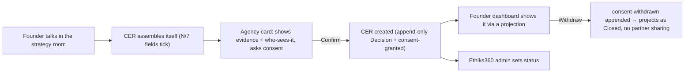

# proof360 — Changelog for Sarvesh

Plain-English "why it was made" for each change, written for the CTO outside the EthiksLabs internal doctrine. Newest first. Problem → Fix → Why it matters. Jargon defined inline.

---

## 2026-09-03 · "How we read this" opens the Inspector — one level-2 surface, both rulings kept

**Problem.** `HowWeReadThis.jsx` was a four-rung disclosure ladder of its own beneath the reading — closed → what counted → why it counted → the arithmetic — mounted twice in `Chat.jsx`. On the branch whose thesis is *two disclosure levels, never three* (the Inspector being the one level-2 surface), that was a level 3 hiding in plain sight; the design lab never mentioned it because it does not appear in the prototype at all.

**The thing that could not be resolved silently.** The file carries John's ruling from 26 Aug in its own words: *"the number is not deleted. It is demoted to the bottom rung of a ladder somebody chooses to climb."* Deleting the arithmetic to satisfy the two-level cap would have overridden that. So both hold:

- **One gesture.** `HowWeReadThis` is now a single affordance — *How we read this →* — that opens the Inspector with the reading as its subject (`subject.kind: 'reading'`). No ladder, no `useState`, no third level.
- **Rungs 1 + 2 become the Inspector's witnesses** — *Who said so*: each gap that carried weight, with its reasoning as the excerpt. One surface, two facts per row, never nested.
- **Rung 3 becomes the Inspector's receipt** — *The receipt · what we ran to get here*, which the Inspector already prefaces with *"This is what ran, not why it's right."* The lines: starting point 100 (labelled *how the arithmetic works, not a measurement of your company*), each subtraction, what is left (*visible from outside, on the day we looked*). Still chosen, still labelled as method, still there.
- `readingInspection({ gaps, trustScore })` is the pure function that builds the payload; the Inspector gained reading-specific copy (an empty ledger says *Nothing counted against you in this reading*, not *we looked and found nothing*; the "sources disagree" line is suppressed — a ledger is not competing witnesses).

**Guards.** `HowWeReadThis.test.jsx` rewritten (closed grades nobody; the gesture opens the Inspector; witnesses and receipt derived; renders inside the real Inspector with the right copy). `one-subject-wiring.test.js` now also asserts every `<HowWeReadThis>` mount passes `onOpen={setInspecting}` and the component has no ladder of its own. 525/525, lint clean.

---

## 2026-09-03 · /raise — the raise designer, a projection of the join over the register

**What it is.** A founder-facing page at `/raise`: every instrument in the ratified Capital Rosetta register (25 today), joined against the founder's own record, in register order. Each card says where the founder stands in the register's own words — *reachable*, *gap* (which class, what confidence it needs, what they hold), *blocked* (which disqualifier) — and how many conditions **could not be checked**. Picking one shows the record's mechanics (every field the register carries; `—` where it carries none), the jurisdiction variant if the register has one, the misconception and the tell from its knowledge block, and the join's four cells written out. Under that: **what you hold that this instrument does not price, and who in the register does** — the UNPRICED inversion, which is the routing primitive.

**Where the entity comes from.** `utils/rosettaClaimSet.js` — the same journey claims `/journey` renders, routed to the fourteen Rosetta classes by subject (`soc2_status` → GOV, `runway_months` → FIN, `match:aws_activate` → TRAC …) with confidence taken from the strongest authority seen (reality/provider → confirmed, legal/cto/system → probable, founder/operator → asserted). A class no claim touches is **absent**, which is what lets the join say GAP honestly. Untyped subjects contribute to no class rather than the wrong one. A stated jurisdiction becomes a join fact; the page's jurisdiction control overrides it.

**What is deliberately not on the page.**

- **No ranking, no score.** Register order, never re-sorted; a render test asserts the page never says *score*, *rank* or *IRR*. The lab's investor returns view (multiple, IRR, a floor table comparing rooms) is not built here and is not built on the join.
- **No invented terms.** The lab's per-instrument "terms that would publish" (8% interest · 24 months, 1.2× cap, 6% fee, 15% carry) were authored numbers with no source. The page shows only what the register carries plus the founder's own division — need ÷ ownership = implied cap — labelled *"that is your division, not the register's."*
- **No pretending on verification.** A record with no `last_verified` shows *"unverified — a rumour by the register's own rule"* in the detail panel and the header counts *5 of 25 verified*. The footer carries the register's projection date and source hash.

**Tests.** `rosettaClaimSet.test.js` (routing, confidence, facts), `Raise.render.test.jsx` (all 25 cards in register order with a state in words; no score/rank/IRR; unverified and could-not-check are said; jurisdiction is an input). Frontend 525/525, lint clean.

**Not yet:** the Deal Room (the investor-facing room around this) and any investor-side arithmetic — a separate decision, not a projection of the register.

---

## 2026-09-03 · The Capital Rosetta join, from the ratified register, as a pure function

**Vocabulary.** The **Capital Rosetta** is the estate's register of every way capital can enter a company — 25 instrument records (SAFE, convertible note, venture debt, R&D tax credit, cloud credits, SPV per asset, …) in one structured form, each stating what a company must **hold** (fourteen claim classes — IDENT, FNDR, PROB, PROD, TRAC, UNIT, FIN, CASH, GOV, USE, EXIT, REL, IMPACT, OPS — at a **confidence** — absent · asserted · probable · confirmed). John ratified it today as the register the Deal Room and Raise Simulator project from. The **join** is the register's one computation: run a company's claim set against an instrument and get four cells back.

**What was built.**

- `src/utils/capitalJoin.js` — `readiness(entity, instrument)` exactly as the schema writes it (§5): for each required class, held ≥ needed → **SATISFIED**, else **GAP** with the distance; every class the company holds that the instrument neither requires nor finds helpful → **UNPRICED**; neither held nor required → **NOISE**; disqualifiers the company satisfies → **BLOCKED**. Plus `readinessVector()` (one result per instrument, register order, never a scalar) and `unpricedInversion()` (for each class nobody priced, who would — the routing primitive the schema says has no name in finance). `validateInstrument()` applies the register's own rules: nine families, fourteen classes, four confidence levels.
- **Two places the lab's prototype diverged from the schema, corrected here.** (1) BLOCKED comes from `disqualifiers` only; "not available in this jurisdiction" is a disqualifier *condition* (`{ field: 'jurisdiction', op: 'nin', value: [...] }`), not a special case. (2) UNPRICED and NOISE exist — the lab's join returned only gaps and blocked, which drops the one cell that points outward.
- **UNEVALUATED, a third honest state.** The register writes its disqualifiers in prose ("no legal entity", "cap table already broken"). A condition that cannot be evaluated is neither passed nor blocked; it is listed as `unevaluated` so a surface can say "we could not check: …". Could-not-look ≠ found-nothing — the same rule the Inspector holds. An absent fact fails a structured condition *closed*: unknown jurisdiction blocks, it does not wave through.
- **Nothing is ranked.** Rule 10 of the register. A test asserts the output contains no `score`, `rank`, `weight` or `percent` key. The investor returns engine in the lab (multiple, IRR, a floor table ranking rooms) is not here and will not be built on this function.
- `src/utils/capitalRegister.js` — reads the register markdown (a YAML fence per record plus five prose sections) into instrument records. **The markdown stays the truth**; `scripts/project-register.mjs` writes `src/data/capital-register.json` with the source's SHA-256, and a test fails if the projection is stale against the file on disk. Nothing is authored: a field the file does not carry is `null`, not guessed.

**Three findings in the register itself, surfaced not fixed** (the reader carries them; the author decides):

- **20 of 25 records have no `last_verified`.** The schema's own words: *"an instrument record without a verification date is a rumour."* The projection script prints the list on every run.
- `spv-per-asset` lists `irrelevant: [parent FIN, parent CASH]` — a class qualified by "parent", which the schema has no notation for. `deferred-salary` lists `irrelevant: [everything external]` — prose. Both carried verbatim as `irrelevant_notes`, never coerced into a class.
- `litigation-finance` carries a YAML comment on its `requires` line (`# plus a meritorious claim`) — a requirement that is not a class. Comment stripped; the requirement is lost to the join until it has a home.

**Tests.** `capitalJoin.test.js` (11), `capitalRegister.test.js` (5: reader on a fixture, all 25 real records parse and validate, the join runs on every one, projection validates, projection not stale). Frontend 519/519, lint clean.

**Not yet:** the Raise Simulator and Deal Room surfaces that project from this. The function and the data exist; the screens are the next step.

---

## 2026-09-03 · The introduction: consent at both ends, on the one edge proof360 creates

**Vocabulary.** A **CER** (Customer Engagement Record) is a founder's typed decision to be routed to a partner — Ingram Micro, Vanta, CyberPro — stored as an append-only log (`decision` + `cer_event` records) and folded at read time (`services/cer-projection.js`). The **partner window** is the demo partner's view of the CERs routed to it, through `projectForViewer()`, the no-leak boundary. An **introduction** is the moment a partner gets the founder's contact. Until today it did not exist as a record.

**Problem.** The shipped partner pages revealed the founder's contact on a *partner-side click* ("Reveal contact" on a blurred hint; "Engage on this record" stored only in the partner's `localStorage`). The founder was never asked, never saw it, could not revoke it. That is the pattern the estate's consent ruling exists to refuse: an edge exists only if both ends consent, both see it, and either can revoke. The Claude Design lab proposed "Ask for an introduction" — and its mock had the partner's own second click standing in for the founder, and a Withdraw button with no handler. This change is the founder's side made real.

**Fix — four more event types on the same log, nothing new to store.**

- `introduction-requested` (partner) · `introduction-granted` / `introduction-declined` (founder) · `introduction-withdrawn` (either). `cerProjection()` now folds them into `cer.introduction = { state, partner, asked_at, decided_at, withdrawn_by }`, state ∈ none · asked · granted · declined · withdrawn. Every ask is kept; a new ask after a decline restarts the fold.
- **Gates are positive conditions** (write gates default-deny): a partner may ask only on a record routed to *them* while the founder's consent stands and no ask is open; the founder may grant or decline only a standing ask; either end may withdraw only its own live edge. Absent fields fail closed.
- **What the partner sees:** `introductionForPartner()` — state and dates always; the founder's `{ name, email }` **only while the grant stands**, and never `person_id`. Withdrawn at the CER level = the partner no longer sees the record at all (unchanged, re-proven).
- **Two doors:** `POST /api/v1/profile/current/cers/:cerId/introduction` `{ action: grant | decline | withdraw }` (founder, `journeyGate`) and `POST /api/v1/partner/:partner/cers/:cerId/introduction` `{ action: request | withdraw }` (partner window, demo-gated). Illegal state → 409 with the current state, never a silent no-op; a record not routed to the asking partner → 404, same as nonexistent (no existence leak).
- **Founder UI:** `IntroductionAsk` under each pathway facet in the Strategy Room rail — "Ingram Micro asked for an introduction. They see nothing until you answer." → *Introduce me* / *Not now*; granted → *Withdraw the introduction*. Drives `useCer().decideIntroduction`.
- **Partner UI:** `PortalRecordDetail` — *Ask for an introduction* → "The founder decides, in their own room" → contact appears only when granted, with *Withdraw*; the event trail names all four events. The `localStorage` "Engage" is gone; there is no reveal action on that side to call.
- **`$k OPPORTUNITY` retired** from the partner dashboard header — it was `score_impact × $200`, a score in dollars on a surface that is records, never deals. Pinned in `no-scores.render.test.jsx`.

**One thing found on the way.** `partnerCersListHandler` / `partnerCerDetailHandler` were written and unit-tested in August and **never registered in `server.js`** — the portal's live book fetch has been 404ing and degrading honestly to "no book". Registered now (the handlers are default-deny inside: 404 unless `DEMO_FOUNDER_MODE === 'true'`, demo founder only).

**Tests.** API: `cer-introduction.test.js` (fold, gates, partner projection — 8), `cer-introduction-handlers.test.js` (ask → grant → contact → withdraw end to end; wrong partner 404; no-ask grant 409; double ask 409; decline; demo-off 404 — 5). Frontend: `IntroductionAsk.test.jsx`. API 552/552 · frontend 503/503.

---

## 2026-09-03 · The rail leaves at the width it was meant to, and /journey stops keeping score

**Where this came from.** John ran the redesign through Claude Design as a lab ("Sarvesh Lab" — eight prototype pages), then had Claude Code read every page against the branch and the rulings. Two things on the branch turned out to be claimed but not wired. Both are fixed here; everything else in that lab is either John's intent by design or later build scope.

**1. The middle width state existed in a hook and nowhere else.**

*Vocabulary.* `useBreakpoint()` computes a **width class** from the viewport: `compact` (<768), `medium` (768–1055), `wide` (≥1056). `hasRail` is true only in `wide`. The whole point of yesterday's pass was the medium state — the rail folds away, the reading keeps its full width.

*Problem.* `hasRail` was read in `Chat.jsx` and used exactly once, to decide whether the Inspector is a dialog. `<Sidebar>` itself was mounted unconditionally, so the rail still sat at 240px from 768px to 4K — the exact defect the spec set out to fix. `useRailState`, the hook that keeps the *preference* (open/closed) separate from the *computed* width class, was exported and called by nobody.

*Fix.* `Chat.jsx` now mounts `<Sidebar>` only when `hasRail` is true, and takes its breakpoint from `useRailState(preference, setPreference)` so the two variables stay two variables. **Why two variables matters:** if "collapsed" and "too narrow for a rail" share one flag, resizing the window resets your choice. They don't share one now.

*Guard.* `tests/unit/one-subject-wiring.test.js` reads `Chat.jsx` as text and asserts both wirings. Source-level on purpose — `Chat.jsx` is 3,500 lines and is not rendered whole under test; the assertion is about where the hook's output *goes*, and the repo already does this shape in `demoFixtureCopy.test.js`.

**2. /journey was the one score-bearing page the no-scores ruling never reached.**

*Problem.* `Journey.jsx` had `deriveArc()`: start every founder at 52, subtract 9 per gap, add 5 per match, add 13 per verified outcome, clamp to 8–96, draw a curve, and put a "posture ↑ 13" chip on every chapter and a "trust momentum" number in the header. That is a trust score with the "/100" filed off. The 26 Aug conversion (`86d2f82`) fixed the dashboard, the portal and the projections and did not touch this file; `no-scores.render.test.jsx` had no case for it. Unfixed and unguarded.

*Fix.* **Presence by chapter.** The page now shows which of the six rooms the rail already knows — Investor readiness · Vendors · AWS programs · Microsoft programs · Posture · SPV — the founder has walked into, per chapter, as pips: present / partial / not yet. The chapter chip reads "n of 6 rooms open"; the header stat replaces momentum with the same. A count of rooms is allowed (John, by design, 3 Sept); a weighted number is not.

*How presence is derived — and why it is derived, not stored.* `src/utils/journeyPresence.js` is a pure function over the record. A claim lands in a room by its **subject** (`soc2_status` → Posture, `match:aws_activate` → AWS, `outcome:<id>` → Vendors, `spv_*` → SPV…); a claim that **reality or a provider attested** makes the room *present*, anything weaker makes it *partial*; and once a room is open it stays open in later chapters, because the record is append-only. No new field on the API, no backfill, nothing the founder can be graded on. If the record changes, the grid changes; there is nothing to keep in sync.

*One honest note for your rebuild.* `classifyClaim()` in Journey still looks for `gap:` / `match:` subject prefixes. **Nothing in the API writes those today** — live journey claims are posture fields plus `outcome:<id>` — so today every non-outcome claim is a "signal" and lands in Posture. The presence routing is written for the vocabulary that exists; when the memory layer starts emitting typed subjects, extend `roomFor()` with a test row each.

*Guards.* `tests/unit/journey-no-scores.test.jsx` renders the page against a mocked record and asserts no posture delta, no momentum, no curve. `tests/unit/journeyPresence.test.js` covers routing, levels, accumulation and the empty record. 499/499, lint clean.

---

## 2026-09-02 · One subject, everything else earned — the interface pass

Research-led. Two deep research passes ran before any code; the sources are cited inline below because two findings **contradicted the design I had already drafted**, and the draft lost.

### The diagnosis

Not density. **Nothing on screen claimed the subject position.** Six co-equal regions competed at once: left rail, `AuthorityLayer` chrome, a second chrome row, the observation strip, the chat stream, and the companion dock. Underneath that, each assistant message already trailed five sub-elements. The governing document (`docs/design/landing-emotional-contract.md`) says the founder should feel *heard*, not *processed* — six regions is processing.

### The finding that killed the plan

The plan was to make the inline `[n]` citation beautiful: rest on a sentence, its source lights in the margin. It is a nice idea and it is wrong.

> **arXiv 2501.01303** — citations raised trust **even when the citations were random**. Trust *fell* when users actually checked them. Hover/click rates run under ~25%.

So a prettier citation buys trust that has not been earned, from the ~75% who never open it. **For this product that is not cosmetic** — it is the invented-provenance failure, the exact thing the identity gate was built to refuse, relocated from the pipeline to the interface. We would have shipped by design what we spent the morning fixing in code.

The one pattern with published evidence that it improves **calibration** rather than confidence is *Attribution Gradients* (UIST '26, arXiv 2510.00361): one expandable surface holding how much evidence exists, and the supporting **and non-agreeing** excerpts together.

Which is John's ruling of this morning, arrived at from the other direction: *"we never adjudicate a company's record… a signal holds MULTIPLE OBSERVATIONS, each stamped with who saw it and when."* `position-signals.js` already produces exactly that shape. **The data model was already right. Only the surface was missing.**

### What shipped

**1. `Inspector.jsx` — level 2, and there is no level 3.** NN/g is unambiguous: *"designs that go beyond 2 disclosure levels typically have low usability because users often get lost."* My draft had three. Corrected to two: the reading, then one inspector that every road opens — a claim, a trace line, a rail row. Never a drawer inside a drawer.

Three sections: *what each source actually said* (every witness, verbatim passage, date, rendered identically whether or not they agree), *what we ran to get here*, and *what would change this*.

Two honesty rules are enforced in the component, not left to copy: the two absences stay different facts (*"we didn't get to look"* vs *"we looked and found nothing"*), and **the trace is labelled as a receipt, not as proof** — *"this is what ran, not why it's right."* That last one matters: research (arXiv 2601.16720, n≈232) measured felt Understanding & Trust rising significantly while perceived Competence did not move. A trace makes a system feel more trustworthy without making it better. Saying so is the difference between showing your working and performing it.

Citations are **passage-level, never document-level** — ~90% vs ~80% precision, and a founder cannot check a claim against a 40-page PDF.

**2. `CommandPalette.jsx` — ⌘K.** The research's answer to how dense products stay calm is not a layout: a palette flattens the hierarchy for the expert while the visual hierarchy stays shallow for the novice. It is why nothing has to be permanently on screen in order to be reachable. Commands are **projected from state, never a stored menu** (INVARIANTS §1), so the palette can never offer a door to an empty room. Full W3C APG dialog contract: `aria-modal`, focus trap, Escape, and focus returns to the invoker.

**3. `ComparisonRail.jsx` — the rail doing its actual job.** John: *"this side panel was always about how to see a comparison."* It was two stacked accordions — two containers, no comparison, since you could never see both at once. Now one set of rows with both companies on each.

**The register is the whole design: it compares what is PRESENT, never a score.** Two scores side by side is a grade, and *"the founder never feels evaluated"* is the contract's hardest line. Two states of fullness is a lamp — and it is the contract's own bottom-shelf pattern, where greyed tiles say *"this will fill in as we learn about you."* A test asserts the component renders no digits at all.

**4. `useBreakpoint.js` — three width states from published tokens.** Correcting something I told John badly: `Chat.jsx` did have responsive plumbing (a `window.innerWidth < 768` binary), it just had no middle state, so the rail sat at 240px from 768px to 4K. Values are read from real token sources — Carbon lg 1056, Polaris lg 1040, Tailwind lg 1024, Atlassian m 1024 — taking **768** (rail must leave) and **1056** (rail may return; the most conservative of the cluster, because a rail that only just fits crowds the reading). Named as capacity classes, never devices: a 900px window on a desktop is *medium*, and calling that "mobile" is how a layout ends up lying about who is looking at it.

Uses `matchMedia`, so dragging a window edge no longer re-renders per pixel. Two bug classes closed by construction: rail collapsed/expanded is a **user preference**, width class is **computed** (one variable for both is why rails forget your choice after a resize), and the measurement is off the viewport, never off a container the sidebar itself resizes.

### Also enforced

Every level-2 affordance is focusable, not hover-only — WCAG 2.1.1 and 1.4.13. Hover-only row actions fail keyboard, touch and cognitive users. (Note for the record: SC 3.2.7 "Visible Controls" was voted out before WCAG 2.2 shipped. Meet it anyway; do not cite it as a conformance requirement.)

**Tests.** 23 new (`redesign-primitives.test.jsx`), each traceable to a constitutional document or a cited finding rather than to taste. Frontend **492 passing**, lint 0 errors, build clean.

**Spec and full research:** `_working/01_SPECS/2026-09-02-proof360-one-subject-redesign.md` — including the draft thesis written *before* the research, kept deliberately so the corrections are visible.

---

## 2026-09-02 · The demo boundary is a switch now, not a caption

**Vocabulary first.** proof360 shows two companies side by side in the left rail: a **worked example** (Hive & Co — a fictional founder used to teach the journey) and the **live workspace** (the real company being read). `INVARIANTS.md` §4 is explicit that these must be *"visually distinct at all times. The user never confuses which one they are looking at."*

**Problem.** Three things were wrong at once, and John spotted all of them in one screenshot.

**1. The boundary was a caption.** The example carried an amber line reading **"reference founder — funded, attested."** *Attested* is the strongest word this product owns — the whole business is built on the difference between a claim and an attested one — and canon records this company as *"domain purchased, product fictional"*. It read as an accolade, not a disclosure. And captions stop being seen by the third session.

**2. The rail was inverted.** The example opened by default with six sub-items and a stage timeline; the live company sat collapsed underneath as a single line. Most of the rail's space went to the fiction and almost none to the work.

**3. Demo-ness was inferred, not stated.** It was derived from which stage happened to be selected. Nothing on screen let you set it, and nothing told you plainly which state you were in.

**Fix.**

**1. A switch, in the top-right chrome beside the live indicator** — SIMULATION / LIVE. It governs the whole surface, so it sits with the surface-level controls rather than inside one panel. **It locks to LIVE and refuses the flip once a real read is in flight**, because at that point which state you are in is a fact, not a preference.

**2. The rail follows the switch.** Simulation on → the example is the subject and opens; off → your own record opens and the example collapses to a peer you can open for comparison. Both stay present in either state — the comparison is what the rail is *for*.

**3. The label is the one the invariant specifies:** `Example company · Hive & Co`. "Funded, attested" is gone, and a test asserts that vocabulary can never describe a fictional record again however the copy is later reworded.

**Two things found while building it, both worth your attention.**

The accordion collapses by animating `max-height` to zero, so a closed section's children stay in the DOM. That means **a hidden section was still being read aloud by assistive tech** — including the worked example, the one thing the boundary exists to keep separate. Sections now carry `aria-expanded` on the header and `aria-hidden` on the panel, which is correct accordion semantics regardless.

And the component's `simulation` default is **false**, not true. A caller that passes nothing gets *your* record as the subject, never the example. The fail-safe direction for a boundary like this is "assume real unless told otherwise" — the opposite default would let a new surface present fiction as the subject by forgetting a prop.

**Scope note.** Staging uses **Finova Capital** as its reference founder; proof360 uses Hive & Co. John ruled 2026-09-02 that these are not competing: Mel/Hive & Co stays the narrative spine (the deck, the ten-beat arc, hiveandco.au) because a fictional honey founder forces the story to teach — a fintech lets a channel audience nod along and learn nothing. Finova is the better in-product fixture for showing a dense, filled-in record. Different jobs, nothing retired.

**Tests.** 9 new (`simulation-mode.test.jsx`): the switch's semantics and its lock, the rail inverting in both directions, the invariant's wording, and the rule that verified vocabulary never lands on a fictional record. Frontend 469 passing, lint 0 errors.

---

## 2026-09-02 · Two words the founder never asked to learn

**Problem 1 — the product named its own filing system.** Asked for citable research, an advisor answered: *"The corpus doesn't yet hold independent Australian market research…"* A founder reads that and asks what a corpus is, and why the machine is telling them about its internals instead of answering.

The cause was ours, not the model's. `corpus-retrieve.js` builds the evidence block, and one of its instructions literally read: *"say plainly that the corpus does not yet hold that."* We taught it the word.

**Fix.** That instruction now says *"we do not hold anything on that yet"*, and a standing rule was added beside it: never name an internal system to the reader — not corpus, not knowledge substrate, not retrieval, not any codename. **The tempting fix was to capitalise it and add a link.** That is worse: it promotes an unknown word into an unknown product name and hands the reader homework instead of an answer. The internal noun stays where it belongs — in the working, under the trace, where the word is defined by what sits beneath it and the reader opted in by expanding.

**Problem 2 — the `[2]` marker.** John asked whether inline citation markers are clear enough on screen, and specifically asked to be checked rather than agreed with.

He was right that something is wrong, and my first read of why was wrong. I said the markers were literal text that nothing rendered. **They were not.** `rendering/citations.js` already resolves each marker against *that answer's* receipt and `Bubble.jsx` already renders it as a link with a hover card carrying publisher, fetch date and excerpt — and an unmatched marker correctly stays plain text, because a link to a source that did not ground the sentence is the invented-provenance failure this product exists to refuse.

The real defect was narrower and worse: the affordance existed and **did not look like one.** It rendered in body ink with a dotted underline the colour of a hairline — on the cream ground, invisible. The strongest thing the product does, a claim bound to its source, read as a stray number.

**Fix.** The marker now carries the accent colour and an underline you can see. Same behaviour, finally legible. One more thing surfaced while in there: when no URL could name a publisher, the hover card fell back to the words **"Corpus holding"** — the internal codename, in the one line whose entire job is telling a founder where a fact came from. It now reads *"A record we already held"*.

**Tests.** Six new (`citation-affordance.test.jsx`), asserting the marker is an anchor, points at the real source, is visually distinct from prose, never says "corpus", and leaves an unbacked marker as plain text. Frontend 460 passing, API 539, lint 0 errors.

---

## 2026-09-02 · The gate held in one place out of four

**Vocabulary first.** **Corpus holdings** are documents we gathered about a company independently, before anyone typed their domain. Retrieval is *semantic* — it finds material that is close in meaning, which is what you want, because you cannot know in advance what a document calls a company. It also means a search for "Congisys" happily returns documents about **Cognisys**.

**Problem.** A read was run on `congisys.co.uk` — a typo. The reading itself behaved perfectly. It said: *"we couldn't tie those records to this domain, so they may describe a different company entirely."* That is the identity gate shipped earlier the same day, working.

Two inches above it, the "Before we read your site" panel opened with **"The record already held 3 things about Congisys"** — asserting the precise claim the reading had just refused to make. Below it, the observation strip published **twelve signals** extracted from those same holdings: headcount, global footprint, CREST accreditation, a category claim. Every advisor answer after that reasoned from them: a six-figure Australian property deal, "Vanta's #1 Global Service Partner." None of it was established to be about the company whose address was typed.

`holdingIdentity` existed in exactly one file. **Three other consumers never called it.** Gating the stream you happen to be looking at is not gating.

**A second defect, found while tracing the first.** Each claim in the dock read `inferred · website extraction · likely`, while the trace beside it read `Reading your site · 0 pages`. The string was hardcoded. A provenance that cannot be wrong is not provenance — it is decoration that looks like an audit trail.

**Fix.**

**1. Identity is resolved once, upstream, and stamped onto the material.** New `api/src/services/holding-identity.js`. `session-start` calls it the moment holdings arrive and marks each one `confirmed` or `unconfirmed`; every consumer reads the stamp. **This is the design point worth your attention:** the obvious fix is to call the gate in the three places that were missing it, which leaves a fourth consumer one commit away from reopening the hole. Closing it where the data is *born* means a new consumer inherits the gate without knowing it exists. A holding is confirmed only on a hard link — published on their own domain, or naming them in its text. It fails closed.

**2. Position signals refuse to speak from unconfirmed material.** Still retrieved, still displayed, still cited — never turned into a signal, because a signal is an assertion about *this* company. Returns an honest zero rather than a guess, and the three-state absence contract is intact: only a failed lookup returns `null`.

**3. The panel changes its sentence, not its existence.** When nothing ties to the domain it reads: *"We already held 3 records under a name close to Congisys… but nothing in them ties back to the address you gave us. It may be a different company. Have a look and tell us."* Showing what we found and asking whether it is them is how the typo gets caught. Suppressing the beat would lose that.

**4. Provenance is derived from what actually ran.** `website extraction` when pages were read; `company research · perplexity` when the site did not open but an engine answered; `no source read` when neither. The last one is the case that was lying.

**5. "Sources disagree" is gone.** A signal seen twice with different values rendered as a red alarm chip reading *⚡ sources disagree*. That adjudicates the founder's record, which this product never does — sources go out of date and contradict each other and that is normal, not a finding. It now reads **two readings**, in a neutral tone, and the drawer still asks which is right. Two tests that pinned the old wording were updated to assert the *rule* instead, so the verdict vocabulary cannot return.

**Also visible in the trace.** When holdings cannot be tied to the domain, the thinking now shows the machine declining to use them: *"none of these can be tied to congisys.co.uk — held as unconfirmed, not spoken as fact."* A founder watching should see a refusal as readily as they see a result.

**Tests.** 19 new on the API (539 passing), 5 new on the frontend (454 passing), lint 0 errors. The identity tests are written against the real Cognisys holdings from the live read, so they fail if the exact production bug returns.

---

## 2026-09-02 · proof360 now renders on the same ground as the platform

**Vocabulary first.** A **design token** is a named colour or typeface held in one file, which every component reads instead of writing a hex value inline. Change the token, every screen changes. Write the hex inline and the component can never be re-themed.

**Problem.** Put the ethiks360 staging app and proof360 side by side and they read as two different products. The platform sits on a warm cream (`#f5f4ee`); proof360 sat on a cool blue-grey (`#f5f6f8`). Same shapes, different temperature — enough that a screenshot of one does not look like it belongs with the other.

The cause was one missing word. `frontend/src/tokens.js` already held a theme called `parallel` whose ground, tint, ink, muted and hairline were measured off the live platform, verbatim. But `main.jsx` calls `applyTheme()` with no argument, so the app rendered whatever `DEFAULT_THEME` said — and that still said `pearl`. The matching work was done and never switched on.

**Fix.**

**1. The default is now `parallel`.** Every surface renders on the platform's cream. Instrument Serif was already the shared display face, so headings needed no work.

**2. The accents are warm, and ours.** `pearl`'s accent is a cool violet (`#5b4cc4`), which on a warm cream ground clashes — a cool accent on a warm base is the part your eye reads as *wrong* before it can say why. Replaced with two hues taken from the activation-gap deck approved this week, so product and deck now agree: `#b0501c` and `#0e6b62`. Both clear 4.9:1 contrast on the cream.

We deliberately did **not** take the platform's `#E05326` orange or `#58D5D3` primary. The two estates run parallel and never merge; a screenshot must still say which build it is. Same skeleton, our skin.

**3. The UI typeface was deliberately not swapped, and this is the part worth your attention.** `applyTheme` previously switched the sans face to Inter whenever the theme was `parallel`. Flipping the default would have fired that automatically — and broken the screen, because roughly 124 call sites hardcode `IBM Plex Sans` in JSX rather than reading the CSS variable. Half the page would render in Inter and half in Plex Sans. The swap is now unconditional on Plex Sans until two things are true: the platform's real UI face is confirmed (it was recorded as Inter from the tailwind config, but the rendered page reads rounder than Inter), and the hardcoded families are swept. Then it flips in one move.

**Known gap, named so it is not mistaken for done.** About 30 files still write dark-theme hex values directly into JSX — `#0f172a`, `#1e293b`, `#475569`. Heaviest: `AccountPanel` (12), `PortalDashboard` (11), `ChatInput` (10), `VendorShortlist` (8). Those components cannot be themed at all; they will stay dark on the cream until the values are moved to tokens. That sweep is next and is the larger half of this work.

**Tests.** Four new contract tests in `frontend/tests/unit/theme-ground.test.js`. Worth knowing why they exist: every one of the other 445 tests passes `theme: 'pearl'` explicitly, so nothing covered what an un-argumented `applyTheme()` actually produces — which is what every real user gets. The new tests pin the default, pin the platform's five neutrals verbatim, assert we never adopt their accent hues, and assert the font face does not swap. Suite: 449 passing, lint 0 errors.

---

## 2026-09-02 · The read stopped describing security and started describing the business

**Not deployed.** On branch `feat/position-read-and-interview`, tests green, waiting on a human walk before it goes near main.

**Vocabulary first.** The cold read produces **signals** — typed facts about a company, each with provenance. Some come from the **website extractor** (an LLM reading their public pages), some from **recon probes** (DNS, TLS, hosting lookups), and some from **corpus holdings** (material we gathered about them independently, before the conversation started). Signals become **claims**, and a claim's status is derived by folding an append-only event log — never by mutating the claim.

**Problem.** A live read on Cognisys — a 120-person security consultancy — came back as a security posture report. It led with a perimeter scan, said their DMARC was not enforcing, noted Oracle hosting, and called them a **"Software product"**.

That last one is the tell, and it was not the model's fault. `product_type` was a fixed enum: `B2B SaaS | B2C App | Platform | API | Software product | Unknown`. There is no value in that list for a services business, so the model had no legal way to say what they are. Services-versus-product sets a company's valuation multiple. Getting it backwards is worse than saying nothing.

Underneath that sat a bigger structural problem. The corpus holdings had **already retrieved** the material that mattered — 120 specialists across 19 countries, 51–200 employees from a second source, founded 2019, CREST-accredited, "Vanta's #1 Global Service Partner". All of it was displayed as citations and **none of it could become a signal**, because the website extractor was the only producer. The retrieval was right; the material had nowhere to go.

**Fix — five changes.**

**1. Port scanning is gone.** The read was making TCP connections to 13 ports on a third party's infrastructure — 22, 23, 3306, 5432, 6379, 9200, 27017 among them — off nothing but a domain someone typed. Two reasons it was removed, and the second outranks the first: it is the wrong product (nobody asked for exposed-port findings), and it is the wrong thing to do (reaching into a live system we do not own, uninvited, often against companies we are mid-conversation with). Kept as a resolved skip rather than deleted so every consumer's shape holds.

**2. Offering is three primitives, not an enum.** Physical, software, services — three independent booleans, any combination. This is John's model and it is better than the enum it replaces: "hybrid" stops being a special value and becomes two flags set, and managed-versus-professional services collapses into `revenue_model`, where recurring-versus-project already lives. Five position fields join it: `revenue_model`, `delivery_model`, `positioning_claim` (verbatim), `claim_conferred_by`, `concentration`. `stage` widens past the venture ladder so a profitable 2019 consultancy is no longer "Unknown".

**3. Security fields are classed, not deleted.** Every signal now carries `signal_class` — position, posture, infrastructure or context. **This is the design decision worth your attention.** The obvious implementation drops the security fields from the output. That breaks the gap engine, which consumes them. Classing lets the renderer lead with position and bury posture while the gap logic keeps everything it had. Security remains available the moment a gap calls for it; it is simply no longer the headline.

**4. Display order is now independent of execution order.** The perimeter scan is fired first deliberately, so its probes stream in the background while everything else runs. Because the UI rendered arrival order, "Perimeter scan" sat at the top of the founder's screen — the first thing they saw, announcing a security tool before a word of the read was visible. The trace now sorts by an explicit rank: holdings lead, posture trails, synthesis closes. The scan keeps its head start.

**5. Position signals, and the rule that shapes them.** A second producer reads the holdings for where a company stands: headcount, footprint, years operating, category position, accreditations, named customers.

Two public sources disagreed about Cognisys's headcount. **That is not modelled as a contradiction, and it never renders as one.** A signal holds multiple **observations**, each stamped with who saw it and when, plus a confirmation state that starts unconfirmed. There is deliberately no `disagreement` type and no contradiction vocabulary anywhere in the file — a test asserts the words conflict, contradict, disagree, unverified, wrong and lying never appear in that render. The reasoning: sources go out of date and disagree, everyone knows this, and adjudicating someone's public record would make this a rating agency. We hold a point-in-time record. One primitive, two audiences — the founder is asked which is right; a partner is told it is observed and not yet confirmed.

**Also: the interview, and a third answer.** The claim strip already put confirm/reject buttons on every tile, but a strip waits to be noticed. There is now a flow that asks — one question at a time, opening on cloud provider because that is the gimme that earns the first yes, then position, then posture, so stopping early still pays.

The new part is **"I don't know"** as a first-class folded event, distinct from *inferred* (never asked) and *rejected* (asked, and wrong). A founder who cannot say whether they are on AWS or behind Cloudflare has told us something true about how the company is run — it is a finding, not a blank. It mints no evidence, leaves the inference intact, and counts as **answered**, so it is never asked again. No counter and no total anywhere in the flow: a progress bar turns a conversation into a form. Skipping goes quiet rather than rendering a dead end, and every tile stays answerable afterwards.

**What this does not do.** `product_type` was kept and widened rather than replaced. It is load-bearing for AWS and Microsoft program matching, the capability-register triggers, firehose intake and claims projection. A services company now falls outside the ISV program lists, which is correct behaviour rather than a regression. Full decomposition into the three primitives is the right end state and is its own change with its own blast radius. The ask order is also duplicated across the API boundary on purpose, commented on both sides; it collapses when the API returns the ordered queue instead of record-ordered claims.

**And one thing genuinely unfinished:** position signals are produced and stored on the session, and **nothing renders them yet**. The data reaches the session and stops there.

**Follow-up the same day — the prose, not just the data.** The first live read after the above returned the right *facts* (120 people, ~20 countries, founded 2019, top global partner) and still opened with: hosting provider, DMARC in monitoring mode, TLS grade. It then closed by noting the email posture "catches the eye when you're advising clients on their own compliance frameworks" — telling a security consultancy it is a hypocrite, from a stranger, in the first thirty seconds.

Fixing the signal schema did not fix this, because the paragraph is written by a **separate prompt** (`cold-reading.js`) that was never touched. That prompt has a well-built three-beat structure — clues, connection, invite — but nothing told it **which** clues to open on, so it picked the most concrete facts available. Technical probes are always the most concrete. Concreteness is not relevance.

Two rules added: infrastructure and posture facts are admissible only when the connection beat genuinely turns on them, never as an opener; and the read **never evaluates the company** — no shortcoming, no inconsistency, no gap between what they sell and what the record shows, no "catches the eye". State the fact, let them draw the line. This binds hardest when the company works in the same field as the observation.

One implementation note worth carrying: the worked examples in that prompt were first written using the real fact words. A test caught it — `cold-reading.test.js` asserts the prompt never mentions facts absent from the session, because a fact named in the prompt can be hallucinated into a read for a company that has none. The examples are now generic by necessity, which is also safer.

**Second follow-up — the dock shows, the chat asks.** The interview shipped inside the companion dock, and the first walk found the flow break immediately: a floating panel that asks questions pulls the founder out of what they are reading in order to answer, and leaves them with two places to be looking. The panel was also rendering near-black over a light chat surface — a hole in the page.

The dock's job is the one it is named for: the surface where the record **visibly accumulates**, filling in parallel while the founder reads. Asking is a different job and it belongs in the conversation, next to the read that raised the question. Same claims, same endpoint, same append-only events — only the seam moved. The per-tile buttons stay in the dock, so anything can still be settled there at any time; they are simply no longer the ask.

The panel is now themed from `tokens.js` like every other surface rather than a private dark palette. A test renders the panel and asserts it contains no interview, and a second checks the old dark hex values are gone — the seam is enforced rather than remembered.

**Third follow-up, and the serious one — a typo produced a confident profile of the wrong company.**

Reading `congisys.co.uk` — one transposition away from `cognisys.co.uk` — hit a site that would not open. **Zero pages readable.** The read still produced a full, confident profile: 120 people, 19 countries, Vanta's #1 global service partner, GRC consulting and CREST-accredited testing. Every one of those facts is real. **None of them is about the domain that was typed.**

**Cause.** Corpus retrieval is semantic, with a similarity floor. That is correct and should stay — finding near material is the point of a retrieval layer. The defect was at **consumption**: every hit that cleared the score floor was handed to the reading prompt as testimony about the company being read, and nothing anywhere checked that a holding was actually *about* them. "Congisys" and "Cognisys" sit one character apart in an identical sector vocabulary, so they score high. With the site unreadable there was no first-party evidence to contradict it either, so third-party records about a different company became the entire read.

**Fix — an identity gate at the point of use, not at retrieval.** `holdingIdentity(hit, {company_name, domain})` returns `confirmed` only on a hard link: the holding is published on their own domain (or a subdomain of it), or it names them in its text or slug. Everything else is `unconfirmed` — still retrieved, still shown, still cited, but tagged `[CORPUS-UNCONFIRMED]` in the prompt and never spoken in the second person. It **fails closed**: no name and no domain to check against means unconfirmed.

The prompt gained a rule that outranks its shape rules: an unconfirmed holding may never be written as "you", never folded into the connection beat, and never used to imply size, age, reach or position. If unconfirmed holdings are the only material available, the model must not write a profile at all — it says plainly that we could not confirm these records are about them, names the company the records *do* describe, and asks whether it is the same organisation.

**Why it matters, and why this one was worth stopping for.** Everything else found today was a read that was unhelpful. This was a read that was **wrong, and confident, about someone else's business** — with no way for the reader to tell. If that domain belonged to a real company, proof360 would have told them they are a 120-person GRC consultancy. A wrong company confidently described is the worst output this product can produce, because the entire proposition is that the evidence is traceable.

**And the fix above was not enough — what actually worked.**

The first attempt tagged unconfirmed holdings `[CORPUS-UNCONFIRMED]` and told the model, in the prompt, never to write them as "you". Both the tag and the rule landed correctly. The model then appended *"and are the records we found actually about your organisation?"* — **and wrote the full profile anyway**, 19 countries and all.

**A rule the model can decline is not a control.** That is the lesson worth keeping: the instruction was clear, correctly placed, and simply not obeyed, because everything else in the prompt was pulling the other way and the facts were sitting right there.

Two changes made it hold:

**1. Unconfirmed material is removed from the evidence block, not labelled in it.** There is now nothing to write a profile from. The holdings are still retrieved, still counted, and still rendered as citation cards — showing what we found and asking whether it is them is honest; handing it to the writer as though it were them is not.

**2. The live-web summary is gated by the same test, which the first fix missed entirely.** Asked to "research the company at congisys.co.uk", the research engine silently corrected the typo and returned a profile of **cognisys.co.uk**. That answer is not a corpus holding, so the holding gate never saw it — and it was feeding the same false read on its own. It now has to name the company being read, or it is dropped.

The session-level verdict is: identity is established if their own pages were read (you cannot fetch the wrong company's website), or a corpus holding names them, or the research summary names them. If none of those hold, the prompt gains a block that overrides the entire three-beat shape and instructs three sentences only — the site would not open, the records may describe a different organisation with a similar name, please confirm or give us the right address.

**And the real fix: check the door before searching the building.**

The identity gate above stopped the false profile. It did not stop the waste. Reading a domain that does not exist still ran the entire pipeline: four corpus retrievals, a **billed** live-web search, a second research engine, an eleven-signal correlation, an infrastructure probe and an LLM write — and then asked the founder to confirm a product type for a company that is not there. The honest answer was available in the first fifty milliseconds and nothing had asked for it.

`domain-preflight.js` now runs **before anything else**. One DNS lookup. If the address does not resolve, the session ends immediately with `infer_status: 'address_not_found'` and a suggestion — no corpus, no research engine, no model, no bill.

**Two postures, deliberately opposite, and this is the part worth reading:**

- **The typed address FAILS OPEN.** An inconclusive lookup lets the pipeline run. Wrongly telling someone their live site does not exist is much worse than running a scan unnecessarily.
- **A suggestion FAILS CLOSED.** "Did you mean X?" is only worth saying when X is real, so a candidate must be positively proven: an address record **and** either mail or its own nameservers — roughly what separates a business from a parked squat.

The first version got this wrong in an instructive way. It shared one 2.5-second deadline across 24 parallel candidate lookups, so most timed out, fell through the fail-open path, and were offered as suggestions — **seven domains, including `ocngisys.co.uk`, none of which exist at all**. The fix was not a longer timeout; it was recognising that the two checks need opposite failure directions.

Candidates are single-edit neighbours: transpositions first (the commonest human typo, and exactly how the two domains differ), then deletions. Not substitutions — 25 per character would mean hundreds of lookups to catch a rarer mistake. Capped at three.

Verified live: `congisys.co.uk` → does not exist, suggests `cognisys.co.uk`, and nothing else runs. `cognisys.co.uk` → passes straight through.

`address_not_found` is threaded end to end as a **terminal state with something useful to say**, never a failure. The status endpoint carries the suggestions so the client needs no second round trip, and the chat says: we couldn't find that address, did you mean this, we haven't read anything or looked you up yet. Reporting it as "inference timeout" would have repeated the 2026-08-26 defect where an honest signal was flattened into a vague one.

**For your demo — the stack, named.** The thinking trace reads as though proof360 does all of this itself. It does not: it orchestrates Firecrawl, Perplexity, Gemini, and Claude on Bedrock. Naming them is more impressive *and* more honest, so each step can now show the service it used.

**It is off by default.** Set `VITE_SHOW_VENDOR_MARKS=true` at build time to turn it on. Your call whether it ships — this is demo dressing, not a product decision.

**Two things about it worth knowing before you touch it.**

**The marks are placeholders, not the official logos.** They are simple geometric stand-ins drawn so the layout, spacing and weight are real. Before this goes anywhere outside a demo, swap `mark` in the `VENDORS` registry for the official SVG from each vendor's brand kit and check their trademark guidance — attribution use is normally fine, but every vendor sets its own rules on colour, spacing and lockup, and an approximated logo looks worse than none. The registry is the single place to change them.

**A mark is bound to what actually ran.** It is derived from the act id and the note the backend already writes — so if we stop using an engine, its mark disappears on its own, with no second place to update. An engine that was *attempted and failed* renders dimmed and labelled "attempted, did not answer" rather than being hidden or shown as a success: the second research read 404s regularly, and both hiding it and dressing it up would misrepresent what the machine did. This is the existing truthful-engines ruling — only claim the engines that really answered — extended to the logo layer, because a brand shown for a service that did not fire is the same defect in a better suit.

**Vendor identity in the recommendation, not just the plumbing.** The step above named the *infrastructure* we run on. This names the *ecosystem we walk a founder into* — Vanta, Cisco Duo, Austbrokers CyberPro, Arctic Wolf, Cloudflare and the rest. John's framing: "the whole idea is to show that this is an ecosystem, not just a single place to do things."

This is a ruling from July, moved out of the deck and into the product: **the logos become part of the timeline, not badges beside it.** The principle under it is that readers genuinely do not know this ecosystem — the product teaches it by naming, and must never rely on inference. A list of words teaches nothing; recognisable marks say "these are real companies, and this thing walks you to them".

**How it scales to a 40-vendor catalog without 40 hand-drawn logos.** Every vendor gets an identity immediately — its brand colour and an initials tile, which reads as deliberate rather than as a missing image. Vendors with a real mark render it instead. `VendorBrand.jsx` holds the registry and is the only place to add marks over time; nothing else changes when you do.

**The part I would push back on if someone simplified it later: the disclosure travels with the logo.** Where we hold a commercial relationship, the mark carries a quiet `partner` marker, and the flag is read off the vendor record itself so a calling surface cannot forget to pass it. **Terms stay sealed** — the relationship is disclosed, never the economics, and a test asserts no margin, commission or deal label can reach the screen. A logo that reads as an endorsement while hiding that we have an interest is exactly what "no one here is paid to sell you something you don't need" exists to prevent. The marker is the cheap part; leaving it out would quietly turn a recommendation engine into an ad.

Wired into the vendor shortlist. The other surfaces that show a vendor — pathway suggestions, the CER cards, the partner portal lead view — should use the same component rather than growing their own; it takes a vendor record and needs nothing else.

Marks are placeholders, same as above: swap for brand-kit SVGs and check trademark guidance before any live use.

**Verification.** API 536/536, frontend 445/445, nothing skipped — 80 new tests. **No human has walked it**, which is why this is on a branch and not on main. A green suite written by the same author that wrote the code is not sign-off.

**Why it matters.** proof360 sells the claim that it can read a company and say something useful about where it stands. A read that calls a consultancy a software product, and leads with their email security, is answering a question nobody asked — and doing it confidently, in the one place the product asks to be trusted.

## 2026-09-01 · The conversation shows its references, and the theme learned to mirror

Three things went live together. The first is the one that changes what a founder sees.

### Inline citations in the chat

**Problem.** proof360 reads a company's public trail and makes statements about it in conversation. Those statements are backed by real evidence records in CORPUS — each one has a source behind it. In the chat surface they arrived as bare prose. The founder saw an assertion about their own company and had no way, in the moment, to ask *how do you know that?*

That gap is the whole product risk in one sentence. A confident claim with no visible backing is indistinguishable from a guess, and the audience most likely to notice is exactly the audience proof360 is for.

**Fix.** Message bubbles now render inline citations — the reference travels with the sentence it supports, in the conversation, rather than living in a separate panel the founder has to go and find.

**Why it matters.** The evidence layer has existed for months and was doing real work invisibly. Showing it is the difference between a product that claims it holds your evidence and one that hands it to you unprompted. An offer without the evidence behind it is an advertisement.

### A 'parallel' theme

**Problem.** The two estates — your Ethiks360 app and this one — are deliberately separate products that increasingly get shown in the same room. Nothing made them look like relatives.

**Fix.** A new theme whose neutrals, ground colour and hairlines are lifted **verbatim** from the live Ethiks360 web app, measured off its Tailwind config and CSS custom properties rather than eyeballed. The accent is deliberately **ours** and not yours.

**The reasoning behind that split**, since it looks like an inconsistency and isn't: a shared skeleton makes the two read as one family; a shared accent would make them indistinguishable in a screenshot. Same bones, different skin. Someone looking at a screenshot should be able to tell instantly which product they're looking at, while still recognising the pair.

It is a normal theme option — the key set is identical to the existing default, and an unknown theme name still falls back to that default. **Nothing was written into your repository to do this.** The values were read out of your tree and reimplemented in ours; the estates stay parallel.

### Inference moved to Sydney — with a caveat that matters

**Problem.** Bedrock calls defaulted to us-east-1 under a July ruling made to dodge regional capacity limits, paying roughly a second of cross-Pacific round trip on every call. Separately, calls used bare model ids, and a bare model id carries no resource tag — which means Bedrock spend cannot be attributed to a service in Cost Explorer at any tagging effort.

**Fix.** The default is now ap-southeast-2, overflowing to us-east-1 **only** on a throttle, so the capacity limit is still covered. Calls route through tagged application inference profiles, which is what makes the spend attributable. A credential, permission, or model fault does not overflow — retrying it elsewhere fails twice as slowly and reads as a regional problem when it isn't one. Note that a profile ARN is region-scoped, so the overflow swaps the ARN along with the region.

**The caveat.** On the production box, `api/.env` still pins the region to us-east-1, and an environment variable beats the new code default. So **as of this writing proof360 is still running in us-east-1**, using the US profile. Nothing is broken and the spend is still tagged and attributable — but the Sydney move has not actually taken effect for this service yet, and the latency win is not being collected. It is a one-line deletion and a restart, and it is John's call when that happens. CORPUS has no such pin and is genuinely on ap-southeast-2 today.

This is flagged here rather than left quiet because "deployed" and "in effect" came apart, and a changelog that reports the first as though it were the second is how a fix gets believed before it is real.

**Verification.** API suite 457/457 and frontend 397/397, both re-run against the merged result rather than the branch. The public site is serving the new build — the bundle the front door references is byte-identical to the one on disk, and it carries both the citation code and the new theme.

---

## 2026-08-26 · The AWS and Microsoft panels show real programs now

**Problem.** An inventory of what's built-but-unreachable turned up the worst fabrication left in the product, and its fix sitting one import away.

`api/src/config/` holds **18 AWS programs** (`AWS_PROGRAMS` with per-program trigger conditions and an `evaluateTrigger` evaluator) and **12 Microsoft programs**. The recompute pipeline has matched against them, with tests, for months. The AWS and Microsoft panels in the UI used **none of it** — they rendered two hardcoded constants in `Projections.jsx` for any company that wasn't the Hive & Co demo, and those constants asserted things about the founder's **own accounts**:

- *"Startup Credits — $10k unclaimed — already granted · expires Q4 · log in to redeem"*
- *"$220k+ in credits and co-sell opportunities are sitting unclaimed at your stage"*
- *"Founders Hub is unclaimed — that's $150k in Azure credits sitting there"*

"Already granted" and "unclaimed" are claims about a real AWS account nobody has looked at. That's a category beyond an invented number — it's an invented **entitlement**.

**Fix.** `services/programs-matcher.js` joins session → signals → the same trigger evaluation recompute already runs, exposed as `GET /api/v1/session/:id/programs`.

Two design points worth knowing if you extend it:

1. **Confirmed claims outrank read signals.** The signal map is built from what the read inferred, then a claim the founder *confirmed* overwrites it. If that ordering isn't there, answering a question in the record changes nothing about what gets offered — and the whole confirm ceremony is decoration. A rejected claim contributes nothing.
2. **Unknown field means no match.** A trigger reading a field we have no value for must fail, not pass. Otherwise an empty session matches every program and the catalogue gets dumped on a stranger as though it were personalised. Know nothing, offer nothing.

Each match carries the trigger that earned it — *"Matched because your stage is Seed and your infrastructure is aws"* — the same rule the pathway follows: an offer without the evidence behind it is an advertisement. The two old constants survive as clearly-marked demo fixtures for the Hive & Co walkthrough only.

**Why it matters.** Two panels stopped making financial claims about accounts we've never seen, and 30 real trigger-matched programs became reachable in the same move. The engine was already right; only the surface was lying.

---

## 2026-08-26 · The record gets a surface of its own

**Problem.** The product had been accumulating a real evidence record for months — every claim read from a company's public trail, graded inferred-until-confirmed, with its provenance attached — and displaying it as a single integer in a floating panel: *"6 things we've noted so far"*. A founder could see that we knew six things about them and had no way to see what the six were, let alone correct one. Meanwhile the same panel's header counted something different (claims + shortlist + pathways = 12) and the sidebar card counted a third thing entirely (a legacy tile count wired to nothing, permanently reading 0/6). Three numbers for one record, on one screen.

**Fix.** The record now has a place to live. `GET /api/v1/session/:id/record` returns the whole thing in one read — company, claims, open pathways, kept pathways, and how much the founder has settled in their own words — rather than the caller fanning out to three endpoints and stitching three partial truths together. On the surface it renders as a **projection**: the same shell as "Vendors matched to your gaps", opening over the conversation rather than navigating away from it. Kept pathways lead, open ones follow, claims come last as the evidence that earned them. Each claim is answerable in place, writing the same `claim_event` the chat ceremony writes — one verb, one log — and the page re-reads afterwards, so confirming a claim visibly opens the next pathway.

There is also a standalone `/record` route for the cold cases (a shared link, a second device). It renders the identical component, so there is one design rather than two that drift.

**A wrong turn worth knowing about**, because the reasoning applies to anything you build on this surface: the first cut was a full-page route. It looked fine and was wrong — navigating to it remounts the chat page, which only *writes* a session snapshot on unload and never reads one back, so "back to the conversation" started a brand-new session and the founder's conversation was gone. Overlays over the chat are correct here; full-page routes are not, until the chat can restore itself.

**Why it matters.** SPEC-011 has had confirm/correct/reject since it was written. The verbs existed, the data existed, and nothing surfaced them. This is the difference between a product that says it holds your evidence and one that shows it to you.

## 2026-08-26 · What's open to you — the capability register made visible

**Problem.** `api/src/config/capability-register.json` holds 70 active entries (32 AWS/Microsoft/Ingram programs, 36 vendors, 2 services) and `evaluateRegister` derives live matches against a founder's confirmed claims and open gaps. The only way any of it reached a person was a persona happening to mention **one** in conversation; the panel showed only what had already been accepted. Asked "where is the AWS stuff?", the honest answer was "nowhere you can see it."

**Fix.** An "Open to you now" section, derived fresh on every read and never stored. Each entry renders its kind, what it's worth, a link to the original, an add action — and, as prominently as the offer, **the claim or gap that earned it**: *"proposed because your cloud provider is confirmed as Oracle."* That reason line is the difference between a recommendation and an advertisement, and it's why the D4 rule matters: nothing appears until the record holds first-party testimony, so every offer traces to something the founder said or a gap that's real.

Two related fixes in the same area. A kept pathway is now titled by the **item**, not the route — every AWS offer routes `ingram_micro_aws`, so titling by route label rendered five genuinely different programs as five identical lines. And a repeat accept is now recognised as already-kept rather than falling through to `proposal_not_open`, which told the caller the wrong reason (accepting closes the proposal). The 409 contract is unchanged; only the reason got honest.

**Why it matters.** The register is the commercial engine. It was fully built and effectively invisible.

## 2026-08-26 · Nothing on screen is invented any more

**Problem.** Three surfaces were showing fabricated data as though it were measured.

1. The machine drawer's "Operational work units" read *Tokens processed 18,420 · Analysis passes 0 · Sources reviewed 0 · Model correlations 2*. Two of those were **hardcoded literals** — 18,420 would have read 18,420 for every company, forever. One was a boolean dressed as a count (`graphNodes.length > 0 ? 2 : 0`). The fourth counted inferences under a label saying sources. The rows contradicted each other on their face: 18,420 tokens processed across zero passes over zero sources.
2. The settings panel rendered a module-level constant marked `// ── Mock data — demo founder profile ──` **to whoever was signed in**: an AWS Activate application under review for $10k, $1,000 of Azure credits, a Vanta subscription "via proof360 · renews 14 Jun 2026", a pending cyber insurance quote, an AWS Console connected to two regions, and "Your company · Founder · Free" as the identity of a logged-in person. The sidebar badges (2 / 1 / 1) were literals too.
3. `ProvenanceAccordion` was passed a hardcoded empty array under the heading "Analysis provenance will appear here" — a promise nothing could keep.

**Fix.** The drawer is now **"What we read"** and every row traces to a measurement the read actually took: pages read, sources read, signals found, corpus holdings cited, and the engines that did the reading — named rather than counted, because "2 engines" tells a founder nothing and "perplexity · gemini" tells them who read their site. A measured zero shows (reading nothing is a real answer); an absent value hides; if nothing can be vouched for, the panel doesn't render. Token counts are deliberately **absent**: `inference.js` meters real usage server-side but it never reaches the browser, and approximating it is the exact thing being fixed.

The account panel derives from the person signed in and the pathways they actually kept — which is the true answer to "programs you've applied for through proof360" — carrying the real CTA where a route has one and none where it doesn't, with consent shown honestly (a withdrawn pathway is not an active one). Purchases and Integrations have no data source at all, so they say so plainly instead of inventing one.

**Why it matters.** This is a product about provenance. A plausible constant under a heading that says "operational work units" is worse than a blank, and a fabricated *account* is worse still — it states commercial relationships that don't exist, to the person they supposedly belong to. The standing rule is: no invented number, live or illustrative. If you add a surface, a row with no measurement behind it should not exist.

## 2026-08-26 · The model picker actually routes now

**Problem.** The chrome showed `● Claude Sonnet 4.6 · Bedrock` above answers signed `claude-haiku-4-5-20251001`. The frontend had been sending `model_override` since the chrome redesign; `session-chat.js` pinned `const MODEL = 'claude-haiku-4-5-20251001'` and never read it. The dropdown was decorative, and four of its seven entries aren't wired to this seam at all — picking Gemini or NVIDIA produced a Haiku answer wearing their badge.

**Fix.** `resolveChatModel()` honours the pick against a `SERVED_MODELS` whitelist — what `inference.js` MODEL_MAP genuinely resolves to a Bedrock profile. Default-deny on an untrusted body field: anything off the list falls back rather than reaching the inference layer to be interpreted. A fallback now **declares itself** (`X-Model-Substituted`), and `X-Model` reports what answered rather than what was asked for. The catalogue carries a `served` flag and the picker marks unwired entries "not wired here yet" — the breadth stays listed on purpose, because inference being a market rather than a monolith is the argument this product makes.

**If you wire another provider**, add it to both lists (`SERVED_MODELS` in `api/src/handlers/session-chat.js` and `served: true` in `frontend/src/data/vectorModels.js`) — there's a test asserting the two agree, because when they drift the chip starts lying again.

## 2026-08-26 · A panel can no longer take the conversation down with it

**Problem.** One unexpected object in one text slot threw React error #31 inside a projection. React text children *throw* on objects rather than stringifying, the app-level error boundary caught it, and the entire chat — the read, the personas, the record, the conversation in progress — was replaced by a black RENDER ERROR screen.

**Fix.** `PanelBoundary` wraps the projection sheet. An overlay is a leaf and must not be able to destroy the room it opened over. The sheet now fails inside its own frame — *"We couldn't render this one. That's on us, not you. Your conversation is still there."* — loud in the console with the component stack, one sentence on screen. Every text slot on the projection also passes through a guard that yields a string or nothing, with a test that renders a deliberately hostile record (an object in *every* slot) and asserts the app stays up.

**The lesson underneath**, worth carrying: the crash happened because the test fixture was written from what the shape was assumed to be, not what the server actually emits. The same assumption produced `[object Object]` in the claim strip earlier the same day. Build fixtures from a live response — the endpoint is one curl away — and shape bugs surface in the test rather than in front of someone.

## 2026-08-26 · Smaller things, same day

- **Ask fatigue.** The confirm ceremony re-asked the same unanswered question every turn, forever — it picked the highest-priority still-inferred claim each exchange and nothing recorded that it had already asked. A question asked and not answered is itself an answer. One voiced ask, then move on; the founder can settle any claim directly on the record instead. The count increments on a question actually *voiced*, not merely armed.
- **Orphaned sessions.** A session left `processing` when the API restarted stayed that way forever — a fresh process has nothing in flight. They're now failed at boot. Two real orphans were caught on the first run. Corrupt session files are reported, never deleted.
- **Memory ceiling.** `max_memory_restart` was 256M against a process that peaks near 490MB during concurrent reads, so pm2 was killing it mid-read. Raised to 1G, verified with three concurrent reads (113MB peak, zero restarts). `ecosystem.config.cjs` was also missing from the deploy workflow's trigger paths, so config-only changes silently never shipped.
- **Nameless gaps.** Persona prompts rendered gaps by an ID field that didn't exist, so personas couldn't name the specific gap they were discussing. Same root cause as the two shape bugs above.

---

## 2026-07-17 · CER noun: "Commercial" → "Customer" Engagement Record (sweep)

**What:** every comment, doc, and UI string now says **Customer** Engagement Record. **Why:** John ruled 2026-07-16 that the record belongs to the customer — the noun should say whose it is, not what kind of deal it is. **What did NOT change:** the stored `decision_type: 'commercial_engagement'` enum stays as accepted residue — renaming stored data would mean a migration for zero behaviour change. If you build against the API, nothing breaks; if you write prose, it's Customer.

## 2026-07-03 · Real founders — the demo stand-in retires from production (D3)

**Problem.** Production ran in "demo founder" mode: every visitor to the journey page saw the same seeded demo record, and a *real* login would have seen an empty journey forever — nothing ever connected a real person's login identity to their data in the memory database. This flag was always marked temporary ("remove this flag when live founder→atom resolution lands").

**Fix.** Resolution now happens lazily on a founder's first authenticated visit. If we've seen their login before (their Auth0 identifier is stamped on a person record), we return it. If not, we read their existing chat/profile history from the founder-memory store and replay it into the memory database using the same tested migration that proved the v1→v2 move — so a founder who has been using the chat logs in and their journey is already populated. A founder with no history gets just their person record — we never invent a company name for them. A database uniqueness rule on the identifier makes double-creation impossible even under a race. With that in place, the demo flag is removed from the production build: journey and pathway records now require a real login (per John's auth-in-front ruling, 2026-07-03), anonymous visitors to the journey page get a sign-in invitation instead of an error, and the anonymous chat keeps its clearly-labelled example company.

**Why it matters.** Every "show your work" claim on the journey/CER surfaces was undermined by the surface itself being a demo. This makes the product honest end-to-end: your journey renders from your record, gated by your login.

---

## 2026-07-03 · Website-reply robustness — a failed scan re-asks instead of stranding (slice 5b)

**Problem.** Two edge cases were knowingly deferred from the previous slice (flagged by Codex review, decision recorded on PR #6). (1) If a founder answered the "what's the company called?" ask with a website *inside a sentence* — "we're at northwind.io" — the URL detector missed it and the whole sentence was saved as the company's name. (2) If the reply *was* recognised as a website but the site scan then failed, nobody asked again: the record sat waiting for a company forever. We reproduced (2) live in a browser before fixing it.

**Fix.** Three small, mostly-pure changes. (1) URL detection moved into its own tested module with **two strictness levels**: ordinary chat messages keep the old narrow matcher (mentioning a domain mid-sentence never triggers a scan), while a reply to a direct "what's the company?" ask uses a broader matcher that catches embedded domains. (2) The reply classifier now hands the *exact* extracted URL to the scanner — the two can't disagree by construction. (3) The "what happens after the scan" decision is a pure function: success guarantees a company lands (the analysed name, else the scanned domain); failure makes the advisor re-ask — *"That site didn't read — give me another link, or just tell me the company name and we'll keep moving."* — and the wait stays armed. The safety gate is deliberate: only an explicit success captures; anything else fails to the re-ask path.

**Why it matters.** The gap-prompt's promise is "the founder is never stranded". These were the two remaining ways to strand them. Both are now closed with unit tests (TDD — tests written first, watched fail, then fixed) plus a live browser walk.

---

## 2026-07-01 · CER persona gap-prompt — the lens asks for what's missing (slice 5)

**Problem.** A founder could start a pathway by talking but then stall: a CER needs a company, and if we didn't know it yet (no website scanned, nothing on record), the flow couldn't reach the consent step. We refused to fix this with a form field or by dropping the requirement.

**Fix.** When a CER is forming and a required field is missing, the fitting advisor asks for it in the conversation — e.g. **Sophia**: *"Before I set this up — what's the company called? A name, a website, or a deck all work."* The founder answers however they like: a plain name is captured as a fact; a website is read by the existing scan. Either way the field fills and the flow continues — no form, the requirement stays.

**Why it matters.** It keeps the product's core promise intact — the record assembles itself out of the conversation, and the founder is never blocked and never handed a form. It also directly closes the gap Codex flagged on the previous PR.

**How it was built (for the record).** Full design → spec → plan → build cycle with a fresh agent per task and independent review at each step. The final whole-branch review caught a real bug the per-task reviews missed — a website typed inside a sentence ("we're at northwind.io") would have stranded the founder because two different bits of code disagreed on what counts as a URL. Fixed by making them use the same detector. Verified: 70/70 frontend tests green.

**Scope.** MVP asks for the **company**; the advisor→field map is built to extend to contact/evidence later. Design + plan committed under `docs/design/` and `docs/plans/`.

---

## 2026-07-01 · CER conversation flow — the record assembles itself in the chat (3b)

**Problem.** The CER engine + cards existed (below) but weren't connected to the strategy-room chat. A founder couldn't actually *create* a pathway by talking.

**Fix.** Wired the CER into the live chat so it behaves like the product promise: the record forms as the founder talks, and nothing is created until they confirm.

- **Hybrid trigger.** A pathway-relevant phrase in a founder's message (e.g. "cloud spend on AWS" → AWS, "SOC 2" → compliance) *proposes* a route — the "forming N/7" card appears in the conversation with the route shown as a question. The founder commits with one click ("Use the … pathway →"). No CTA before they've said something; the founder always confirms.
- **Then the agency card** surfaces inline (consent + who-sees-it), and confirming creates the CER, which then shows as a created-pathway card and a sidebar facet beside the Company Profile.
- **Demo access.** The CER endpoints now use the same gate as `/journey`: real auth in production, a demo stand-in when `DEMO_FOUNDER_MODE` is on — so the demo founder can drive the whole flow without a login.

**Why it matters.** This is the felt difference from a normal intake form: the commercial decision *assembles itself out of the conversation* and stays under the founder's control. Verified live — typing a message makes the CER card build itself in the chat stream, field by field.

**Demo completeness.** The demo founder is now seeded with its own company (Northwind Robotics — the founder's *own* workspace, kept distinct from the amber Hive & Co example) so the flow walks all the way through: forming card → confirm route → agency card → consent → created CER + sidebar facet. Verified live in the browser and via the API (create/list/status/withdraw). Only applies in `DEMO_FOUNDER_MODE`; a real founder's workspace still starts empty and fills as they talk.

---

## 2026-07-01 · CER (Customer Engagement Record) — engine, API, and cards

**What a CER is (one line):** when a founder decides to pursue a commercial pathway (AWS credits via Ingram, cyber insurance via Austbrokers, compliance via Vanta, Cisco via Ingram), proof360 creates a **living, permissioned, evidence-backed record** of that decision — with consent, route, visibility, and status — instead of just firing a form.

**Problem.** A "call to action" today is just a button: click it and a form posts silently. There's no durable record of *what the founder agreed to share*, *who is allowed to see it*, or *what evidence backs it* — and no way for the founder to withdraw that consent later. For a trust product, that's the whole game.

**Fix (this change).** A CER is modelled as a **typed commercial Decision**, not a new database or a new primitive. It rides proof360's existing append-only founder-memory store (the same event log that powers the "Company Profile fills as you talk" tile). Three things shipped:

1. **Engine** — a `decision` record + an append-only `cer_event` log (consent-granted / consent-withdrawn / status-updated). Current status and consent are *derived by replaying the log*, never by editing a row. Consent-withdrawn overrides the admin status to `Closed` at read time, and the original grant is never erased (audit stays intact).
2. **API** — four endpoints under `/api/v1/profile/current/cers` (create, list, consent-withdraw, admin status). Every write is an append; reads are a pure projection. A partner (e.g. Ingram) can only ever see CERs on *their own* route and only while consent stands — proven by a test, before any partner can log in.
3. **UI cards** — four React components (the "forming N/7" build card, the inline consent/agency card, the created-CER projection, and the sidebar facet), theme-driven, no hardcoded colours.

```mermaid
flowchart LR
  Chat["Founder talks in the strategy room"] --> Build["CER assembles itself (N/7 fields tick)"]
  Build --> Agency["Agency card: shows evidence + who-sees-it, asks consent"]
  Agency -->|Confirm| Create["CER created (append-only Decision + consent-granted)"]
  Create --> Proj["Founder dashboard shows it via a projection"]
  Create --> Admin["Ethiks360 admin sets status"]
  Proj -->|Withdraw| WD["consent-withdrawn appended → projects as Closed, no partner sharing"]
```

**Why it matters.** The product promise becomes concrete: *proof360 doesn't just recommend a pathway — it turns recommendations into permissioned, evidence-backed commercial Decisions the founder controls.* One CER shape works for all four pathways (AWS is just the first proof), so adding a fifth is config, not a rebuild. Consent is revocable and fully auditable, which is exactly what an enterprise/investor trust surface needs.

**Scope note.** The cards are built and tested but **not yet wired into the live chat flow** (that's the next step — the conversation ticks the fields and surfaces the agency card). Recommendation *engine*, real partner integrations (Ingram/Vanta/Austbrokers/Cisco), HubSpot, partner dashboards, and billing are all intentionally out of scope for v1 — mocked or seeded.

**Verification.** api unit suite 51/51 green; frontend 47/47 green. No confidence/freshness score minted on the CER — trust semantics stay with VERITAS, per the frozen invariant.
