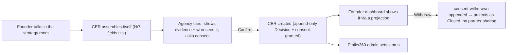

# proof360 — Changelog for Sarvesh

Plain-English "why it was made" for each change, written for the CTO outside the EthiksLabs internal doctrine. Newest first. Problem → Fix → Why it matters. Jargon defined inline.

---

## 2026-09-02 · The read stopped describing security and started describing the business

**Not deployed.** On branch `feat/position-read-and-interview`, tests green, waiting on a human walk before it goes near main.

**Vocabulary first.** The cold read produces **signals** — typed facts about a company, each with provenance. Some come from the **website extractor** (an LLM reading their public pages), some from **recon probes** (DNS, TLS, hosting lookups), and some from **corpus holdings** (material we gathered about them independently, before the conversation started). Signals become **claims**, and a claim's status is derived by folding an append-only event log — never by mutating the claim.

**Problem.** A live read on Cognisys — a 120-person security consultancy — came back as a security posture report. It led with a perimeter scan, said their DMARC was not enforcing, noted Oracle hosting, and called them a **"Software product"**.

That last one is the tell, and it was not the model's fault. `product_type` was a fixed enum: `B2B SaaS | B2C App | Platform | API | Software product | Unknown`. There is no value in that list for a services business, so the model had no legal way to say what they are. Services-versus-product sets a company's valuation multiple. Getting it backwards is worse than saying nothing.

Underneath that sat a bigger structural problem. The corpus holdings had **already retrieved** the material that mattered — 120 specialists across 19 countries, 51–200 employees from a second source, founded 2019, CREST-accredited, "Vanta's #1 Global Service Partner". All of it was displayed as citations and **none of it could become a signal**, because the website extractor was the only producer. The retrieval was right; the material had nowhere to go.

**Fix — five changes.**

**1. Port scanning is gone.** The read was making TCP connections to 13 ports on a third party's infrastructure — 22, 23, 3306, 5432, 6379, 9200, 27017 among them — off nothing but a domain someone typed. Two reasons it was removed, and the second outranks the first: it is the wrong product (nobody asked for exposed-port findings), and it is the wrong thing to do (reaching into a live system we do not own, uninvited, often against companies we are mid-conversation with). Kept as a resolved skip rather than deleted so every consumer's shape holds.

**2. Offering is three primitives, not an enum.** Physical, software, services — three independent booleans, any combination. This is John's model and it is better than the enum it replaces: "hybrid" stops being a special value and becomes two flags set, and managed-versus-professional services collapses into `revenue_model`, where recurring-versus-project already lives. Five position fields join it: `revenue_model`, `delivery_model`, `positioning_claim` (verbatim), `claim_conferred_by`, `concentration`. `stage` widens past the venture ladder so a profitable 2019 consultancy is no longer "Unknown".

**3. Security fields are classed, not deleted.** Every signal now carries `signal_class` — position, posture, infrastructure or context. **This is the design decision worth your attention.** The obvious implementation drops the security fields from the output. That breaks the gap engine, which consumes them. Classing lets the renderer lead with position and bury posture while the gap logic keeps everything it had. Security remains available the moment a gap calls for it; it is simply no longer the headline.

**4. Display order is now independent of execution order.** The perimeter scan is fired first deliberately, so its probes stream in the background while everything else runs. Because the UI rendered arrival order, "Perimeter scan" sat at the top of the founder's screen — the first thing they saw, announcing a security tool before a word of the read was visible. The trace now sorts by an explicit rank: holdings lead, posture trails, synthesis closes. The scan keeps its head start.

**5. Position signals, and the rule that shapes them.** A second producer reads the holdings for where a company stands: headcount, footprint, years operating, category position, accreditations, named customers.

Two public sources disagreed about Cognisys's headcount. **That is not modelled as a contradiction, and it never renders as one.** A signal holds multiple **observations**, each stamped with who saw it and when, plus a confirmation state that starts unconfirmed. There is deliberately no `disagreement` type and no contradiction vocabulary anywhere in the file — a test asserts the words conflict, contradict, disagree, unverified, wrong and lying never appear in that render. The reasoning: sources go out of date and disagree, everyone knows this, and adjudicating someone's public record would make this a rating agency. We hold a point-in-time record. One primitive, two audiences — the founder is asked which is right; a partner is told it is observed and not yet confirmed.

**Also: the interview, and a third answer.** The claim strip already put confirm/reject buttons on every tile, but a strip waits to be noticed. There is now a flow that asks — one question at a time, opening on cloud provider because that is the gimme that earns the first yes, then position, then posture, so stopping early still pays.

The new part is **"I don't know"** as a first-class folded event, distinct from *inferred* (never asked) and *rejected* (asked, and wrong). A founder who cannot say whether they are on AWS or behind Cloudflare has told us something true about how the company is run — it is a finding, not a blank. It mints no evidence, leaves the inference intact, and counts as **answered**, so it is never asked again. No counter and no total anywhere in the flow: a progress bar turns a conversation into a form. Skipping goes quiet rather than rendering a dead end, and every tile stays answerable afterwards.

**What this does not do.** `product_type` was kept and widened rather than replaced. It is load-bearing for AWS and Microsoft program matching, the capability-register triggers, firehose intake and claims projection. A services company now falls outside the ISV program lists, which is correct behaviour rather than a regression. Full decomposition into the three primitives is the right end state and is its own change with its own blast radius. The ask order is also duplicated across the API boundary on purpose, commented on both sides; it collapses when the API returns the ordered queue instead of record-ordered claims.

**And one thing genuinely unfinished:** position signals are produced and stored on the session, and **nothing renders them yet**. The data reaches the session and stops there.

**Follow-up the same day — the prose, not just the data.** The first live read after the above returned the right *facts* (120 people, ~20 countries, founded 2019, top global partner) and still opened with: hosting provider, DMARC in monitoring mode, TLS grade. It then closed by noting the email posture "catches the eye when you're advising clients on their own compliance frameworks" — telling a security consultancy it is a hypocrite, from a stranger, in the first thirty seconds.

Fixing the signal schema did not fix this, because the paragraph is written by a **separate prompt** (`cold-reading.js`) that was never touched. That prompt has a well-built three-beat structure — clues, connection, invite — but nothing told it **which** clues to open on, so it picked the most concrete facts available. Technical probes are always the most concrete. Concreteness is not relevance.

Two rules added: infrastructure and posture facts are admissible only when the connection beat genuinely turns on them, never as an opener; and the read **never evaluates the company** — no shortcoming, no inconsistency, no gap between what they sell and what the record shows, no "catches the eye". State the fact, let them draw the line. This binds hardest when the company works in the same field as the observation.

One implementation note worth carrying: the worked examples in that prompt were first written using the real fact words. A test caught it — `cold-reading.test.js` asserts the prompt never mentions facts absent from the session, because a fact named in the prompt can be hallucinated into a read for a company that has none. The examples are now generic by necessity, which is also safer.

**Second follow-up — the dock shows, the chat asks.** The interview shipped inside the companion dock, and the first walk found the flow break immediately: a floating panel that asks questions pulls the founder out of what they are reading in order to answer, and leaves them with two places to be looking. The panel was also rendering near-black over a light chat surface — a hole in the page.

The dock's job is the one it is named for: the surface where the record **visibly accumulates**, filling in parallel while the founder reads. Asking is a different job and it belongs in the conversation, next to the read that raised the question. Same claims, same endpoint, same append-only events — only the seam moved. The per-tile buttons stay in the dock, so anything can still be settled there at any time; they are simply no longer the ask.

The panel is now themed from `tokens.js` like every other surface rather than a private dark palette. A test renders the panel and asserts it contains no interview, and a second checks the old dark hex values are gone — the seam is enforced rather than remembered.

**Third follow-up, and the serious one — a typo produced a confident profile of the wrong company.**

Reading `congisys.co.uk` — one transposition away from `cognisys.co.uk` — hit a site that would not open. **Zero pages readable.** The read still produced a full, confident profile: 120 people, 19 countries, Vanta's #1 global service partner, GRC consulting and CREST-accredited testing. Every one of those facts is real. **None of them is about the domain that was typed.**

**Cause.** Corpus retrieval is semantic, with a similarity floor. That is correct and should stay — finding near material is the point of a retrieval layer. The defect was at **consumption**: every hit that cleared the score floor was handed to the reading prompt as testimony about the company being read, and nothing anywhere checked that a holding was actually *about* them. "Congisys" and "Cognisys" sit one character apart in an identical sector vocabulary, so they score high. With the site unreadable there was no first-party evidence to contradict it either, so third-party records about a different company became the entire read.

**Fix — an identity gate at the point of use, not at retrieval.** `holdingIdentity(hit, {company_name, domain})` returns `confirmed` only on a hard link: the holding is published on their own domain (or a subdomain of it), or it names them in its text or slug. Everything else is `unconfirmed` — still retrieved, still shown, still cited, but tagged `[CORPUS-UNCONFIRMED]` in the prompt and never spoken in the second person. It **fails closed**: no name and no domain to check against means unconfirmed.

The prompt gained a rule that outranks its shape rules: an unconfirmed holding may never be written as "you", never folded into the connection beat, and never used to imply size, age, reach or position. If unconfirmed holdings are the only material available, the model must not write a profile at all — it says plainly that we could not confirm these records are about them, names the company the records *do* describe, and asks whether it is the same organisation.

**Why it matters, and why this one was worth stopping for.** Everything else found today was a read that was unhelpful. This was a read that was **wrong, and confident, about someone else's business** — with no way for the reader to tell. If that domain belonged to a real company, proof360 would have told them they are a 120-person GRC consultancy. A wrong company confidently described is the worst output this product can produce, because the entire proposition is that the evidence is traceable.

**And the fix above was not enough — what actually worked.**

The first attempt tagged unconfirmed holdings `[CORPUS-UNCONFIRMED]` and told the model, in the prompt, never to write them as "you". Both the tag and the rule landed correctly. The model then appended *"and are the records we found actually about your organisation?"* — **and wrote the full profile anyway**, 19 countries and all.

**A rule the model can decline is not a control.** That is the lesson worth keeping: the instruction was clear, correctly placed, and simply not obeyed, because everything else in the prompt was pulling the other way and the facts were sitting right there.

Two changes made it hold:

**1. Unconfirmed material is removed from the evidence block, not labelled in it.** There is now nothing to write a profile from. The holdings are still retrieved, still counted, and still rendered as citation cards — showing what we found and asking whether it is them is honest; handing it to the writer as though it were them is not.

**2. The live-web summary is gated by the same test, which the first fix missed entirely.** Asked to "research the company at congisys.co.uk", the research engine silently corrected the typo and returned a profile of **cognisys.co.uk**. That answer is not a corpus holding, so the holding gate never saw it — and it was feeding the same false read on its own. It now has to name the company being read, or it is dropped.

The session-level verdict is: identity is established if their own pages were read (you cannot fetch the wrong company's website), or a corpus holding names them, or the research summary names them. If none of those hold, the prompt gains a block that overrides the entire three-beat shape and instructs three sentences only — the site would not open, the records may describe a different organisation with a similar name, please confirm or give us the right address.

**Verification.** API 518/518, frontend 421/421, nothing skipped — 80 new tests. **No human has walked it**, which is why this is on a branch and not on main. A green suite written by the same author that wrote the code is not sign-off.

**Why it matters.** proof360 sells the claim that it can read a company and say something useful about where it stands. A read that calls a consultancy a software product, and leads with their email security, is answering a question nobody asked — and doing it confidently, in the one place the product asks to be trusted.

## 2026-09-01 · The conversation shows its references, and the theme learned to mirror

Three things went live together. The first is the one that changes what a founder sees.

### Inline citations in the chat

**Problem.** proof360 reads a company's public trail and makes statements about it in conversation. Those statements are backed by real evidence records in CORPUS — each one has a source behind it. In the chat surface they arrived as bare prose. The founder saw an assertion about their own company and had no way, in the moment, to ask *how do you know that?*

That gap is the whole product risk in one sentence. A confident claim with no visible backing is indistinguishable from a guess, and the audience most likely to notice is exactly the audience proof360 is for.

**Fix.** Message bubbles now render inline citations — the reference travels with the sentence it supports, in the conversation, rather than living in a separate panel the founder has to go and find.

**Why it matters.** The evidence layer has existed for months and was doing real work invisibly. Showing it is the difference between a product that claims it holds your evidence and one that hands it to you unprompted. An offer without the evidence behind it is an advertisement.

### A 'parallel' theme

**Problem.** The two estates — your Ethiks360 app and this one — are deliberately separate products that increasingly get shown in the same room. Nothing made them look like relatives.

**Fix.** A new theme whose neutrals, ground colour and hairlines are lifted **verbatim** from the live Ethiks360 web app, measured off its Tailwind config and CSS custom properties rather than eyeballed. The accent is deliberately **ours** and not yours.

**The reasoning behind that split**, since it looks like an inconsistency and isn't: a shared skeleton makes the two read as one family; a shared accent would make them indistinguishable in a screenshot. Same bones, different skin. Someone looking at a screenshot should be able to tell instantly which product they're looking at, while still recognising the pair.

It is a normal theme option — the key set is identical to the existing default, and an unknown theme name still falls back to that default. **Nothing was written into your repository to do this.** The values were read out of your tree and reimplemented in ours; the estates stay parallel.

### Inference moved to Sydney — with a caveat that matters

**Problem.** Bedrock calls defaulted to us-east-1 under a July ruling made to dodge regional capacity limits, paying roughly a second of cross-Pacific round trip on every call. Separately, calls used bare model ids, and a bare model id carries no resource tag — which means Bedrock spend cannot be attributed to a service in Cost Explorer at any tagging effort.

**Fix.** The default is now ap-southeast-2, overflowing to us-east-1 **only** on a throttle, so the capacity limit is still covered. Calls route through tagged application inference profiles, which is what makes the spend attributable. A credential, permission, or model fault does not overflow — retrying it elsewhere fails twice as slowly and reads as a regional problem when it isn't one. Note that a profile ARN is region-scoped, so the overflow swaps the ARN along with the region.

**The caveat.** On the production box, `api/.env` still pins the region to us-east-1, and an environment variable beats the new code default. So **as of this writing proof360 is still running in us-east-1**, using the US profile. Nothing is broken and the spend is still tagged and attributable — but the Sydney move has not actually taken effect for this service yet, and the latency win is not being collected. It is a one-line deletion and a restart, and it is John's call when that happens. CORPUS has no such pin and is genuinely on ap-southeast-2 today.

This is flagged here rather than left quiet because "deployed" and "in effect" came apart, and a changelog that reports the first as though it were the second is how a fix gets believed before it is real.

**Verification.** API suite 457/457 and frontend 397/397, both re-run against the merged result rather than the branch. The public site is serving the new build — the bundle the front door references is byte-identical to the one on disk, and it carries both the citation code and the new theme.

---

## 2026-08-26 · The AWS and Microsoft panels show real programs now

**Problem.** An inventory of what's built-but-unreachable turned up the worst fabrication left in the product, and its fix sitting one import away.

`api/src/config/` holds **18 AWS programs** (`AWS_PROGRAMS` with per-program trigger conditions and an `evaluateTrigger` evaluator) and **12 Microsoft programs**. The recompute pipeline has matched against them, with tests, for months. The AWS and Microsoft panels in the UI used **none of it** — they rendered two hardcoded constants in `Projections.jsx` for any company that wasn't the Hive & Co demo, and those constants asserted things about the founder's **own accounts**:

- *"Startup Credits — $10k unclaimed — already granted · expires Q4 · log in to redeem"*
- *"$220k+ in credits and co-sell opportunities are sitting unclaimed at your stage"*
- *"Founders Hub is unclaimed — that's $150k in Azure credits sitting there"*

"Already granted" and "unclaimed" are claims about a real AWS account nobody has looked at. That's a category beyond an invented number — it's an invented **entitlement**.

**Fix.** `services/programs-matcher.js` joins session → signals → the same trigger evaluation recompute already runs, exposed as `GET /api/v1/session/:id/programs`.

Two design points worth knowing if you extend it:

1. **Confirmed claims outrank read signals.** The signal map is built from what the read inferred, then a claim the founder *confirmed* overwrites it. If that ordering isn't there, answering a question in the record changes nothing about what gets offered — and the whole confirm ceremony is decoration. A rejected claim contributes nothing.
2. **Unknown field means no match.** A trigger reading a field we have no value for must fail, not pass. Otherwise an empty session matches every program and the catalogue gets dumped on a stranger as though it were personalised. Know nothing, offer nothing.

Each match carries the trigger that earned it — *"Matched because your stage is Seed and your infrastructure is aws"* — the same rule the pathway follows: an offer without the evidence behind it is an advertisement. The two old constants survive as clearly-marked demo fixtures for the Hive & Co walkthrough only.

**Why it matters.** Two panels stopped making financial claims about accounts we've never seen, and 30 real trigger-matched programs became reachable in the same move. The engine was already right; only the surface was lying.

---

## 2026-08-26 · The record gets a surface of its own

**Problem.** The product had been accumulating a real evidence record for months — every claim read from a company's public trail, graded inferred-until-confirmed, with its provenance attached — and displaying it as a single integer in a floating panel: *"6 things we've noted so far"*. A founder could see that we knew six things about them and had no way to see what the six were, let alone correct one. Meanwhile the same panel's header counted something different (claims + shortlist + pathways = 12) and the sidebar card counted a third thing entirely (a legacy tile count wired to nothing, permanently reading 0/6). Three numbers for one record, on one screen.

**Fix.** The record now has a place to live. `GET /api/v1/session/:id/record` returns the whole thing in one read — company, claims, open pathways, kept pathways, and how much the founder has settled in their own words — rather than the caller fanning out to three endpoints and stitching three partial truths together. On the surface it renders as a **projection**: the same shell as "Vendors matched to your gaps", opening over the conversation rather than navigating away from it. Kept pathways lead, open ones follow, claims come last as the evidence that earned them. Each claim is answerable in place, writing the same `claim_event` the chat ceremony writes — one verb, one log — and the page re-reads afterwards, so confirming a claim visibly opens the next pathway.

There is also a standalone `/record` route for the cold cases (a shared link, a second device). It renders the identical component, so there is one design rather than two that drift.

**A wrong turn worth knowing about**, because the reasoning applies to anything you build on this surface: the first cut was a full-page route. It looked fine and was wrong — navigating to it remounts the chat page, which only *writes* a session snapshot on unload and never reads one back, so "back to the conversation" started a brand-new session and the founder's conversation was gone. Overlays over the chat are correct here; full-page routes are not, until the chat can restore itself.

**Why it matters.** SPEC-011 has had confirm/correct/reject since it was written. The verbs existed, the data existed, and nothing surfaced them. This is the difference between a product that says it holds your evidence and one that shows it to you.

## 2026-08-26 · What's open to you — the capability register made visible

**Problem.** `api/src/config/capability-register.json` holds 70 active entries (32 AWS/Microsoft/Ingram programs, 36 vendors, 2 services) and `evaluateRegister` derives live matches against a founder's confirmed claims and open gaps. The only way any of it reached a person was a persona happening to mention **one** in conversation; the panel showed only what had already been accepted. Asked "where is the AWS stuff?", the honest answer was "nowhere you can see it."

**Fix.** An "Open to you now" section, derived fresh on every read and never stored. Each entry renders its kind, what it's worth, a link to the original, an add action — and, as prominently as the offer, **the claim or gap that earned it**: *"proposed because your cloud provider is confirmed as Oracle."* That reason line is the difference between a recommendation and an advertisement, and it's why the D4 rule matters: nothing appears until the record holds first-party testimony, so every offer traces to something the founder said or a gap that's real.

Two related fixes in the same area. A kept pathway is now titled by the **item**, not the route — every AWS offer routes `ingram_micro_aws`, so titling by route label rendered five genuinely different programs as five identical lines. And a repeat accept is now recognised as already-kept rather than falling through to `proposal_not_open`, which told the caller the wrong reason (accepting closes the proposal). The 409 contract is unchanged; only the reason got honest.

**Why it matters.** The register is the commercial engine. It was fully built and effectively invisible.

## 2026-08-26 · Nothing on screen is invented any more

**Problem.** Three surfaces were showing fabricated data as though it were measured.

1. The machine drawer's "Operational work units" read *Tokens processed 18,420 · Analysis passes 0 · Sources reviewed 0 · Model correlations 2*. Two of those were **hardcoded literals** — 18,420 would have read 18,420 for every company, forever. One was a boolean dressed as a count (`graphNodes.length > 0 ? 2 : 0`). The fourth counted inferences under a label saying sources. The rows contradicted each other on their face: 18,420 tokens processed across zero passes over zero sources.
2. The settings panel rendered a module-level constant marked `// ── Mock data — demo founder profile ──` **to whoever was signed in**: an AWS Activate application under review for $10k, $1,000 of Azure credits, a Vanta subscription "via proof360 · renews 14 Jun 2026", a pending cyber insurance quote, an AWS Console connected to two regions, and "Your company · Founder · Free" as the identity of a logged-in person. The sidebar badges (2 / 1 / 1) were literals too.
3. `ProvenanceAccordion` was passed a hardcoded empty array under the heading "Analysis provenance will appear here" — a promise nothing could keep.

**Fix.** The drawer is now **"What we read"** and every row traces to a measurement the read actually took: pages read, sources read, signals found, corpus holdings cited, and the engines that did the reading — named rather than counted, because "2 engines" tells a founder nothing and "perplexity · gemini" tells them who read their site. A measured zero shows (reading nothing is a real answer); an absent value hides; if nothing can be vouched for, the panel doesn't render. Token counts are deliberately **absent**: `inference.js` meters real usage server-side but it never reaches the browser, and approximating it is the exact thing being fixed.

The account panel derives from the person signed in and the pathways they actually kept — which is the true answer to "programs you've applied for through proof360" — carrying the real CTA where a route has one and none where it doesn't, with consent shown honestly (a withdrawn pathway is not an active one). Purchases and Integrations have no data source at all, so they say so plainly instead of inventing one.

**Why it matters.** This is a product about provenance. A plausible constant under a heading that says "operational work units" is worse than a blank, and a fabricated *account* is worse still — it states commercial relationships that don't exist, to the person they supposedly belong to. The standing rule is: no invented number, live or illustrative. If you add a surface, a row with no measurement behind it should not exist.

## 2026-08-26 · The model picker actually routes now

**Problem.** The chrome showed `● Claude Sonnet 4.6 · Bedrock` above answers signed `claude-haiku-4-5-20251001`. The frontend had been sending `model_override` since the chrome redesign; `session-chat.js` pinned `const MODEL = 'claude-haiku-4-5-20251001'` and never read it. The dropdown was decorative, and four of its seven entries aren't wired to this seam at all — picking Gemini or NVIDIA produced a Haiku answer wearing their badge.

**Fix.** `resolveChatModel()` honours the pick against a `SERVED_MODELS` whitelist — what `inference.js` MODEL_MAP genuinely resolves to a Bedrock profile. Default-deny on an untrusted body field: anything off the list falls back rather than reaching the inference layer to be interpreted. A fallback now **declares itself** (`X-Model-Substituted`), and `X-Model` reports what answered rather than what was asked for. The catalogue carries a `served` flag and the picker marks unwired entries "not wired here yet" — the breadth stays listed on purpose, because inference being a market rather than a monolith is the argument this product makes.

**If you wire another provider**, add it to both lists (`SERVED_MODELS` in `api/src/handlers/session-chat.js` and `served: true` in `frontend/src/data/vectorModels.js`) — there's a test asserting the two agree, because when they drift the chip starts lying again.

## 2026-08-26 · A panel can no longer take the conversation down with it

**Problem.** One unexpected object in one text slot threw React error #31 inside a projection. React text children *throw* on objects rather than stringifying, the app-level error boundary caught it, and the entire chat — the read, the personas, the record, the conversation in progress — was replaced by a black RENDER ERROR screen.

**Fix.** `PanelBoundary` wraps the projection sheet. An overlay is a leaf and must not be able to destroy the room it opened over. The sheet now fails inside its own frame — *"We couldn't render this one. That's on us, not you. Your conversation is still there."* — loud in the console with the component stack, one sentence on screen. Every text slot on the projection also passes through a guard that yields a string or nothing, with a test that renders a deliberately hostile record (an object in *every* slot) and asserts the app stays up.

**The lesson underneath**, worth carrying: the crash happened because the test fixture was written from what the shape was assumed to be, not what the server actually emits. The same assumption produced `[object Object]` in the claim strip earlier the same day. Build fixtures from a live response — the endpoint is one curl away — and shape bugs surface in the test rather than in front of someone.

## 2026-08-26 · Smaller things, same day

- **Ask fatigue.** The confirm ceremony re-asked the same unanswered question every turn, forever — it picked the highest-priority still-inferred claim each exchange and nothing recorded that it had already asked. A question asked and not answered is itself an answer. One voiced ask, then move on; the founder can settle any claim directly on the record instead. The count increments on a question actually *voiced*, not merely armed.
- **Orphaned sessions.** A session left `processing` when the API restarted stayed that way forever — a fresh process has nothing in flight. They're now failed at boot. Two real orphans were caught on the first run. Corrupt session files are reported, never deleted.
- **Memory ceiling.** `max_memory_restart` was 256M against a process that peaks near 490MB during concurrent reads, so pm2 was killing it mid-read. Raised to 1G, verified with three concurrent reads (113MB peak, zero restarts). `ecosystem.config.cjs` was also missing from the deploy workflow's trigger paths, so config-only changes silently never shipped.
- **Nameless gaps.** Persona prompts rendered gaps by an ID field that didn't exist, so personas couldn't name the specific gap they were discussing. Same root cause as the two shape bugs above.

---

## 2026-07-17 · CER noun: "Commercial" → "Customer" Engagement Record (sweep)

**What:** every comment, doc, and UI string now says **Customer** Engagement Record. **Why:** John ruled 2026-07-16 that the record belongs to the customer — the noun should say whose it is, not what kind of deal it is. **What did NOT change:** the stored `decision_type: 'commercial_engagement'` enum stays as accepted residue — renaming stored data would mean a migration for zero behaviour change. If you build against the API, nothing breaks; if you write prose, it's Customer.

## 2026-07-03 · Real founders — the demo stand-in retires from production (D3)

**Problem.** Production ran in "demo founder" mode: every visitor to the journey page saw the same seeded demo record, and a *real* login would have seen an empty journey forever — nothing ever connected a real person's login identity to their data in the memory database. This flag was always marked temporary ("remove this flag when live founder→atom resolution lands").

**Fix.** Resolution now happens lazily on a founder's first authenticated visit. If we've seen their login before (their Auth0 identifier is stamped on a person record), we return it. If not, we read their existing chat/profile history from the founder-memory store and replay it into the memory database using the same tested migration that proved the v1→v2 move — so a founder who has been using the chat logs in and their journey is already populated. A founder with no history gets just their person record — we never invent a company name for them. A database uniqueness rule on the identifier makes double-creation impossible even under a race. With that in place, the demo flag is removed from the production build: journey and pathway records now require a real login (per John's auth-in-front ruling, 2026-07-03), anonymous visitors to the journey page get a sign-in invitation instead of an error, and the anonymous chat keeps its clearly-labelled example company.

**Why it matters.** Every "show your work" claim on the journey/CER surfaces was undermined by the surface itself being a demo. This makes the product honest end-to-end: your journey renders from your record, gated by your login.

---

## 2026-07-03 · Website-reply robustness — a failed scan re-asks instead of stranding (slice 5b)

**Problem.** Two edge cases were knowingly deferred from the previous slice (flagged by Codex review, decision recorded on PR #6). (1) If a founder answered the "what's the company called?" ask with a website *inside a sentence* — "we're at northwind.io" — the URL detector missed it and the whole sentence was saved as the company's name. (2) If the reply *was* recognised as a website but the site scan then failed, nobody asked again: the record sat waiting for a company forever. We reproduced (2) live in a browser before fixing it.

**Fix.** Three small, mostly-pure changes. (1) URL detection moved into its own tested module with **two strictness levels**: ordinary chat messages keep the old narrow matcher (mentioning a domain mid-sentence never triggers a scan), while a reply to a direct "what's the company?" ask uses a broader matcher that catches embedded domains. (2) The reply classifier now hands the *exact* extracted URL to the scanner — the two can't disagree by construction. (3) The "what happens after the scan" decision is a pure function: success guarantees a company lands (the analysed name, else the scanned domain); failure makes the advisor re-ask — *"That site didn't read — give me another link, or just tell me the company name and we'll keep moving."* — and the wait stays armed. The safety gate is deliberate: only an explicit success captures; anything else fails to the re-ask path.

**Why it matters.** The gap-prompt's promise is "the founder is never stranded". These were the two remaining ways to strand them. Both are now closed with unit tests (TDD — tests written first, watched fail, then fixed) plus a live browser walk.

---

## 2026-07-01 · CER persona gap-prompt — the lens asks for what's missing (slice 5)

**Problem.** A founder could start a pathway by talking but then stall: a CER needs a company, and if we didn't know it yet (no website scanned, nothing on record), the flow couldn't reach the consent step. We refused to fix this with a form field or by dropping the requirement.

**Fix.** When a CER is forming and a required field is missing, the fitting advisor asks for it in the conversation — e.g. **Sophia**: *"Before I set this up — what's the company called? A name, a website, or a deck all work."* The founder answers however they like: a plain name is captured as a fact; a website is read by the existing scan. Either way the field fills and the flow continues — no form, the requirement stays.

**Why it matters.** It keeps the product's core promise intact — the record assembles itself out of the conversation, and the founder is never blocked and never handed a form. It also directly closes the gap Codex flagged on the previous PR.

**How it was built (for the record).** Full design → spec → plan → build cycle with a fresh agent per task and independent review at each step. The final whole-branch review caught a real bug the per-task reviews missed — a website typed inside a sentence ("we're at northwind.io") would have stranded the founder because two different bits of code disagreed on what counts as a URL. Fixed by making them use the same detector. Verified: 70/70 frontend tests green.

**Scope.** MVP asks for the **company**; the advisor→field map is built to extend to contact/evidence later. Design + plan committed under `docs/design/` and `docs/plans/`.

---

## 2026-07-01 · CER conversation flow — the record assembles itself in the chat (3b)

**Problem.** The CER engine + cards existed (below) but weren't connected to the strategy-room chat. A founder couldn't actually *create* a pathway by talking.

**Fix.** Wired the CER into the live chat so it behaves like the product promise: the record forms as the founder talks, and nothing is created until they confirm.

- **Hybrid trigger.** A pathway-relevant phrase in a founder's message (e.g. "cloud spend on AWS" → AWS, "SOC 2" → compliance) *proposes* a route — the "forming N/7" card appears in the conversation with the route shown as a question. The founder commits with one click ("Use the … pathway →"). No CTA before they've said something; the founder always confirms.
- **Then the agency card** surfaces inline (consent + who-sees-it), and confirming creates the CER, which then shows as a created-pathway card and a sidebar facet beside the Company Profile.
- **Demo access.** The CER endpoints now use the same gate as `/journey`: real auth in production, a demo stand-in when `DEMO_FOUNDER_MODE` is on — so the demo founder can drive the whole flow without a login.

**Why it matters.** This is the felt difference from a normal intake form: the commercial decision *assembles itself out of the conversation* and stays under the founder's control. Verified live — typing a message makes the CER card build itself in the chat stream, field by field.

**Demo completeness.** The demo founder is now seeded with its own company (Northwind Robotics — the founder's *own* workspace, kept distinct from the amber Hive & Co example) so the flow walks all the way through: forming card → confirm route → agency card → consent → created CER + sidebar facet. Verified live in the browser and via the API (create/list/status/withdraw). Only applies in `DEMO_FOUNDER_MODE`; a real founder's workspace still starts empty and fills as they talk.

---

## 2026-07-01 · CER (Customer Engagement Record) — engine, API, and cards

**What a CER is (one line):** when a founder decides to pursue a commercial pathway (AWS credits via Ingram, cyber insurance via Austbrokers, compliance via Vanta, Cisco via Ingram), proof360 creates a **living, permissioned, evidence-backed record** of that decision — with consent, route, visibility, and status — instead of just firing a form.

**Problem.** A "call to action" today is just a button: click it and a form posts silently. There's no durable record of *what the founder agreed to share*, *who is allowed to see it*, or *what evidence backs it* — and no way for the founder to withdraw that consent later. For a trust product, that's the whole game.

**Fix (this change).** A CER is modelled as a **typed commercial Decision**, not a new database or a new primitive. It rides proof360's existing append-only founder-memory store (the same event log that powers the "Company Profile fills as you talk" tile). Three things shipped:

1. **Engine** — a `decision` record + an append-only `cer_event` log (consent-granted / consent-withdrawn / status-updated). Current status and consent are *derived by replaying the log*, never by editing a row. Consent-withdrawn overrides the admin status to `Closed` at read time, and the original grant is never erased (audit stays intact).
2. **API** — four endpoints under `/api/v1/profile/current/cers` (create, list, consent-withdraw, admin status). Every write is an append; reads are a pure projection. A partner (e.g. Ingram) can only ever see CERs on *their own* route and only while consent stands — proven by a test, before any partner can log in.
3. **UI cards** — four React components (the "forming N/7" build card, the inline consent/agency card, the created-CER projection, and the sidebar facet), theme-driven, no hardcoded colours.

```mermaid
flowchart LR
  Chat["Founder talks in the strategy room"] --> Build["CER assembles itself (N/7 fields tick)"]
  Build --> Agency["Agency card: shows evidence + who-sees-it, asks consent"]
  Agency -->|Confirm| Create["CER created (append-only Decision + consent-granted)"]
  Create --> Proj["Founder dashboard shows it via a projection"]
  Create --> Admin["Ethiks360 admin sets status"]
  Proj -->|Withdraw| WD["consent-withdrawn appended → projects as Closed, no partner sharing"]
```

**Why it matters.** The product promise becomes concrete: *proof360 doesn't just recommend a pathway — it turns recommendations into permissioned, evidence-backed commercial Decisions the founder controls.* One CER shape works for all four pathways (AWS is just the first proof), so adding a fifth is config, not a rebuild. Consent is revocable and fully auditable, which is exactly what an enterprise/investor trust surface needs.

**Scope note.** The cards are built and tested but **not yet wired into the live chat flow** (that's the next step — the conversation ticks the fields and surfaces the agency card). Recommendation *engine*, real partner integrations (Ingram/Vanta/Austbrokers/Cisco), HubSpot, partner dashboards, and billing are all intentionally out of scope for v1 — mocked or seeded.

**Verification.** api unit suite 51/51 green; frontend 47/47 green. No confidence/freshness score minted on the CER — trust semantics stay with VERITAS, per the frozen invariant.
